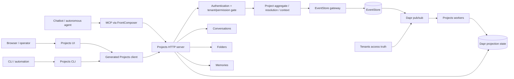

# Hexalith.Projects production-readiness and agent-use audit

**Audit date:** 2026-07-14

**Repository:** `/home/administrator/projects/hexalith/projects`

**Baseline:** inspection began at `4fc7fa5` and ended at externally advanced `b89cb8f` (`fix: resolve root test failures`, synchronized with `origin/main`); user-owned submodule worktrees preserved

**Disposition:** Read-only audit; this report is the only audit-created repository artifact

## 1. Executive verdict

Hexalith.Projects is **not ready for production chatbot or autonomous-agent use**. The pure aggregate, validation, deterministic resolution/context logic, metadata-only boundary, generated-client reproducibility, and broad unit suite are substantial strengths. They are currently wrapped in an architecture that the latest repository rules explicitly prohibit, however, and several public machine-caller workflows are unsafe or unusable in a production topology.

No P0 was verified. This is not a clean security verdict: nine P1 findings must be closed before production use. The most important are the custom Dapr/runtime implementation instead of `Hexalith.EventStore.DomainService`, production registration of development-only allow validators, absent authentication/token propagation in the shipped UI and CLI, process-local idempotency for a non-atomic cross-service proposal workflow, and caller-asserted confirmation evidence.

| Priority | Count | Meaning in this audit |
|---|---:|---|
| P0 | 0 | No verified immediately exploitable cross-tenant, disclosure, destructive-action, or data-loss path |
| P1 | 9 | Mandatory compliance, security/correctness, durability, or broken public workflow blockers |
| P2 | 7 | Bounded but meaningful operability, performance, compatibility, test, UX, or maintainability gaps |
| P3 | 0 | Low-risk polish was intentionally not promoted into backlog noise |

| Obligation | Count |
|---|---:|
| Required compliance | 6 |
| Required correctness/security | 9 |
| Recommended optimization | 1 |
| Optional polish | 0 |

Top risks:

1. The service bypasses the required DomainService SDK and independently implements persistence, projections, subscriptions, health, topology, and endpoint plumbing. This splits correctness and security responsibility between Projects and the platform.
2. Runtime wiring replaces deny-all authorization dependencies with classes documented as development/test stubs that always allow.
3. The UI and CLI do not acquire or forward bearer tokens, while the API requires authoritative tenant, principal, and permission claims.
4. Proposal confirmation performs multiple sibling-service mutations behind an in-memory idempotency ledger; restart, concurrency, and partial failure can duplicate or strand work.
5. Confirmations and dry-run evidence are caller-authored values rather than server-issued artifacts bound to the reviewed action and current state.

Highest-leverage changes:

1. First add or validate missing generic seams in EventStore.DomainService/Client (including durable workflow/confirmation support), then migrate Projects to SDK handlers, stores, cursors, and the two-line host.
2. Replace optional/stub authorization with platform-owned authenticated admission and real fail-closed policy evidence; make issuer/audience configuration mandatory outside explicit development.
3. Define one server-issued confirmation and durable idempotency/task contract shared by HTTP, generated client, MCP, CLI, and UI.
4. Move integration and E2E verification onto a real Dapr/EventStore topology and make those lanes mandatory in CI.
5. Reconcile the OpenAPI/runtime contract, then expose accurate MCP annotations and bounded, cursor-based read models from the same canonical semantics.

## 2. Scope, assumptions, precedence, and limitations

### Scope inspected

The audit covered root build/Git/package configuration, `.github` workflows, root-declared submodule state, current planning artifacts, all first-party projects under `src/`, all .NET test projects, `tests/e2e`, generated-client provenance gates, OpenAPI, MCP descriptors, CLI parsing/execution, Blazor UI, and the pinned EventStore/FrontComposer public seams needed to validate ownership assumptions. `bin/`, `obj/`, package caches, and archived backups were excluded from code-quality counts.

The source-of-truth comparison included the current PRD (`_bmad-output/planning-artifacts/prds/prd-Hexalith.Projects-2026-05-24/prd.md`), architecture and UX specification, later sprint-change proposals, both ADRs, and the event/projection catalogs, payload taxonomy, context decision matrix, resolution scoring rules, parity matrix, negative-test checklist, and topology runbook under `docs/`. Research, brief, epic, readiness, and validation artifacts were treated as supporting intent rather than current mandatory rules.

The repository contains approximately 359 first-party source files, 170 test files, 11 documentation files, and 16 CI/release files; 579 files were inventoried under the principal in-scope roots. Ten root-declared submodules were initialized. Nested submodules remained uninitialized, as required.

### Source precedence

1. `AGENTS.md` and the current `references/Hexalith.AI.Tools/hexalith-*-instructions.md` files.
2. Executable contracts and current source: OpenAPI, public types, runtime composition, CI, and tests.
3. Current PRD and domain/product constraints.
4. Architecture, ADR, story, catalog, and generated artifacts as evidence of historical intent. Conflicts with item 1 are reported rather than silently accepted.
5. Current official specifications and vendor documentation, accessed 2026-07-14, where repository rules do not fully define behavior.

### Assumptions and evidence limits

- The worktree was already dirty. During the audit, external/user actions committed the root fixes, advanced `main` from `4fc7fa5` to `b89cb8f`, synchronized `origin/main`, and moved the EventStore, Folders, FrontComposer, and Memories submodule worktrees relative to their root gitlinks; the audit did not perform those mutations. All submodule worktree changes were preserved. Findings were checked against the final observed worktree, not only the initial `HEAD`.
- A full Release build and all test lanes had been run and recorded in the same-day worktree artifact `_bmad-output/implementation-artifacts/spec-fix-all-test-failures.md:73-93`. The audit did not repeat those mutation-prone gates; it independently ran read-only package-vulnerability queries and inspected current sources.
- The broad solution needs an explicit root `HexalithCommonsRoot` override because a nested Conversations dependency is absent. Initializing that nested submodule was prohibited.
- No production credentials or external data stores were used. Runtime authorization, Dapr persistence, restart behavior, service-to-service identity, health, traces, latency, and horizontal-scale behavior are therefore **not dynamically verified**.
- The checked-out EventStore SDK contains the mandated handler/store/cursor/host seams. Whether a sufficiently generic durable saga and server-issued confirmation capability already exists was not proven; the roadmap treats that as a platform design prerequisite, not permission to build another Projects-local technical framework.
- External sources used: official MCP 2025-11-25 [tools](https://modelcontextprotocol.io/specification/2025-11-25/server/tools), [schema](https://modelcontextprotocol.io/specification/2025-11-25/schema), and [tasks](https://modelcontextprotocol.io/specification/2025-11-25/basic/utilities/tasks); Microsoft [JWT bearer guidance](https://learn.microsoft.com/en-us/aspnet/core/security/authentication/configure-jwt-bearer-authentication?view=aspnetcore-10.0); Dapr [application health checks](https://docs.dapr.io/operations/resiliency/health-checks/app-health/); OpenAPI [3.1.1](https://spec.openapis.org/oas/v3.1.1.html); and GitHub [secure use of Actions](https://docs.github.com/en/actions/reference/security/secure-use). All were accessed 2026-07-14.

## 3. Repository and system map

### Project/dependency map

| Layer/surface | First-party projects | Observed responsibility |
|---|---|---|
| Contracts | `Hexalith.Projects.Contracts` | Commands, events, identifiers, OpenAPI, DTOs, plus inappropriate UI/FrontComposer types |
| Domain/application | `Hexalith.Projects` | Aggregate Handle/Apply, validators, resolution, context decisions, projections, tenant access |
| Technical/runtime | `Infrastructure`, `Server`, `Workers` | Custom Dapr stores, subscriptions, gateway/endpoints, authorization, sibling clients |
| Clients/agents | `Client`, `Client.Generation`, `Client.Generation.Shared`, `Mcp`, `Cli` | Generated HTTP client, agent resources/tools, shell command adapter |
| UI | `UI` | FrontComposer registration plus custom operator pages/components |
| Hosting/topology | `AppHost`, `Aspire`, `ServiceDefaults` | Local topology, Dapr configuration, health/telemetry defaults; current rules assign these outside the domain module |
| Test support | `Testing` | Fixtures and shared test helpers |

The desired dependency direction is contracts/domain outward into adapters, with EventStore and FrontComposer supplying technical capabilities. The observed graph crosses that boundary: Contracts directly references EventStore, Conversations, FrontComposer, ASP.NET, Fluxor, and Fluent UI (`src/Hexalith.Projects.Contracts/Hexalith.Projects.Contracts.csproj:16-29`), while Projects owns technical host/persistence infrastructure that current instructions assign to platform modules.

### Data flow and trust boundaries



Trust boundaries exist at every caller-to-adapter hop, at API authentication/tenant derivation, at each sibling-service call, at Dapr sidecars/components, and at EventStore publication/subscription. Human-authored names/setup and sibling metadata are untrusted data. Projects correctly avoids storing transcript/file/memory payloads in the inspected domain model, but current runtime authorization and confirmation composition do not fully preserve least agency and durable trust.

### Command, event, and projection map

| Command/workflow | Success/rejection evidence | Current projection/read path |
|---|---|---|
| `CreateProject` | `ProjectCreated` / `ProjectCreationRejected`; optional `ProjectFolderCreationPending` | Tenant projection journal rebuilt into list/detail/reference/audit views |
| `UpdateProjectSetup` | `ProjectSetupUpdated` / `ProjectSetupUpdateRejected` | Same journal/rebuild path |
| `SetProjectFolder` | `ProjectFolderSet` or reference rejection | Same journal/rebuild path |
| `LinkFileReference` / `UnlinkFileReference` | `FileReferenceLinked` / `FileReferenceUnlinked` or rejection | Reference health and detail views |
| `LinkMemory` / `UnlinkMemory` | `MemoryLinked` / `MemoryUnlinked` or rejection | Reference health and detail views |
| `ArchiveProject` / `RestoreProject` | `ProjectArchived` / `ProjectRestored` or rejection | Active-list filtering and detail/audit |
| `ConfirmProjectResolution` | `ProjectResolutionConfirmed` / confirmation rejection | Resolution metadata/audit |
| Conversation assignment/move/unlink | Conversations-owned mutation plus Projects confirmation event | Cross-service endpoint composition, not a durable workflow |

Aggregate command handling and replay are generally pure and deterministic. The noncompliant part is the technical path around them: `ProjectsDomainProcessor`, hand-mapped endpoints, EventStore gateway, custom Dapr journal, and worker subscriptions replace the mandated DomainService SDK path.

### Public surface map

| Job | HTTP/generated client | MCP | CLI | UI | Audit status |
|---|---|---|---|---|---|
| Create/update/open/list | Present | Inventory/detail resources; no general create tool | Present | Operator reads; no full project authoring | Partial parity; client auth absent |
| Resolve conversation/attachments | Present | Resolution trace resource, reevaluate maintenance tool | Present | Diagnostic trace | Confirmation binding unsafe |
| Multiple candidates/confirm | Present | Indirect maintenance model | Present | Maintenance UI | Caller assertion, not bound artifact |
| No-match proposal/confirm creation | Present | No dedicated tool | Present | No complete active E2E | Non-durable multi-service flow |
| Link/unlink/replace references | Present | Relink/unlink maintenance tools | Present | Maintenance panels | Safety model inconsistent across surfaces |
| Archive/restore | Present | Archive/restore tools | Present | Maintenance panels | Confirmation is caller-authored |
| Context get/explain/refresh | Present | Diagnostics/resources only | Present | Diagnostic views | HTTP is canonical; MCP job coverage partial |
| Inventory/detail/health/trace/audit/warnings/export | Present | Ten read resources | Present | Present | N+1/unbounded and UX gaps |

HTTP and the generated client expose the broadest operation set. MCP exposes ten diagnostic resources and five maintenance tools, not the complete chatbot job surface. That may be an intentional operator-only FrontComposer boundary, but no current authoritative cross-surface decision closes the gap; it remains a product/API decision rather than an automatic demand to turn every HTTP mutation into a tool.

Exact discovered surface inventory:

- **HTTP/OpenAPI and generated client (25 operations):** `ListProjects`, `CreateProject`, `GetProject`, `GetProjectOperatorDiagnostics`, `ListProjectConversations`, `GetProjectContext`, `GetProjectContextExplanation`, `RefreshProjectContext`, `GetConversationStartSetup`, `LinkProjectConversation`, `MoveProjectConversation`, `ConfirmProjectResolution`, `UnlinkProjectConversation`, `SetProjectFolder`, `LinkFileReference`, `UnlinkFileReference`, `LinkMemory`, `UnlinkMemory`, `UpdateProjectSetup`, `ArchiveProject`, `RestoreProject`, `ResolveProjectFromConversation`, `ResolveProjectFromAttachments`, `ProposeNewProject`, and `ConfirmNewProjectProposal` (`src/Hexalith.Projects.Contracts/openapi/hexalith.projects.v1.yaml:31-1764`).
- **MCP resources (10):** `projects.inventory`, `.detail`, `.operatorDiagnostic`, `.referenceHealth`, `.resolutionTrace`, `.auditTimeline`, `.safeDiagnosticExport`, `.warningQueue`, `.operationalDashboard`, and `.maintenanceAction`; **tools (5):** `projects.archive`, `.restore`, `.relink`, `.unlink`, and `.reevaluate` (`src/Hexalith.Projects.Mcp/ProjectsMcpDescriptors.cs:23-65,91-117`).
- **CLI commands (18 including aliases):** `list`, `describe`, `inspect`, `trace`, `trace-resolution`, `validate`, `validate-references`, `audit`, `warnings`, `dashboard`, `dry-run`, `preview`, `archive`, `restore`, `relink`, `unlink`, `reevaluate`, and `diagnostic export` (`src/Hexalith.Projects.Cli/ProjectsCliParser.cs:26-78`).
- **UI routes (4):** `/`, `/projects`, `/projects/warnings`, and `/projects/{ProjectId}` (`src/Hexalith.Projects.UI/Components/Pages/Home.razor:1-3`; `ProjectDiagnostics.razor:1`).

## 4. Baseline evidence

### Commands and results

| Command/evidence | Result |
|---|---|
| `git status --short --branch`, submodule status, file/project inventory | Initial `main` at `4fc7fa5`; final `main`/`origin/main` at user-advanced `b89cb8f`; EventStore/Folders/FrontComposer/Memories worktrees preserved; ten root submodules available; no nested initialization performed by this audit |
| `dotnet restore Hexalith.Projects.slnx && dotnet build ... --configuration Release -warnaserror` | Same-day recorded **blocked** result: 221 errors from absent nested Conversations/Commons project dependencies (`_bmad-output/implementation-artifacts/spec-fix-all-test-failures.md:76`) |
| Same restore/build with `-p:HexalithCommonsRoot=/home/administrator/projects/hexalith/projects/references/Hexalith.Commons` | Same-day recorded **pass**, Release, 0 warnings/0 errors (`_bmad-output/implementation-artifacts/spec-fix-all-test-failures.md:77`) |
| Eight individual .NET test projects | Same-day recorded **pass**, 1,494 passed, 0 failed, 0 skipped (`_bmad-output/implementation-artifacts/spec-fix-all-test-failures.md:78-85`) |
| FrontComposer inspect gate | Same-day recorded **pass**, 12 inputs/22 generated files, 0 warnings/errors (`_bmad-output/implementation-artifacts/spec-fix-all-test-failures.md:86`) |
| OpenAPI fingerprint/compatibility gate with Commons root fallback | Same-day recorded **pass**, 38 tests (`_bmad-output/implementation-artifacts/spec-fix-all-test-failures.md:87-89`) |
| `CI=1 npm --prefix tests/e2e ci`; typecheck; Playwright | Same-day recorded install/typecheck **pass**; 18 active Chromium tests passed, 61 `test.fixme` scenarios skipped; npm reported three moderate transitive advisories (`_bmad-output/implementation-artifacts/spec-fix-all-test-failures.md:90-93`) |
| `dotnet list Hexalith.Projects.CI.slnx package --vulnerable --include-transitive --no-restore` | **Pass**: no vulnerable packages reported for included projects using NuGet.org |
| Same package query for `Hexalith.Projects.Integration.Tests.csproj` | **Pass**: no vulnerable packages reported |
| Static searches for SDK seams, GUID generation, logger generation, UI tokens/components, skipped E2E, and multi-type files | Confirmed findings below; heuristic hits were manually inspected before inclusion |

### Test-lane inventory and blockers

| Lane | Current evidence | CI coverage |
|---|---|---|
| Contracts | 164 passing cases | Included |
| Client/generation | 53 passing; 38 fingerprint/compatibility cases in focused gate | Included |
| Domain/core | 584 passing | Included |
| Server | 502 passing | Included |
| UI | 140 passing | Included |
| MCP | 21 passing | Included |
| CLI | 13 passing | Included |
| Integration | 17 passing but fake/textual rather than live persisted-boundary tests | **Omitted** from `Hexalith.Projects.CI.slnx:34-41` and workflows |
| E2E | 18 framework-smoke expansions pass; 61 product scenarios skipped | **No CI lane** |
| Load/resilience/restart/multi-instance | None found | Absent |

The green count is useful regression evidence, not production proof. `tests/Hexalith.Projects.Integration.Tests/ProjectsIntegrationSkeletonTests.cs:15-18` explicitly defers real integration tests; Dapr projection tests use a fake state store, and topology tests inspect configuration text. No inspected test proves persisted state-store end state through live Dapr/EventStore, restart durability, or two-instance behavior.

## 5. Compliance and coverage matrix

### Mandatory repository rules

| Rule | Status | Evidence | Finding |
|---|---|---|---|
| Domain module uses EventStore.DomainService; two-line host | Fail | `Server/Program.cs:15-59`; custom Server/Workers/AppHost/Aspire/ServiceDefaults | ARCH-001 |
| No direct Dapr/state/projection/subscription plumbing in Projects | Fail | `src/Hexalith.Projects.Infrastructure/DaprProjectsStateStore.cs:14-66`; `src/Hexalith.Projects.Infrastructure/DaprProjectProjectionStore.cs:23-360`; Workers module | ARCH-001 |
| Required query/projection/store/cursor SDK seams | Fail | No Projects use; pinned EventStore exposes the seams | ARCH-001 |
| Contracts/domain independent of presentation/hosting | Fail | Contracts csproj references FrontComposer UI/shell/generator, ASP.NET, Fluxor, Fluent UI | ARCH-002 |
| Event-sourced Handle/Apply and structured rejections | Pass | Commands/events/aggregate tests inspected; no direct aggregate-state persistence found | — |
| ULIDs/framework-owned identifiers; no GUID generation | Fail | 13 production `Guid.NewGuid` occurrences | ID-001 |
| One C# type per file | Fail | At least 24 handwritten files with multiple declarations; representative list in CODE-001 | CODE-001 |
| File-scoped namespaces/nullability/current language | Pass | `net10.0`, C# latest, nullable/warnings-as-errors; inspected source generally file-scoped | — |
| FrontComposer + Fluent UI v5/current Fluent 2 tokens/accordion rules | Fail | FrontComposer registered, but raw controls/legacy tokens/no accordions | UX-001 |
| `.slnx`, .NET 10, Dapr 1.18+ | Partial | `.slnx`, SDK 10.0.300, packages 1.18.4; CI runtime pins Dapr 1.17.0 | BUILD-001 |
| Centralized Hexalith.Builds/package configuration | Fail | `Directory.Build.props:2-11` explicitly avoids Builds props; CI graph uses project references | BUILD-001 |
| xUnit v3/Shouldly/NSubstitute; individual tests | Pass | Eight individual projects pass | — |
| Integration asserts actual state-store end state | Fail | Integration uses fake/configuration assertions | TEST-001 |
| Source-generated logging | Fail | Ten classic `Log*` calls; zero `[LoggerMessage]` definitions | OPS-001 |

### Review lenses A-K

| Lens | Status | Principal evidence/finding |
|---|---|---|
| A. Requirements/source consistency | Fail | Current rules conflict with architecture docs and runtime; OpenAPI drift — ARCH-001, API-001 |
| B. Architecture/package boundaries | Fail | ARCH-001, ARCH-002, CODE-001 |
| C. Domain/CQRS/event sourcing | Partial | Pure aggregate passes; technical persistence/idempotency/cross-context durability fail — ARCH-001, REL-001, ID-001 |
| D. LLM/agent readiness | Fail | Confirmation, durability, MCP semantics, CLI validation — AGENT-001, REL-001, MCP-001, CLI-001 |
| E. Security/privacy/abuse | Partial | Metadata minimization/validation good; auth stubs/client auth/confirmation fail — SEC-001, CLIENT-001, AGENT-001 |
| F. Reliability/distributed behavior | Fail | Process-local ledger, partial multi-service mutation, fake readiness — REL-001, OPS-001 |
| G. Performance/resource efficiency | Fail | Unbounded journal/list rebuild and serial diagnostic enrichment; no p95 evidence — PERF-001 |
| H. API/contract quality | Fail | Runtime/OpenAPI and MCP semantic drift — API-001, MCP-001 |
| I. Observability/operations | Fail | Always-healthy readiness and non-generated logging — OPS-001 |
| J. UI/CLI/operator experience | Fail | UI component/token/accessibility and CLI closed-schema gaps — UX-001, CLI-001 |
| K. Tests/CI/packaging/DX | Fail | Integration/E2E omitted, dependency mode and mutable CI refs — TEST-001, BUILD-001 |

### Mandatory workflow traces

| # | Workflow | Status | Missing/unsafe links |
|---:|---|---|---|
| 1 | Create project + optional folder | Fail | UI/CLI auth absent; generated GUID; sibling folder work not durable | CLIENT-001, ID-001, REL-001 |
| 2 | Open/list + conversation-start setup | Partial | Core reads exist; unbounded projection/list and client auth gap | CLIENT-001, PERF-001 |
| 3 | Resolve from conversation | Partial | Deterministic engine exists; end-to-end auth/real boundary unverified | TEST-001 |
| 4 | Resolve from attachments | Partial | Metadata-only validation exists; live ACL/TOCTOU behavior unverified | TEST-001 |
| 5 | Multiple candidates + explicit confirmation | Fail | Caller-authored confirmation/evidence | AGENT-001 |
| 6 | No match + propose/confirm creation | Fail | In-memory ledger and non-atomic sibling mutations | REL-001, AGENT-001 |
| 7 | Get/explain/refresh context across trust states | Partial | Deterministic policy/tests exist; live stale/unavailable/mixed evidence not proved | TEST-001 |
| 8 | Link/replace/move/unlink references | Fail | Cross-service partial failure and boolean replacement confirmation | REL-001, AGENT-001 |
| 9 | Archive/restore/relink/unlink/reevaluate on all surfaces | Partial | Surface semantics differ; auth and confirmation gaps | CLIENT-001, MCP-001, CLI-001 |
| 10 | Operator diagnostic surfaces | Partial | Present and metadata-focused; serial enrichment, UX, auth deployment unknowns | PERF-001, UX-001 |
| 11 | Lost response/restart/rebuild/replay/two callers | Fail | No durable ledger/task/workflow proof or CI lane | REL-001, TEST-001 |

## 6. Prioritized findings summary

| ID | Pri | Obligation | Title | Effort | Confidence |
|---|---|---|---|---|---|
| ARCH-001 | P1 | Required compliance | Replace Projects-owned technical runtime with EventStore.DomainService | XL, breaking migration | High |
| ARCH-002 | P1 | Required compliance | Restore Contracts/domain dependency direction | L, public package migration | High |
| SEC-001 | P1 | Required correctness/security | Remove production allow stubs and require complete authentication validation | M | High |
| CLIENT-001 | P1 | Required correctness/security | Make shipped UI/CLI authenticate and propagate caller identity | L, public/config change | High |
| REL-001 | P1 | Required correctness/security | Make proposal workflow and idempotency durable and recoverable | XL, data/workflow migration | High |
| AGENT-001 | P1 | Required correctness/security | Replace caller assertions with bound server-issued confirmations | L, public contract migration | High |
| ID-001 | P1 | Required compliance | Use canonical ULIDs/framework-owned IDs everywhere | M, compatibility migration | High |
| API-001 | P1 | Required correctness/security | Reconcile OpenAPI and runtime validation/pagination/error behavior | L, public contract migration | High |
| TEST-001 | P1 | Required correctness/security | Add real persisted-boundary, restart, and critical E2E CI gates | L | High |
| PERF-001 | P2 | Recommended optimization | Replace unbounded tenant journal rebuilds and serial enrichment | L, read-model migration | High on complexity; latency unmeasured |
| OPS-001 | P2 | Required correctness/security | Implement truthful health and source-generated observability | M | High |
| MCP-001 | P2 | Required correctness/security | Publish accurate MCP schemas, annotations, and task semantics | M, protocol contract change | High |
| BUILD-001 | P2 | Required compliance | Align dependency modes, Dapr runtime, central build policy, and immutable Actions | M | High |
| UX-001 | P2 | Required compliance | Rebuild operator UI with Fluent components/current tokens/accessibility patterns | L | High |
| CODE-001 | P2 | Required compliance | Enforce one handwritten C# type per file | M, no semantic migration | High |
| CLI-001 | P2 | Required correctness/security | Reject unknown/duplicate/unsupported CLI options deterministically | S, behavior tightening | High |

## 7. Detailed findings

### ARCH-001 — Replace Projects-owned technical runtime with EventStore.DomainService

1. **Outcome/impact.** The module implements a parallel domain-service platform. Persistence, ordering, authorization integration, projection consistency, health, and topology can therefore diverge from the Hexalith platform and are already noncompliant with the current repository architecture.
2. **Verified behavior.** The API is a custom ASP.NET host with hand-mapped routes and a custom domain processor. Projects directly calls Dapr state APIs, stores a projection event journal, rebuilds read models, subscribes with a separate worker host, and ships AppHost/Aspire/ServiceDefaults projects. None of the required `IDomainQueryHandler`, `IDomainProjectionHandler`, `IReadModelStore`/`ReadModelWritePolicy`, or `IQueryCursorCodec`/`QueryCursorScope` seams is used.
3. **Evidence/occurrences.** `src/Hexalith.Projects.Server/Program.cs:15-59`; `src/Hexalith.Projects.Server/ProjectsServerServiceCollectionExtensions.cs:45-169`; `src/Hexalith.Projects.Server/ProjectsDomainProcessor.cs:34-818`; `src/Hexalith.Projects.Server/ProjectsDomainServiceEndpoints.cs:70-527`; `src/Hexalith.Projects.Infrastructure/DaprProjectsStateStore.cs:14-66`; `src/Hexalith.Projects.Infrastructure/DaprProjectProjectionStore.cs:23-360`; `src/Hexalith.Projects.Infrastructure/DaprProjectTenantAccessProjectionStore.cs:13-75`; `src/Hexalith.Projects.Infrastructure/ProjectsInfrastructureServiceCollectionExtensions.cs:23-40`; `src/Hexalith.Projects.Workers/Program.cs:11-17`; `src/Hexalith.Projects.Workers/ProjectsWorkersModule.cs:69-181`; `src/Hexalith.Projects/Projections/TenantAccess/ProjectsTenantEventSubscription.cs:9-21`; all projects under `src/Hexalith.Projects.AppHost`, `src/Hexalith.Projects.Aspire`, and `src/Hexalith.Projects.ServiceDefaults`. The stale architecture explicitly endorses these projects at `_bmad-output/planning-artifacts/architecture.md:134-181,292-321,396-397,544-559,638-669`.
4. **Rule/requirement.** `references/Hexalith.AI.Tools/hexalith-llm-instructions.md:101-129` and `references/Hexalith.AI.Tools/hexalith-state-instructions.md:7-57` require the SDK, two-line host, platform persistence, handlers/stores/cursors, and no domain-owned hosting/topology plumbing.
5. **Agent relevance.** Retrying agents need one canonical accepted/rejected/replayed contract. Parallel plumbing creates inconsistent status, retry, cursor, authorization, and projection semantics between Projects and other Hexalith modules.
6. **Required design/owner.** EventStore.DomainService owns host, persistence, publication, subscriptions, query/projection dispatch, health, telemetry, and read-model/cursor abstractions. EventStore.Client owns client-side read-model/cursor helpers. Projects keeps commands, events, aggregate logic, domain validators, resolution/context policy, and thin domain handlers. FrontComposer/platform host owns UI/MCP composition and local topology. Add a missing generic seam to those technical modules before consuming it in Projects.
7. **Compatibility/rollout/rollback.** Inventory existing state keys, event envelopes, cursor formats, routes, response codes, and projection watermarks. Run old and SDK read models side-by-side from the same event stream, compare outputs, then cut queries over. Preserve route/client compatibility through adapters for one migration window. Roll back query routing, not event history; do not dual-write commands without a proven deduplication contract.
8. **Dependencies/sequence.** First validate SDK capability and add any generic saga/confirmation seam; then implement SDK query/projection handlers and read-model migration; then switch command host; finally delete custom Server/Workers/Infrastructure/AppHost/Aspire/ServiceDefaults plumbing and update architecture/tests.
9. **Acceptance criteria.** Projects production host contains only the required SDK registration/use lines plus domain registration; no Projects project references Dapr SDK or owns state/pubsub/topology/telemetry/health plumbing; all required handler/store/cursor seams are used; existing supported HTTP behavior has an explicit compatibility disposition.
10. **Verification.** SDK contract tests; event replay and dual-read-model equivalence; live Dapr/EventStore persisted-end-state integration; cursor scope/expiry tests; startup/health tests; generated-client compatibility; zero custom Dapr API calls under `src/Hexalith.Projects*`.
11. **Classification.** P1; Required compliance; effort XL; breaking architecture and read-model migration; high rollout risk; confidence High because both rule and occurrences are explicit.
12. **Alternatives considered.** Keeping custom plumbing behind local interfaces still violates ownership and preserves duplicate semantics. A single flag-day rewrite is faster on paper but makes rollback and projection verification unsafe; staged read-model migration is preferred.

### ARCH-002 — Restore Contracts/domain dependency direction

1. **Outcome/impact.** The public Contracts package pulls presentation and hosting concerns into the innermost package, increasing transitive weight and coupling every domain consumer to UI framework evolution.
2. **Verified behavior.** `Hexalith.Projects.Contracts` references EventStore.Contracts, Conversations.Contracts, FrontComposer.Contracts/Shell/source generation, ASP.NET, Fluxor, and Fluent UI and contains a `Ui/` model surface.
3. **Evidence/occurrences.** `src/Hexalith.Projects.Contracts/Hexalith.Projects.Contracts.csproj:16-29`; all declarations under `src/Hexalith.Projects.Contracts/Ui/`.
4. **Rule/requirement.** `references/Hexalith.AI.Tools/hexalith-llm-instructions.md:54-58,101-105,116-129` requires inner domain packages to remain domain-centric and outer UI/MCP/hosting layers to depend inward.
5. **Agent relevance.** Agent adapters should share stable operation/domain contracts, not acquire UI concepts or generator/framework dependencies whose vocabulary and versioning do not belong to the machine contract.
6. **Required design/owner.** Keep commands, events, identifiers, domain DTOs, and the canonical OpenAPI source in Contracts. Move FrontComposer descriptors, shell/UI records, Fluxor/Fluent dependencies, and UI generator inputs to a presentation adapter package owned by UI/FrontComposer. Minimize sibling contract references to types actually present in the public domain contract.
7. **Compatibility/rollout/rollback.** This changes package surfaces. Introduce the presentation package, type-forward or obsolete public UI types for one version if external consumers exist, update pack metadata, then remove the old references in the next major version. Rollback retains the compatibility facade without moving domain types back.
8. **Dependencies/sequence.** Define package ownership after ARCH-001's target graph; inventory public NuGet consumers/API compatibility; move generator inputs; update tests and package manifests.
9. **Acceptance criteria.** Contracts has no FrontComposer, Fluent UI, Fluxor, ASP.NET hosting, generated-client, MCP, CLI, or UI dependency; dependency graph is acyclic and documented; public compatibility is tested or a versioned break is declared.
10. **Verification.** `dotnet list ... reference/package`; package-content inspection; API compatibility baseline; restore a small Contracts-only consumer; full individual test lanes.
11. **Classification.** P1; Required compliance; effort L; public-package migration; medium compatibility risk; confidence High.
12. **Alternatives considered.** Keeping UI types in Contracts but marking dependencies private does not restore source/package ownership. A broad “Shared” package would obscure the boundary; a narrowly named presentation adapter is preferable.

### SEC-001 — Remove production allow stubs and require complete authentication validation

1. **Outcome/impact.** Two advertised defense-in-depth layers always authorize in production composition, and JWT issuer/audience validation can be silently disabled by missing configuration. Existing tenant/claim/read-model gates prevent a verified P0, but deployment safety depends on fewer controls than the code and tests imply.
2. **Verified behavior.** `AllowingProjectEventStoreAuthorizationValidator` and `AllowingProjectDaprPolicyEvidenceProvider` are documented as development/test implementations and return allowed evidence. Runtime registration replaces deny-all defaults with both. Server JWT setup only validates issuer/audience when the corresponding configuration strings are non-empty.
3. **Evidence/occurrences.** `src/Hexalith.Projects/Authorization/AllowingProjectEventStoreAuthorizationValidator.cs:10-21`; `src/Hexalith.Projects.Server/Authorization/AllowingProjectDaprPolicyEvidenceProvider.cs:7-16`; `src/Hexalith.Projects.Server/ProjectsServerServiceCollectionExtensions.cs:121-131`; `src/Hexalith.Projects.Server/Authorization/ProjectAuthorizationGate.cs:447-502`; `src/Hexalith.Projects.Server/Program.cs:24-46`.
4. **Rule/requirement.** Repository security/state rules require technical authorization and tenant truth to fail closed. Microsoft JWT guidance requires signature, issuer, audience, and expiration validation for bearer tokens (official JWT source above, accessed 2026-07-14).
5. **Agent relevance.** Agents retry and chain tools; an optional authorization layer can turn one deployment mistake into broad automated access. “Allowed” test evidence must never be indistinguishable from authoritative policy evidence.
6. **Required design/owner.** Platform/DomainService authentication admission derives tenant/principal and validates token issuer, audience, signing keys, and lifetime. Real EventStore/Dapr service authorization evidence must be registered by the platform host, or the fictional layers must be removed from the security decision. Permit explicit allow stubs only in a named test/development environment with fail-fast production guards.
7. **Compatibility/rollout/rollback.** Introduce startup validation and deployment configuration before enabling fail-fast behavior. Existing environments lacking audience/issuer will stop, intentionally. Roll back configuration, not validation; an emergency bypass must be explicit, time-bounded, audited, and unavailable by default.
8. **Dependencies/sequence.** Coordinate with ARCH-001 and platform identity ownership; define service-to-service token/claims; provision configuration/secrets; add deployment probes; remove stub registrations.
9. **Acceptance criteria.** Production startup fails without complete authority/audience/signing configuration; no `Allowing*` implementation can resolve outside test/development; every command/query/diagnostic path is authenticated and tenant-derived server-side; unknown/stale policy fails closed without payload leakage.
10. **Verification.** Negative tests for forged issuer/audience/signature, expired token, missing claims, tenant mismatch, stale/unknown ACL, unauthorized/nonexistent equivalence, and service-to-service confused deputy; deployed configuration/startup evidence; security logs contain reason codes but no token or payload.
11. **Classification.** P1; Required correctness/security; effort M; configuration behavior change; high production risk; confidence High.
12. **Alternatives considered.** Treating the allow classes as harmless because earlier gates exist leaves misleading defense-in-depth and unsafe future reuse. Removing them without a real platform control is also insufficient; the decision must have one authoritative owner.

### CLIENT-001 — Make the shipped UI and CLI authenticate and propagate caller identity

1. **Outcome/impact.** Normal UI and CLI calls cannot satisfy the API's authoritative claim requirements in a secured production deployment; these public workflows are effectively broken or pressure operators to invent unsafe token plumbing.
2. **Verified behavior.** The server requires tenant, principal, and permission claims. CLI creates a plain `HttpClient`; UI registers the Projects client without token acquisition/forwarding. The client registration explicitly leaves authentication to callers.
3. **Evidence/occurrences.** `src/Hexalith.Projects.Server/Authorization/ProjectAuthorizationGate.cs:366-397`; `src/Hexalith.Projects.Cli/Program.cs:9-18`; `src/Hexalith.Projects.UI/Program.cs:11-44`; `src/Hexalith.Projects.Client/ProjectsClientServiceCollectionExtensions.cs:20-23,75-81`.
4. **Rule/requirement.** End-to-end authenticated, server-derived tenant identity is mandatory. Microsoft JWT guidance states clients must acquire an access token and send it in the `Authorization: Bearer` header (official JWT source above).
5. **Agent relevance.** Machine callers need a documented credential provider and predictable unauthorized result. Ad hoc token arguments, environment echoing, or logs would expose credentials and make unattended execution brittle.
6. **Required design/owner.** FrontComposer/platform authentication owns browser token acquisition and delegated token propagation. CLI uses a platform token-provider abstraction with an approved interactive device flow for humans and workload identity/client credentials for automation; secrets/tokens never appear in command arguments, output, telemetry, or persisted config. Client keeps an injectable delegating handler and remains agnostic to the identity provider.
7. **Compatibility/rollout/rollback.** Add explicit configuration and interactive/non-interactive modes without changing operation DTOs. Fail clearly when no credential source exists. Preserve injectable handlers for embedded consumers. Rollback can disable a provider, not fall back to unauthenticated calls in secured environments.
8. **Dependencies/sequence.** SEC-001 defines server authority/audience; platform host provisions client registrations; UI/CLI integrate the shared provider; documentation and E2E follow.
9. **Acceptance criteria.** UI and CLI successfully call a secured server as an authorized tenant; unauthorized, expired, and consent-required states are structured and actionable; tenant is never accepted from a caller-controlled substitute claim/header; token material is absent from logs/output.
10. **Verification.** Browser and CLI E2E against a real identity-enabled AppHost; token refresh/expiry/cancellation tests; cross-tenant negative tests; redaction snapshots; workload-identity smoke test.
11. **Classification.** P1; Required correctness/security; effort L; deployment/configuration and CLI behavior change; high workflow risk; confidence High.
12. **Alternatives considered.** Accepting a raw `--token` is scriptable but leaks through history/process inspection and is not an acceptable default. Disabling API auth for local composition invalidates production workflows; use a development identity provider instead.

### REL-001 — Make proposal workflow and idempotency durable and recoverable

1. **Outcome/impact.** A lost response, process restart, second instance, or failure after the first sibling mutation can duplicate work or leave a project, conversation assignment, folder, and file links in inconsistent partial states.
2. **Verified behavior.** Proposal confirmation records a key in a process-local `ConcurrentDictionary`, then sequentially creates the project, assigns the conversation, creates a folder, and links each file. The ledger is a singleton only within one process and has no request-hash conflict, durable status, reconciliation, compensation, or lease.
3. **Evidence/occurrences.** `src/Hexalith.Projects.Server/Proposals/InMemoryProjectProposalConfirmationIdempotencyLedger.cs:10-22`; registration at `src/Hexalith.Projects.Server/ProjectsServerServiceCollectionExtensions.cs:62`; workflow at `src/Hexalith.Projects.Server/Queries/ProposeNewProjectEndpoint.cs:315-417`.
4. **Rule/requirement.** `references/Hexalith.AI.Tools/hexalith-state-instructions.md:7-57` assigns durability to EventStore/platform seams. The audit prompt requires retry safety across restart/instances/lost responses and durable cross-context workflows.
5. **Agent relevance.** Agents routinely retry after timeouts. A response-lost retry must return the same durable task/result for the same key and reject the same key with a different normalized request, not repeat side effects.
6. **Required design/owner.** Add a generic durable workflow/inbox/outbox/task capability in EventStore.DomainService if absent. Projects owns the proposal workflow state machine and business transitions; sibling adapters execute idempotent steps. Persist tenant, actor, normalized request hash, step status, correlation/task IDs, retry schedule, and terminal outcome; never persist secrets or sibling payloads. Reconcile incomplete workflows and define compensation where a sibling contract supports it.
7. **Compatibility/rollout/rollback.** Version the confirm response to return a pollable task/status while retaining accepted-command compatibility. Existing in-flight process-local keys cannot migrate; deploy behind a write gate, drain old instances, then enable durable admission. Rollback must keep reading existing workflow records and stop new orchestration safely.
8. **Dependencies/sequence.** Platform workflow seam; AGENT-001 confirmation token; sibling idempotency contracts; task/status API; then UI/MCP/CLI adoption and old ledger removal.
9. **Acceptance criteria.** Same key/same request always yields the same durable workflow; same key/different request is a conflict; restart or second instance resumes exactly once; every partial step becomes completed, retried, compensated, or terminally actionable; status is pollable and bounded.
10. **Verification.** Crash after each step; response-lost replay; two-instance concurrent admission; conflicting key; dependency timeout/outage; poison/dead-letter/reconciliation; persisted workflow end-state and sibling outcome assertions; no key/body leakage in telemetry.
11. **Classification.** P1; Required correctness/security; effort XL; workflow data and public-status migration; high integrity risk; confidence High.
12. **Alternatives considered.** A distributed cache lock does not provide durable outcome or crash recovery. Making the HTTP request synchronous only lengthens the failure window. A durable state machine is required; compensation is step-specific and should not pretend cross-service atomicity.

### AGENT-001 — Replace caller assertions with bound server-issued confirmations

1. **Outcome/impact.** A caller can claim that a candidate or replacement was reviewed without proving what the user saw; it can confirm a changed target/body/current state or fabricate dry-run evidence.
2. **Verified behavior.** Resolution confirmation trusts `Confirmed=true`, a literal result, and caller-supplied candidate data. It mutates Conversations before EventStore. Folder replacement trusts a Boolean. MCP commands accept `Confirmed`, free-form `DryRunEvidence`, and an idempotency key; validation only checks presence/Boolean state.
3. **Evidence/occurrences.** `src/Hexalith.Projects.Server/Queries/ConfirmProjectResolutionEndpoint.cs:55-66,95-155`; `src/Hexalith.Projects.Server/ProjectsDomainServiceEndpoints.cs:1128-1145`; `src/Hexalith.Projects.Mcp/ProjectsMcpModels.cs:176-185`; `src/Hexalith.Projects.Mcp/ProjectsMcpCommandService.cs:226-253`; UI maintenance source at `src/Hexalith.Projects.UI/Diagnostics/IProjectMaintenanceActionSource.cs:89-127`.
4. **Rule/requirement.** The audit's product rules require explicit confirmation for ambiguity and state that a Boolean is insufficient. Official MCP tools guidance recommends showing tool inputs and obtaining human confirmation for sensitive operations (official MCP tools source above).
5. **Agent relevance.** A fallible or compromised agent must not be able to expand the scope of a reviewed action between preview and execution. Confirmation is an authorization-adjacent capability, not descriptive text.
6. **Required design/owner.** The server issues an opaque, expiring, single-use token from preview/resolve, bound to tenant, actor, action, target, normalized body hash, candidate/evidence digest, and current project/sibling version. Execution atomically consumes it with REL-001's durable admission. FrontComposer renders the server preview and returns only the token; MCP/CLI/UI do not synthesize evidence.
7. **Compatibility/rollout/rollback.** Add token fields and deprecate Booleans/free-form evidence. During a short compatibility window require both old intent and a valid token; never accept the old fields alone. Expiry and stale-state conflicts need stable reason codes. Rollback must not re-enable assertion-only execution.
8. **Dependencies/sequence.** Platform confirmation artifact/secure storage; canonical request hashing; version/evidence semantics from siblings; durable workflow admission; then surface regeneration/migration.
9. **Acceptance criteria.** A token cannot be replayed, used by another tenant/actor/action/target/body, or consumed after expiry/state change; no mutation occurs before successful atomic consumption; all consequential actions display a server-derived preview.
10. **Verification.** Tampered body/candidate, tenant/actor swap, expired/replayed token, concurrent consume, state-version race, lost response, and partial sibling failure tests; UI/MCP/CLI E2E proves reviewed inputs match executed inputs.
11. **Classification.** P1; Required correctness/security; effort L; breaking public contract and state migration; high autonomous-action risk; confidence High.
12. **Alternatives considered.** Signing the entire preview client-side reduces server storage but still needs nonce consumption and current-state checks; an opaque server artifact is simpler and limits disclosure. A Boolean plus audit log records intent but does not bind it.

### ID-001 — Use canonical ULIDs or framework-owned identifiers everywhere

1. **Outcome/impact.** Production code mints 32-character GUID strings for project, correlation, conversation, and idempotency identifiers despite an explicit ULID/framework-ownership rule. Ordering, validation, diagnostics, and inter-module interoperability can diverge.
2. **Verified behavior.** Thirteen `Guid.NewGuid().ToString("N")` call sites generate identifiers. `ProjectId` correctly avoids GUID parsing but cannot correct GUID values minted by create paths.
3. **Evidence/occurrence list.** `src/Hexalith.Projects.Server/ProjectsDomainServiceEndpoints.cs:608`; `src/Hexalith.Projects.Server/Conversations/ConversationsProjectConversationDirectory.cs:43`; `src/Hexalith.Projects.Mcp/ProjectsMcpCommandService.cs:59`; `src/Hexalith.Projects.Mcp/ProjectsMcpResourceReader.cs:389`; `src/Hexalith.Projects.Cli/ProjectsCliApplication.cs:567`; `src/Hexalith.Projects.UI/Diagnostics/ProjectResolutionTraceSource.cs:32`; `src/Hexalith.Projects.UI/Diagnostics/ProjectAuditTimelineSource.cs:32`; `src/Hexalith.Projects.UI/Diagnostics/ProjectOperatorDiagnosticSource.cs:25`; `src/Hexalith.Projects.UI/Diagnostics/IProjectMaintenanceActionSource.cs:108,110`; `src/Hexalith.Projects.UI/Diagnostics/ProjectDetailSource.cs:28`; `src/Hexalith.Projects.UI/Diagnostics/ProjectInventorySource.cs:24`; `src/Hexalith.Projects.UI/Diagnostics/ProjectWarningsDashboardSource.cs:28`.
4. **Rule/requirement.** `references/Hexalith.AI.Tools/hexalith-llm-instructions.md:176-179` mandates ULIDs and forbids GUID validation/generation for these identities. EventStore/Commons already pins a ULID implementation.
5. **Agent relevance.** Stable shape and sortable IDs reduce schema guessing and let an agent correlate accepted operations consistently across HTTP, MCP, CLI, and UI.
6. **Required design/owner.** A common framework `IIdentityGenerator` owns message/correlation/causation/task/event/idempotency creation; aggregate IDs use the canonical domain identity factory. Projects accepts sibling-owned opaque IDs according to sibling contracts and does not reinterpret them.
7. **Compatibility/rollout/rollback.** Continue accepting existing opaque project IDs during read/replay; generate only ULIDs for new records. Do not rewrite event history. Version schemas/examples and ensure mixed old/new IDs sort by explicit domain timestamps rather than lexical assumptions during migration.
8. **Dependencies/sequence.** Confirm common generator API; update schema/examples/validators; replace generation call sites; regenerate client; add mixed-history tests.
9. **Acceptance criteria.** No production GUID generation/parsing remains for governed identifiers; all newly minted IDs pass the canonical ULID contract; existing GUID-shaped IDs remain readable where already persisted; caller-supplied IDs are not silently regenerated.
10. **Verification.** Static gate; generator conformance; serialization round trips; monotonic/time-order behavior where promised; mixed legacy replay; cross-surface examples and contract tests.
11. **Classification.** P1; Required compliance; effort M; compatibility migration but no event rewrite; medium interoperability risk; confidence High.
12. **Alternatives considered.** Treating GUID-N as opaque preserves runtime behavior but directly violates the current rule and loses common semantics. Rewriting old IDs is rejected because it would break event/reference identity.

### API-001 — Reconcile OpenAPI and runtime validation, pagination, and error behavior

1. **Outcome/impact.** The generated client can be perfectly reproducible from a schema that does not describe runtime behavior. Agents may send IDs one layer rejects, receive lists outside declared bounds, or fail to parse error/status fields.
2. **Verified behavior.** Runtime project IDs allow 1-128 characters and dots, while OpenAPI requires 16+ characters and excludes dots. OpenAPI caps list results at 200, while `ProjectListProjection` returns the full tenant list without a limit/cursor. Runtime safe-denial maps authorization to 404 although the schema advertises 401/403 paths, and ProblemDetails can emit a null correlation ID where the schema requires one.
3. **Evidence/occurrences.** `src/Hexalith.Projects.Server/ProjectsDomainServiceEndpoints.cs:64-65,1927-1940,2001-2009`; `src/Hexalith.Projects/Projections/ProjectList/ProjectListProjection.cs:227-243`; `src/Hexalith.Projects.Contracts/openapi/hexalith.projects.v1.yaml:58-67,2574-2579,2588-2627,3460-3472`.
4. **Rule/requirement.** Repository rules require canonical public contracts, bounded queries, and generated drift gates. OpenAPI 3.1.1 requires the document to describe available operations and valid responses (official OpenAPI source above).
5. **Agent relevance.** Machine callers generate inputs and parsers from schemas. Contradictions cause nonproductive retries, truncation assumptions, or failures to distinguish validation, safe denial, staleness, and retryable dependency errors.
6. **Required design/owner.** Make OpenAPI the canonical external contract while sharing identifier/limit/error validators with SDK endpoint handlers. Add opaque cursor pagination with stable ordering and scoped cursor semantics; document only actual status behavior and stable reason/retry fields; always produce a server correlation ID or mark the field nullable consistently.
7. **Compatibility/rollout/rollback.** Tightening ID validation or adding pagination is a public contract change. Accept legacy IDs already persisted; introduce cursor/limit with a conservative default and version/compatibility window; regenerate clients. Do not silently truncate existing list callers without continuation metadata.
8. **Dependencies/sequence.** ARCH-001 handler/cursor design and ID-001 identity shape; update schema; contract-first runtime implementation; regenerate; migrate surface callers; then retire legacy response form if needed.
9. **Acceptance criteria.** Every runtime accepted/rejected identifier matches schema; list results are bounded and include usable continuation state; every actual status/content type/error field is represented; correlation/retry semantics are consistent; fingerprint remains deterministic.
10. **Verification.** Runtime OpenAPI conformance tests for boundary IDs, >200 projects, cursor tampering/scope/expiry, every auth/validation/not-found/dependency response, ProblemDetails serialization, generated client pagination and error mapping.
11. **Classification.** P1; Required correctness/security; effort L; public contract migration; medium client-break risk; confidence High.
12. **Alternatives considered.** Merely loosening the schema to match the unbounded runtime preserves unsafe result size. Merely tightening runtime breaks existing opaque IDs. A versioned, shared-validation migration is required.

### TEST-001 — Add real persisted-boundary, restart, and critical E2E CI gates

1. **Outcome/impact.** The current green test count cannot catch regressions in the production boundaries most likely to fail: Dapr/EventStore persistence, projection convergence, authorization composition, restart/two-instance idempotency, or real browser workflows.
2. **Verified behavior.** Integration has 17 passing tests but explicitly calls itself a skeleton; tests use fake state stores or inspect topology/configuration text. The CI solution and workflows omit Integration. Product E2E scenarios are mostly `test.fixme`: 18 expanded smoke tests pass while 61 scenarios are skipped.
3. **Evidence/occurrences.** `tests/Hexalith.Projects.Integration.Tests/ProjectsIntegrationSkeletonTests.cs:15-18`; integration Dapr tests using `FakeProjectsStateStore`; `Hexalith.Projects.CI.slnx:34-41`; `.github/workflows/ci.yml:25-36`; `.github/workflows/release.yml:44-55`; `tests/e2e/specs/*.spec.ts` (57 source `test.fixme` declarations expanding to 61 cases), including lifecycle, resolution, proposal, file-reference, audit, accessibility, and maintenance suites.
4. **Rule/requirement.** `references/Hexalith.AI.Tools/hexalith-state-instructions.md:54-57` and `references/Hexalith.AI.Tools/hexalith-llm-instructions.md:259-269` require integration assertions on persisted state-store end state and individual test execution. The audit requires every required lane in CI.
5. **Agent relevance.** Retry, confirmation, tenant isolation, and eventual status are emergent boundary behaviors. Unit mocks cannot prove an agent receives the same safe result after timeout, replay, restart, or stale evidence.
6. **Required design/owner.** Use the platform-provided EventStore/Dapr integration fixture or create it in the technical test-support module, not Projects production code. Test the SDK-based module through public boundaries and inspect persisted/event/read-model end state. Add a small authenticated AppHost E2E lane for critical workflows; keep broader browser suites partitioned if runtime cost requires it.
7. **Compatibility/rollout/rollback.** Build gates can be introduced as required-but-nonblocking for a short stabilization window with an explicit deadline, then made blocking. Quarantine only a documented flaky case with owner/expiry; do not retain empty `fixme` coverage as proof.
8. **Dependencies/sequence.** ARCH-001 target topology and SEC/CLIENT identity fixture; build reusable seeders; enable Integration; activate P1 E2E scenarios; then add restart/concurrency/resilience/load lanes.
9. **Acceptance criteria.** CI executes every .NET test project individually; integration proves persisted event/read-model state in real Dapr/EventStore; P1 workflows have active authenticated E2E tests; skipped tests have a tracked owner/reason/expiry; restart and two-instance idempotency are gated.
10. **Verification.** CI run artifacts with exact case counts; persisted state snapshots/assertions; cross-tenant negative suite; crash/replay/projection rebuild evidence; browser traces/screenshots only on failure; flake history and gate duration.
11. **Classification.** P1; Required correctness/security; effort L; no public data migration; high detection risk; confidence High.
12. **Alternatives considered.** Increasing fake-based unit coverage is faster but cannot close the mandated boundary evidence. Running every browser scenario on every commit may be expensive; a critical PR lane plus fuller scheduled lane is acceptable if both are blocking at the appropriate cadence.

### PERF-001 — Replace unbounded tenant journal rebuilds and serial diagnostic enrichment

1. **Outcome/impact.** Read and write cost grows with a tenant's entire project-event history, and diagnostic reads make serial per-project calls. This is incompatible with bounded agent responses and creates a credible path to missing the 500 ms p95 target, although no latency benchmark was run.
2. **Verified behavior.** One Dapr key per tenant stores every event payload as base64 plus processed-message state. Each list/detail/reference/audit read reloads and rebuilds from that journal; append copies the event and processed-message collections. The list projection returns all projects. MCP warnings enriches up to 25 projects sequentially.
3. **Evidence/occurrences.** `src/Hexalith.Projects.Infrastructure/DaprProjectProjectionStore.cs:71-105,110-171,341-357`; `src/Hexalith.Projects/Projections/ProjectList/ProjectListProjection.cs:227-243`; `src/Hexalith.Projects.Mcp/ProjectsMcpResourceReader.cs:241-298`; PRD target at `_bmad-output/planning-artifacts/prds/prd-Hexalith.Projects-2026-05-24/prd.md:338-350`.
4. **Rule/requirement.** Current repository state rules require SDK read-model stores/cursors. The PRD defines p95 below 500 ms for listing/opening/resolution/context when dependency metadata is available; the audit requires bounded queries and evidence before latency claims.
5. **Agent relevance.** Unbounded tool results waste context tokens and can time out, inducing retries that amplify load. Serial N+1 enrichment makes diagnostic calls slow and costly even when only a compact summary is needed.
6. **Required design/owner.** Under ARCH-001, use EventStore.Client/DomainService incremental, multi-key read models with optimistic write policy and scoped cursor pagination. Precompute bounded warning summaries or add an authorized batch diagnostic contract in the owning service. Use bounded parallelism only if batch support is unavailable and ordering/tenant isolation remain explicit.
7. **Compatibility/rollout/rollback.** Backfill new projections by replay, compare against old journal-derived results, then cut reads over. Preserve stable ordering/cursors and retain the old store read-only until equivalence and rollback window pass. Never delete the canonical event history.
8. **Dependencies/sequence.** ARCH-001 and API-001 cursor contract; projection schema/version; replay/backfill; benchmarks; MCP/client migration; old journal retirement.
9. **Acceptance criteria.** No query scans a tenant's full event history; list/audit/context results have explicit maximums and continuations; warning enrichment uses one batch or proven bounded concurrency; stable ordering and authorization are preserved.
10. **Verification.** Complexity-oriented tests with growing event/project cardinality; replay/equivalence; BenchmarkDotNet microbenchmarks where useful; repeatable authenticated load test reporting p50/p95/p99, allocations, dependency calls, projection lag, and error rate against the PRD scenario.
11. **Classification.** P2; Recommended optimization; effort L; read-model migration; medium rollout risk; confidence High for algorithmic behavior, Medium for actual latency impact because it is unmeasured.
12. **Alternatives considered.** Caching the rebuilt journal masks growth and complicates tenant-safe invalidation. Parallelizing all calls can overload dependencies. Incremental bounded projections and batch contracts address the root cause.

### OPS-001 — Implement truthful health and source-generated observability

1. **Outcome/impact.** Orchestrators can route traffic to instances whose dependencies are unavailable, while logs do not follow the mandated generated/event-ID pattern. Incident diagnosis and alerting cannot reliably distinguish liveness, readiness, policy denial, projection lag, and dependency outage.
2. **Verified behavior.** Five infrastructure health checks always return `Healthy` without probing. Ten production logging call sites use classic extension methods; no source-generated `[LoggerMessage]` definition exists in first-party source.
3. **Evidence/occurrences.** `src/Hexalith.Projects.Infrastructure/ProjectsInfrastructureServiceCollectionExtensions.cs:35-40`; logging at `src/Hexalith.Projects.Infrastructure/ProjectEventProjectionProcessor.cs:38-52`, `src/Hexalith.Projects.Workers/Tenants/TenantEventHandlers/ProjectsTenantEventHandler.cs:149`, `src/Hexalith.Projects/Context/ProjectContextInclusionPolicy.cs:662`, `src/Hexalith.Projects/Projections/TenantAccess/ProjectTenantAccessHandler.cs:43-97`, `src/Hexalith.Projects/Projections/TenantAccess/ProjectsTenantAccessEventMapper.cs:44`, and `src/Hexalith.Projects/Resolution/ProjectResolutionEngine.cs:53`.
4. **Rule/requirement.** `references/Hexalith.AI.Tools/hexalith-llm-instructions.md:181-186` mandates source-generated logging. Health must represent its named semantics; Dapr's official health guidance distinguishes app health behavior (official Dapr source above).
5. **Agent relevance.** A retrying agent needs structured retryable/unavailable state, not traffic sent to a falsely ready instance or opaque prose. Correlation must remain useful without echoing untrusted metadata.
6. **Required design/owner.** DomainService/platform owns liveness/readiness, OpenTelemetry, and dependency instrumentation. Liveness is process-only; readiness uses real, bounded platform-defined checks for required admission dependencies and projection readiness. Projects defines low-cardinality domain metrics/reason codes and source-generated, payload-free log events only where domain-specific signals remain.
7. **Compatibility/rollout/rollback.** Changing readiness may reduce available replicas during dependency incidents; tune timeouts/failure thresholds and deployment surge before enforcement. Roll back thresholds, not truthful probes. Preserve metric names through a documented transition.
8. **Dependencies/sequence.** ARCH-001 telemetry/health owner; define SLI/error taxonomy; implement probes and generated logs; add dashboards/alerts/runbook; validate under fault injection.
9. **Acceptance criteria.** Readiness becomes unhealthy/degraded according to documented dependency states; liveness remains independent; no always-healthy dependency placeholders exist; all remaining domain logs are source-generated with stable event IDs and no payload/high-cardinality leaks.
10. **Verification.** Kill/timeout each dependency; stale projection and policy-unavailable tests; readiness transition timing; trace/correlation propagation through HTTP/event/worker/sibling calls; log/metric redaction and cardinality review; alert/runbook exercise.
11. **Classification.** P2; Required correctness/security; effort M; operational behavior change; medium availability risk; confidence High.
12. **Alternatives considered.** Marking fake checks as liveness avoids a lie but leaves no readiness signal. Direct Projects-owned probes preserve the forbidden platform duplication; platform health contributors are the correct seam.

### MCP-001 — Publish accurate MCP schemas, annotations, and task semantics

1. **Outcome/impact.** Models cannot reliably infer whether tools are read-only, destructive, idempotent, or long-running, and one read-only reevaluation operation is represented as an accepted confirmation lifecycle. Tool selection and retry behavior are therefore guesswork.
2. **Verified behavior.** Descriptors have generic descriptions and parameter names/titles but no protocol annotations, output schema, useful bounds/defaults/examples, or task support. All maintenance tools require confirmation/dry-run/idempotency fields. The resource reader states reevaluate needs none of those, while its command path performs GET and fabricates `Accepted`/`Confirmed` status with local time.
3. **Evidence/occurrences.** `src/Hexalith.Projects.Mcp/ProjectsMcpDescriptors.cs:91-117`; `src/Hexalith.Projects.Mcp/ProjectsMcpResourceReader.cs:314-327`; `src/Hexalith.Projects.Mcp/ProjectsMcpCommandService.cs:42-59,205-253`; pinned `references/Hexalith.FrontComposer/src/Hexalith.FrontComposer.Contracts/Mcp/McpCommandDescriptor.cs:8-17` lacks the current protocol fields.
4. **Rule/requirement.** Official MCP 2025-11-25 schema defines `readOnlyHint`, `destructiveHint`, `idempotentHint`, `openWorldHint`, output schemas, and task support; MCP tools requires schema validation and safe confirmation; MCP tasks defines durable task states (official sources above).
5. **Agent relevance.** An agent uses annotations and schemas to choose tools, limit agency, construct valid calls, and decide whether a retry or poll is safe. Fabricated lifecycle states are actively misleading.
6. **Required design/owner.** First extend FrontComposer's generic descriptor/composition model to represent current MCP annotations, structured output, and tasks. Projects then declares precise operation-specific schemas. Reevaluate is a read-only resource/tool with no confirmation/idempotency claim; consequential mutations use AGENT-001 tokens and REL-001 durable tasks. Decide explicitly which broader chatbot jobs belong in MCP rather than mechanically mirroring HTTP.
7. **Compatibility/rollout/rollback.** Descriptor/schema changes affect tool discovery. Add versioned names only for semantic breaks; keep aliases for a deprecation window if clients cache descriptors. Structured content should coexist with text fallback where protocol compatibility requires it.
8. **Dependencies/sequence.** FrontComposer capability; product surface decision; AGENT-001/REL-001/API-001 semantics; descriptors; protocol conformance and client tests.
9. **Acceptance criteria.** Every tool has accurate annotations, bounded input, stable structured output/error schema, and truthful synchronous/task behavior; read-only reevaluate asks for no mutation confirmation; tool omissions are documented against chatbot jobs.
10. **Verification.** MCP schema/protocol conformance; malicious/oversized input; authorization per tool/resource; same/different idempotency retry; task poll/cancel where supported; model/tool-selection evaluation using representative prompts; no payload leakage in results/errors.
11. **Classification.** P2; Required correctness/security; effort M; protocol contract change; medium compatibility risk; confidence High.
12. **Alternatives considered.** Encoding semantics only in prose is backward-compatible but not machine-reliable. Projects-local descriptor extensions would duplicate FrontComposer ownership; the generic contract must move first.

### BUILD-001 — Align dependency modes, Dapr runtime, central build policy, and immutable Actions

1. **Outcome/impact.** Local/CI builds exercise a dependency graph different from the mandated consumer model, CI runs an older Dapr runtime than package APIs target, repository analyzers are bypassed, and mutable action references weaken reproducibility/supply-chain control.
2. **Verified behavior.** Local solution restore fails without a nonstandard Commons-root override. The CI solution includes root submodule projects rather than package-only dependencies. CI/release pin Dapr 1.17.0 while central package references resolve Dapr 1.18.4 and rules require 1.18+. Root props explicitly avoid the Hexalith.Builds props chain. Reusable workflows/actions use `@main` and checkout uses a mutable major tag.
3. **Evidence/occurrences.** `Directory.Build.props:2-11,35-63`; `Directory.Packages.props` Dapr versions; `Hexalith.Projects.CI.slnx:18-32`; `.github/workflows/ci.yml:25-28,44-50`; `.github/workflows/release.yml:44-47`; broad/fallback build evidence at `_bmad-output/implementation-artifacts/spec-fix-all-test-failures.md:76-77`.
4. **Rule/requirement.** `references/Hexalith.AI.Tools/hexalith-llm-instructions.md:206-250` requires centralized Builds configuration, local project refs/Debug, CI package refs/Release, .NET 10, and Dapr 1.18+. GitHub states a full-length commit SHA is the only immutable Action release reference (official GitHub source above).
5. **Agent relevance.** Generated schemas and tool contracts are trustworthy only if CI reproduces the packaged consumer graph and cannot change because an upstream branch moved.
6. **Required design/owner.** Adopt Hexalith.Builds central props/analyzers. Keep a developer `.slnx` with root project refs and Debug; make CI restore published/locally packed versioned packages only and build Release. Align Dapr runtime with the supported package baseline. Pin third-party and Hexalith reusable Actions to reviewed full SHAs with automated update PRs. Make root dependency resolution explicit without nested submodule initialization.
7. **Compatibility/rollout/rollback.** Central analyzers may surface debt; fix violations rather than suppress globally. Package-mode CI needs a staged internal feed/pack job. Dapr alignment needs compatibility smoke tests. SHA updates roll back to the prior reviewed SHA.
8. **Dependencies/sequence.** ARCH-001 removes many technical projects; then central props/analyzers, package-mode CI graph, Dapr alignment, immutable Action pins, SBOM/provenance/secret and dependency review gates.
9. **Acceptance criteria.** Clean clone follows documented Debug local build without nested submodules; CI uses package refs and Release only; Dapr runtime/package versions are supported and aligned; central analyzers run; every external action reference is immutable; generation gates remain deterministic.
10. **Verification.** Clean-clone developer and CI simulations; binary/project-reference graph inspection; Dapr integration smoke; analyzer zero-warning build; action SHA inventory; NuGet/npm audit, dependency review, SBOM and provenance artifacts.
11. **Classification.** P2; Required compliance; effort M; CI/dependency migration; medium delivery risk; confidence High.
12. **Alternatives considered.** Keeping project refs in CI provides source debugging but does not validate consumers. Pinning release tags is readable but still mutable. Comments explaining skipped central props do not satisfy current policy.

### UX-001 — Rebuild operator UI with Fluent components, current tokens, and accessible composition

1. **Outcome/impact.** Operator pages bypass the mandated design system, duplicate component styling, and expose custom tab/section behavior without complete keyboard/ARIA relationships. This creates visual drift and accessibility risk for high-consequence maintenance actions.
2. **Verified behavior.** UI registers FrontComposer and Fluent UI, but Home and ProjectDiagnostics hand-roll buttons, selects, tables, tabs, and multi-section layouts. No `FluentAccordion` is used. CSS uses prohibited `--neutral-*` and `--accent-*` FAST-era tokens across the page and shared diagnostic components. Custom tab buttons lack a complete id/`aria-controls`/`aria-labelledby` and roving keyboard model.
3. **Evidence/occurrence list.** `src/Hexalith.Projects.UI/Program.cs:18-31`; `Components/Pages/Home.razor:8-260` and `Home.razor.css:21-189`; `Components/Pages/ProjectDiagnostics.razor:22-188` and `.razor.css:18-282`; shared CSS in `ProjectNavigation`, `ProjectResolutionTraceWorkbench`, `ProjectDiagnosticHeader`, and `ProjectAuditTimelineSection` (legacy token hits throughout). No `FluentAccordion` occurrence under `src/Hexalith.Projects.UI`.
4. **Rule/requirement.** `references/Hexalith.AI.Tools/hexalith-ux-instructions.md:7-17,24-51` requires FrontComposer/Fluent components, current Fluent 2 tokens, no recreated component styling, and accordions for pages with multiple titled sections.
5. **Agent relevance.** Human supervision is a safety control. Preview, stale state, target, irreversible effect, and confirmation must be perceivable and keyboard/screen-reader operable before a human delegates or approves an agent action.
6. **Required design/owner.** UI/FrontComposer composes `FluentButton`, `FluentSelect`, `FluentDataGrid`, `FluentTabs` where true tabs are appropriate, and `FluentAccordion` for titled diagnostic sections. Use current component parameters/design tokens, shared loading/empty/denied/stale/error patterns, focus management, localization, reduced-motion and zoom-safe layouts. Keep untrusted metadata as encoded text.
7. **Compatibility/rollout/rollback.** Preserve routes, `data-testid` hooks, operation semantics, and responsive information hierarchy while replacing markup incrementally. Visual differences are expected; capture approved baselines. Roll back per component without restoring unsafe confirmation semantics.
8. **Dependencies/sequence.** AGENT-001 preview contract; shared FrontComposer patterns; migrate common header/actions first, then pages; activate accessibility/E2E tests; remove legacy CSS.
9. **Acceptance criteria.** No prohibited tokens or recreated Fluent control styles remain; multi-section views use the required accordion pattern; all controls have names, keyboard/focus behavior, error/stale states, 200%/400% zoom and reduced-motion support; confirmation shows server-bound target/effect.
10. **Verification.** bUnit semantic tests; Playwright keyboard/focus scenarios; axe WCAG 2.2 AA scans; screen-reader spot checks; zoom/reflow/reduced-motion/localization tests; safe rendering of malicious metadata; visual regression at supported breakpoints.
11. **Classification.** P2; Required compliance; effort L; UI markup migration; low data risk/medium interaction risk; confidence High.
12. **Alternatives considered.** Renaming CSS variables leaves custom controls and accessibility debt. Wrapping existing HTML in Fluent-looking classes is not component reuse. A staged component migration preserves reviewability.

### CODE-001 — Enforce one handwritten C# type per file

1. **Outcome/impact.** Numerous handwritten files group unrelated public/internal records and helpers, directly violating the repository's file/type rule and making API ownership, review, navigation, and generated documentation less predictable.
2. **Verified behavior.** A conservative declaration scan found at least 24 non-generated files with multiple type declarations; nested/private types and declaration forms omitted by the scan may increase the total.
3. **Evidence/occurrence list.** Highest-density files: `src/Hexalith.Projects.Mcp/ProjectsMcpModels.cs:11-145` (11); `src/Hexalith.Projects.UI/Diagnostics/ProjectSafeDiagnosticExportBuilder.cs:17-259` (7); `src/Hexalith.Projects.Client/Generation/Program.cs:649-669` (6); `src/Hexalith.Projects.Contracts/Ui/ProjectMaintenanceActionProjection.cs:20-183` (5); `src/Hexalith.Projects.UI/Diagnostics/IProjectMaintenanceActionSource.cs:12-94` (4); `src/Hexalith.Projects.Cli/ProjectsCliApplication.cs:14,575-588` (4); `src/Hexalith.Projects.Contracts/Models/ProjectResolution.cs:22,78,129` (3). Additional two-/three-type files occur in Server validation/results, Client generation/idempotency, domain resolution models, Contracts models, CLI parser, and Testing helpers.
4. **Rule/requirement.** `references/Hexalith.AI.Tools/hexalith-llm-instructions.md:20-22` requires one class/record/struct/interface/enum per C# file, including private types.
5. **Agent relevance.** Indirect but real: precise type/file correspondence improves code-agent retrieval and reduces the chance that a public contract change misses a colocated type. It is not a runtime defect.
6. **Required design/owner.** Move each handwritten type to a same-named file in its existing owning project/namespace. Preserve accessibility, documentation, serialization attributes, partial/generated relationships, and source-generator discovery. Do not edit generated output.
7. **Compatibility/rollout/rollback.** File moves should be semantic no-ops; use small project-grouped changes so Git history remains reviewable. No public namespace or type name changes. Rollback is file-level.
8. **Dependencies/sequence.** Do after ARCH-002/UX/MCP ownership moves to avoid moving types twice; add analyzer/static gate first in warning mode, split files, then enforce.
9. **Acceptance criteria.** Every non-generated `.cs` file declares exactly one type; type name matches file name where practical; generated and compiler-required exceptions are explicitly documented; public API baseline is unchanged.
10. **Verification.** Static declaration gate; Release build; API compatibility; individual tests; generator/fingerprint gates.
11. **Classification.** P2; Required compliance; effort M; no contract/data migration; low runtime risk; confidence High.
12. **Alternatives considered.** Exempting small records is contrary to the explicit rule. Performing the split before architecture/package migration creates needless churn; sequence it after ownership stabilizes.

### CLI-001 — Reject unknown, duplicate, and unsupported CLI options deterministically

1. **Outcome/impact.** Typos and unsupported formatting requests can be silently accepted while the CLI performs a different operation or always emits JSON. Automation may interpret a successful invocation as evidence that safety/target options were honored.
2. **Verified behavior.** The generic parser accepts arbitrary `--name` options and overwrites/accumulates without per-command closed schemas. `--format` is parsed but application output remains JSON; invalid format values are not rejected.
3. **Evidence/occurrences.** `src/Hexalith.Projects.Cli/ProjectsCliParser.cs:92-123`; `src/Hexalith.Projects.Cli/ProjectsCliApplication.cs:552-567`; command definitions in `src/Hexalith.Projects.Cli/ProjectsCliParser.cs:9-89`.
4. **Rule/requirement.** The audit requires deterministic, script-friendly CLI behavior aligned with API/MCP/UI, bounded explicit inputs, and machine-readable errors. Silent unknown options violate predictable caller semantics.
5. **Agent relevance.** LLMs frequently misspell or reuse options from another command. Closed schemas must fail before any mutation so the agent can correct the call instead of assuming an ignored confirmation/target/format was applied.
6. **Required design/owner.** CLI owns a per-command option schema: allowed names, required/repeatable flags, value types/bounds/enums, mutual exclusion, and mutation intent. Reject unknown and duplicate singleton options. Implement only documented formats (initially JSON) or reject them; return stable reason code, usage fragment, and nonzero exit without echoing sensitive values.
7. **Compatibility/rollout/rollback.** Tightening parsing may break scripts that relied on ignored options, which is desirable but should be called out in release notes. Keep documented option aliases through a deprecation window. No server contract changes.
8. **Dependencies/sequence.** Can start independently; align final confirmation/task options after AGENT-001/REL-001; update help/examples and generated parity tests.
9. **Acceptance criteria.** Every command has a closed option schema; unknown/duplicate/invalid enum/unsupported format exits nonzero before network access; JSON success/error envelopes and exit-code mapping are documented and stable.
10. **Verification.** Table-driven parser tests for every command/option; typo/duplicate/cross-command/missing-value/oversized/control-character cases; spy asserts zero HTTP calls on validation failure; shell snapshot and parity tests.
11. **Classification.** P2; Required correctness/security; effort S; intentional behavior tightening; low rollout risk; confidence High.
12. **Alternatives considered.** Warning and continuing is unsafe for mutation automation. Adopting a mature command-line parser is reasonable if dependency policy and AOT/startup costs are acceptable; a small existing parser can also enforce closed schemas.

## 8. LLM/agent contract scorecard

Scale: 1 = unsafe/absent, 3 = usable with important gaps, 5 = production-strong.

| Axis | Score | Evidence and disposition |
|---|---:|---|
| Discoverability | 3/5 | OpenAPI and generated client are broad and fingerprinted; MCP descriptions/schemas and cross-surface job decisions are incomplete (MCP-001). |
| Deterministic behavior | 3/5 | Resolution/context scoring and aggregate outcomes are deterministic; API/schema drift and permissive CLI parsing undermine caller determinism (API-001, CLI-001). |
| Confirmation and least agency | 1/5 | Boolean/free-form caller assertions are not bound to preview, actor, body, or state (AGENT-001). |
| Idempotency and recovery | 1/5 | Core commands carry keys, but proposal confirmation is process-local and non-recoverable across sibling mutations (REL-001). |
| Structured errors/status | 2/5 | Reason-coded domain results exist; ProblemDetails/runtime/schema and fabricated MCP accepted states diverge (API-001, MCP-001). |
| Context/token economy | 3/5 | Metadata-only, deterministic inclusion/exclusion and budgets are strengths; unbounded list/journal and serial diagnostic calls remain (PERF-001). |
| Provenance/trust/freshness | 3/5 | Context policy models unavailable/stale/denied evidence; production authorization evidence includes unconditional allow stubs and lacks live proof (SEC-001, TEST-001). |
| Prompt-injection/tool-abuse boundary | 3/5 | Setup/path/control-character validation and metadata-only ownership are strong; forged confirmations and underspecified tool schemas remain (AGENT-001, MCP-001). |
| HTTP/MCP/client/CLI/UI parity | 2/5 | HTTP/generated client are broad; MCP is operator-partial, reevaluate semantics conflict, UI/CLI auth is absent, and confirmation vocabulary differs. |

Overall: **2.2/5**. The domain decision core is promising, but the safety envelope for a retrying, fallible machine caller is not production-ready.

## 9. Security/privacy threat model and negative-test gaps

| Boundary/threat | Current control observed | Residual risk/gap | Required negative evidence |
|---|---|---|---|
| Agent/browser/CLI -> API: forged tenant or principal | Server extracts claims and checks caller-vs-request tenant | UI/CLI lack real token path; issuer/audience optional | Forged/missing/mixed claims; tenant header/body mismatch; expired/wrong-audience token |
| API -> EventStore/Dapr: confused deputy | Authorization gate names separate evidence layers | Runtime layers always allow | Real service identity/permission denial; unknown/stale policy; no caller-token over-forwarding |
| Cross-tenant project/reference IDs | Tenant-scoped gates and safe-denial mapping | Real boundary not exercised; stale membership behavior unproved | Authorized A requests B's IDs; mixed-tenant batch; deleted tenant; membership revoked mid-workflow |
| Preview -> mutation: forged/stale confirmation | Boolean, text evidence, idempotency key | No binding, expiry, single-use, actor/tenant/body/state digest | Swap target/body/candidate/actor/tenant; replay; concurrent consume; state changes after preview |
| Retry/lost response/restart | Command idempotency fields; proposal memory ledger | Duplicate/partial sibling actions across instances | Crash after every step; same/different key request; second instance; poll/reconcile after lost response |
| Untrusted names/setup/labels | NFC/length/forbidden setup/control-character/path checks | Rendering/log/tool-result injection still needs end-to-end proof | HTML/Markdown/ANSI/log newline/Bidi/confusable strings; ensure encoded display and data/instruction separation |
| Sibling metadata/ACL outage | Conservative domain evidence states in several paths | TOCTOU between validation and mutation; live fail-closed unverified | Timeout, denied, redacted, stale, deleted, changed ACL/version between preview and consume |
| Dapr pub/sub/state | Tenant-prefixed/custom keys and worker mapping | Direct custom plumbing, fake health, no component least-privilege proof | Wrong topic/app identity, replay/reorder/duplicate, poison event, state-key tenant collision, component denial |
| Diagnostics/export/logging | Metadata-only DTO intent and safe export builder | No deployed telemetry/redaction/cardinality proof | Secret/token/raw prompt/file/memory/transcript markers through every exception/log/export/MCP/CLI/UI path |
| Resource exhaustion | Several input/cardinality validators | Unbounded tenant list/journal; no rate limit/quotas/load evidence | Oversized collections/metadata, retry burst, slow sibling, cursor abuse, many-project tenant |
| Browser maintenance | Server authorization and UI previews | Custom accessibility/confirmation UI; deployed CSRF/cookie model unknown | Cross-origin request under actual credential mode; focus/keyboard approval; stale form/token |
| Supply chain | Warnings-as-errors, deterministic props, NuGet audit, lockfile | Mutable Actions; package-mode mismatch; three moderate npm advisories not dispositioned | SHA inventory, dependency review, secret scan, SBOM/provenance, npm advisory reachability/upgrade test |

No raw transcript, file-content, memory-payload, prompt, or secret field was found in the inspected Project aggregate/events/projections. That is a reviewed strength, not proof that exception/telemetry/deployed component paths cannot leak. Retention, encryption-at-rest/in-transit, Dapr component ACLs, operator role provisioning, CORS/CSRF under the deployed auth mode, and rate-limit enforcement remain runtime/deployment unknowns.

## 10. Performance, reliability, and observability assessment

### Measured or directly established facts

- The Release fallback build completed with zero warnings/errors, and 1,494 .NET cases plus 18 active Playwright expansions passed in the same-day recorded run.
- `DaprProjectProjectionStore` serializes a tenant-wide event/processed-message collection and reconstructs views from it on reads; this is O(history) work and storage growth by inspection.
- Project list output has no runtime cursor/limit, while the schema claims a 200-item maximum.
- MCP warning enrichment performs up to 25 diagnostic calls sequentially after the list call.
- Five dependency-named health checks unconditionally return healthy.
- No benchmark, load-test lane, p95 regression threshold, production SLI dashboard, restart/multi-instance test, or live projection-lag evidence was found.

### Hypotheses requiring runtime proof

- The journal and serial enrichment are likely to breach the PRD's p95 <500 ms target at realistic tenant history/cardinality, but no latency result is claimed.
- Custom state-store concurrency and worker delivery may lose or duplicate projection effects under version conflict/reorder; tests are insufficient to prove the actual Dapr behavior.
- Optional/stub authorization may be compensated by platform composition in a deployment not present here; static code proves unsafe defaults, not an exploit in a named environment.
- Package/runtime Dapr 1.18.4/1.17.0 skew may cause compatibility defects; a real smoke test is needed.
- Always-healthy readiness is likely to route requests during dependency outage; actual orchestrator probe routing is deployment-specific.

### Required measurement design

After ARCH/API/PERF migration, run an authenticated, tenant-isolated workload with small/median/large project and event histories. Measure list/open/resolution/context p50/p95/p99, error rate, allocations, response/tool-result bytes, dependency call count/latency, projection lag, retries, and CPU/memory. Include dependency latency/outage, replay/backfill, two instances, and bursty agent retry. Define scenario data and warm/cold conditions; report confidence intervals and fail the documented p95 budget only for the scenarios to which it applies.

## 11. Test and CI gap matrix

| Capability/risk | Current evidence | Missing closure evidence | Owner/finding |
|---|---|---|---|
| Aggregate Handle/Apply/invariants | Broad focused unit suite | Maintain through migration; add property/concurrency cases for changed contracts | Projects domain |
| Event serialization/replay | Unit/conformance helpers | Version-skew replay through actual SDK/event store and unknown additive fields | ARCH-001, TEST-001 |
| Projection persisted end state | Fake store and rebuild helpers | Live Dapr/EventStore contents, watermark, duplicate/reorder/rebuild | TEST-001 |
| Authentication/tenant isolation | Gate unit tests | Real issuer/audience/signature, service identity, two tenants, stale membership | SEC-001, CLIENT-001 |
| Confirmation | Boolean/input validation tests | Token binding/expiry/replay/concurrent consume/state race | AGENT-001 |
| Proposal/idempotency | In-process behavior | Crash at each step, response lost, restart, two instances, conflict hash, reconciliation | REL-001 |
| OpenAPI/runtime | Fingerprint and generated provenance | Live response/request conformance, pagination, every error/status/content type | API-001 |
| MCP | 21 unit cases | Protocol schema/annotations, auth, structured output, task lifecycle, adversarial inputs | MCP-001 |
| CLI | 13 unit cases | Per-command closed schemas, no-network-on-invalid, exit/output parity, secured E2E | CLI-001, CLIENT-001 |
| UI/accessibility | 140 component tests | Active keyboard/axe/zoom/reduced-motion/authenticated maintenance E2E | UX-001, CLIENT-001 |
| Critical product E2E | 18 smoke expansions | 61 skipped product cases activated/triaged; real seed/auth fixtures | TEST-001 |
| Health/telemetry | Static registration/tests | Fault-injected readiness, trace propagation, redaction/cardinality, alerts/runbook | OPS-001 |
| Performance/resilience | None | Repeatable p95 load, dependency faults, retry storm/backpressure, resource budgets | PERF-001 |
| Packaging/supply chain | NuGet no-known-vulnerability result; deterministic flags | Package-consumer graph, npm advisory disposition, immutable Actions, SBOM/provenance | BUILD-001 |

## 12. Phased implementation roadmap

### Phase 0 — contain P0 risks

No P0 was verified, so no emergency data shutdown or patch is prescribed. Before any production exposure, treat SEC-001, AGENT-001, and REL-001 as release blockers: do not enable consequential autonomous tools or proposal confirmation behind the current allow/assertion/in-memory composition.

**Exit gate:** explicit production-release decision records no P0 and blocks the unsafe mutation paths until Phase 1 criteria pass.

### Phase 1 — mandatory architecture, security, and correctness compliance

1. **Platform design group (serial prerequisite):** validate/add EventStore.DomainService handlers, read-model/cursor, durable workflow/task, and confirmation-artifact seams (ARCH-001, REL-001, AGENT-001).
2. **Identity/security group:** define platform JWT/service identity, issuer/audience requirements, real EventStore/Dapr authorization evidence, browser/CLI credential providers (SEC-001, CLIENT-001).
3. **Contracts group:** define canonical ID, pagination/error, confirmation/task schemas and Contracts/presentation package split (ID-001, API-001, ARCH-002).
4. **Migration group:** dual-build SDK read models, replay/compare, move command/query/projection handlers, switch host, migrate clients/surfaces, then remove custom runtime/topology.

Groups 2 and 3 can proceed in parallel after the platform contracts stabilize; the host cutover waits for all three. Do not delete the old read path until replay equivalence and rollback are proven.

**Exit gates:** two-line SDK host; no Projects-owned Dapr/topology plumbing; real fail-closed auth; secured UI/CLI; durable same/different-key behavior across restart/two instances; server-bound confirmation; canonical ULID generation; runtime/OpenAPI conformance; Contracts dependency direction restored.

### Phase 2 — agent contract, reliability, and test hardening

1. Extend FrontComposer's MCP model, then publish accurate annotations/schemas/tasks and make an explicit MCP job-surface decision (MCP-001).
2. Add truthful platform health/telemetry and domain generated logs (OPS-001).
3. Build the real persisted-boundary fixture; gate Integration, authenticated critical E2E, restart/concurrency, cross-tenant, projection replay, and privacy tests (TEST-001).
4. Tighten CLI closed schemas in parallel; migrate UI to safe server previews and Fluent composition (CLI-001, UX-001).

**Exit gates:** agent scorecard has no axis below 3; every consequential tool is bound and pollable; critical E2E has no unowned skip; fault-injected health and redaction evidence exists; CI includes every mandatory lane.

### Phase 3 — measured performance and developer-experience improvements

1. Backfill/cut over incremental bounded read models and batch diagnostic enrichment; establish p95/load/projection-lag gates (PERF-001).
2. Complete central build/package-mode CI, Dapr alignment, immutable Actions, SBOM/provenance, and dependency-review policy (BUILD-001).
3. Split multi-type files after final package/UI/MCP ownership settles and enforce the static rule (CODE-001).
4. Expand README/onboarding/runbooks as part of the owning changes; the current one-line README is inadequate but is not a separate risk backlog item.

**Exit gates:** documented workload meets applicable p95 target; bounded results/calls are enforced; clean local and package-consumer CI are reproducible; analyzer/supply-chain gates pass; no handwritten multi-type files remain.

## 13. Quick wins

These are low-risk slices of existing findings, not substitutes for the owning root-cause work:

- CLI-001: reject unknown options, duplicate singleton options, and any `--format` other than the implemented `json` before network access.
- BUILD-001: update CI/release Dapr input to the already-supported 1.18 baseline after a focused smoke test, and pin Actions/reusable workflows to reviewed full SHAs.
- TEST-001: add Integration to the `.slnx`/individual CI invocation immediately, while clearly labeling its current tests as non-boundary evidence; do not claim this closes the finding.
- OPS-001: convert the ten remaining classic log sites to generated domain log definitions while the larger platform telemetry migration is designed.
- ID-001: introduce the common ID generator at adapter boundaries and stop creating new GUID-N correlation/idempotency IDs; retain legacy-read compatibility.
- CODE-001: add a reporting-only one-type-per-file check now, then make it blocking after ownership migrations avoid double churn.

## 14. Reviewed with no finding, rejected false positives, unknowns, and deferred decisions

### Reviewed with no finding

- **Bounded-context/data minimization:** inspected commands, events, projections, MCP/CLI/UI DTOs and diagnostic export are metadata-oriented; no owned transcript, file content, memory payload, raw prompt, model orchestration, task board, or secret-storage feature was found.
- **Domain decision core:** aggregate Handle/Apply, structured success/rejection events, archived-state checks, deterministic resolution scoring/tie-breaking, and context inclusion reasoning have substantial unit coverage. No evidence-backed invariant defect was isolated during this audit.
- **Input safety:** validators apply length/cardinality, normalization, forbidden setup/path/secret patterns, and control-character checks; server JSON disallows unmapped members (`src/Hexalith.Projects.Server/ProjectsDomainServiceEndpoints.cs:53-62`).
- **Safe-denial intent:** unauthorized/nonexistent results are deliberately collapsed without payload echo in inspected mapping. No verified cross-tenant disclosure was found.
- **Generated artifacts:** FrontComposer inspection and OpenAPI/client fingerprints are reproducible in the recorded fallback gate; fixes belong in schema/generator, not generated files.
- **Baseline technology:** `.slnx`, .NET SDK 10.0.300, nullable/warnings-as-errors/deterministic flags, xUnit v3, Shouldly, and NSubstitute are present. NuGet audit reported no known vulnerable package in queried projects.

### False positives rejected

- `ProjectId` accepting an opaque nonblank value is not itself GUID validation; the defect is at GUID-producing call sites.
- Package age alone was not treated as a reason to upgrade. The Dapr finding is based on an explicit rule and runtime/package skew.
- A green unit count was not treated as proof of production readiness, nor were `test.fixme` bodies treated as active coverage.
- Absence of every chatbot job from MCP was not automatically called a defect; the current surface may intentionally be operator-focused. The missing authoritative decision and inaccurate semantics are the finding.
- Unknown-event behavior and several TODO/story comments were not promoted without a proven compatibility failure.
- No latency number, exploit, data loss, or deployed leak was inferred from static code.

### Unknowns requiring deployment or owner input

- Whether the production FrontComposer host actually registers/maps Projects MCP; no first-party `AddProjectsMcp`/`MapProjectsMcp` composition call was found.
- Actual identity provider, service-to-service token exchange, Dapr component scopes, CORS/CSRF credential mode, rate limits, encryption, retention/deletion policy, container user, and network policy.
- Actual p95/p99, projection lag, event ordering/duplicate behavior, readiness routing, retry policies, and horizontal-scale behavior.
- Reachability and remediation of the three moderate transitive npm advisories reported by the recorded install.
- External consumers of Contracts UI types, legacy GUID-shaped project IDs, and unpaginated list responses.

### Deferred decisions

- Which create/resolve/context jobs should become MCP tools versus remain orchestrator-composed HTTP workflows.
- Exact platform package for the generic durable workflow and confirmation-artifact seam; ownership must be outside Projects, but EventStore.DomainService versus a closely related technical package needs platform review.
- Compatibility duration for legacy identifiers, response shapes, UI contract types, and old MCP tool names.
- Concrete SLO workload/cardinality profile and retention bounds; the PRD target is clear, the representative operating envelope is not.

## 15. Machine-readable backlog appendix

```yaml
findings:
  - id: ARCH-001
    title: "Replace Projects-owned technical runtime with EventStore.DomainService"
    priority: P1
    obligation: required_compliance
    category: architecture
    confidence: high
    effort: XL
    affected_files:
      - path: "src/Hexalith.Projects.Server/Program.cs"
        lines: [15, 59]
        symbol: "Projects server host"
      - path: "src/Hexalith.Projects.Infrastructure/DaprProjectProjectionStore.cs"
        lines: [23, 360]
        symbol: "DaprProjectProjectionStore"
      - path: "src/Hexalith.Projects.Workers/ProjectsWorkersModule.cs"
        lines: [69, 181]
        symbol: "ProjectsWorkersModule"
    current_behavior: "Projects owns a custom host, Dapr state/projection/subscription plumbing, workers, health, and topology and does not use the mandated SDK handler/store/cursor seams."
    required_change: "Move technical runtime responsibilities to EventStore.DomainService/Client and the platform host; retain only domain handlers and use the two-line SDK host."
    acceptance_criteria:
      - "No Projects production project directly owns Dapr state, pubsub, health, telemetry, AppHost, Aspire, or ServiceDefaults plumbing."
      - "SDK query/projection handlers, read-model write policy, and scoped cursor codec are used and replay equivalence passes."
    verification:
      - "Live EventStore/Dapr persisted-end-state integration and replay/dual-read-model comparison."
      - "Static dependency gate and generated-client compatibility suite."
    dependencies: []
    breaking_change: true
    migration_required: true
    source_rules:
      - "references/Hexalith.AI.Tools/hexalith-llm-instructions.md:101-129"
      - "references/Hexalith.AI.Tools/hexalith-state-instructions.md:7-57"

  - id: ARCH-002
    title: "Restore Contracts/domain dependency direction"
    priority: P1
    obligation: required_compliance
    category: architecture
    confidence: high
    effort: L
    affected_files:
      - path: "src/Hexalith.Projects.Contracts/Hexalith.Projects.Contracts.csproj"
        lines: [16, 29]
        symbol: "Project and package references"
      - path: "src/Hexalith.Projects.Contracts/Ui/ProjectMaintenanceActionProjection.cs"
        lines: [20, 183]
        symbol: "Presentation contracts"
    current_behavior: "The inner Contracts package references FrontComposer UI/shell/generator, Fluent UI, Fluxor, ASP.NET, EventStore, and Conversations concerns."
    required_change: "Keep domain/public operation contracts in Contracts and move presentation descriptors and framework dependencies into a UI/FrontComposer adapter package."
    acceptance_criteria:
      - "Contracts has no UI, MCP, CLI, generated-client, or hosting framework dependency."
      - "Public API compatibility is preserved by a facade or declared versioned migration."
    verification:
      - "Dependency graph, package contents, API compatibility baseline, and Contracts-only consumer build."
    dependencies: [ARCH-001]
    breaking_change: true
    migration_required: true
    source_rules:
      - "references/Hexalith.AI.Tools/hexalith-llm-instructions.md:54-58"
      - "references/Hexalith.AI.Tools/hexalith-llm-instructions.md:101-129"

  - id: SEC-001
    title: "Remove production allow stubs and require complete authentication validation"
    priority: P1
    obligation: required_correctness_security
    category: security
    confidence: high
    effort: M
    affected_files:
      - path: "src/Hexalith.Projects/Authorization/AllowingProjectEventStoreAuthorizationValidator.cs"
        lines: [10, 21]
        symbol: "AllowingProjectEventStoreAuthorizationValidator"
      - path: "src/Hexalith.Projects.Server/ProjectsServerServiceCollectionExtensions.cs"
        lines: [121, 131]
        symbol: "AddProjectsServer"
      - path: "src/Hexalith.Projects.Server/Program.cs"
        lines: [24, 46]
        symbol: "JWT bearer options"
    current_behavior: "Production composition registers development/test validators that always allow, while missing issuer or audience configuration disables those JWT checks."
    required_change: "Use platform-owned real authorization evidence, fail production startup on incomplete token validation configuration, and restrict allow stubs to explicit tests/development."
    acceptance_criteria:
      - "Production cannot resolve an Allowing authorization implementation or start without complete authority/audience/signing configuration."
      - "Unknown, stale, forged, or mismatched identity/policy evidence fails closed without disclosure."
    verification:
      - "Forged issuer/audience/signature, expiry, missing-claim, tenant-mismatch, and service-to-service negative tests."
      - "Deployment startup/configuration and redacted security-telemetry evidence."
    dependencies: [ARCH-001]
    breaking_change: false
    migration_required: true
    source_rules:
      - "references/Hexalith.AI.Tools/hexalith-state-instructions.md:7-14"
      - "https://learn.microsoft.com/en-us/aspnet/core/security/authentication/configure-jwt-bearer-authentication?view=aspnetcore-10.0"

  - id: CLIENT-001
    title: "Make the shipped UI and CLI authenticate and propagate caller identity"
    priority: P1
    obligation: required_correctness_security
    category: client_security
    confidence: high
    effort: L
    affected_files:
      - path: "src/Hexalith.Projects.Cli/Program.cs"
        lines: [9, 18]
        symbol: "CLI HttpClient composition"
      - path: "src/Hexalith.Projects.UI/Program.cs"
        lines: [11, 44]
        symbol: "UI client composition"
      - path: "src/Hexalith.Projects.Client/ProjectsClientServiceCollectionExtensions.cs"
        lines: [20, 81]
        symbol: "AddProjectsClient"
    current_behavior: "UI and CLI create/register the HTTP client without a token acquisition or propagation path even though the API requires authoritative claims."
    required_change: "Integrate platform browser authentication and a secure CLI token-provider abstraction while keeping the generated client injectable and identity-provider agnostic."
    acceptance_criteria:
      - "Authorized UI and CLI calls succeed against a secured server and unauthorized/expired states are structured."
      - "Tokens never appear in arguments, output, logs, traces, or persisted configuration."
    verification:
      - "Authenticated browser/CLI E2E, expiry/refresh/workload-identity tests, cross-tenant negatives, and redaction scans."
    dependencies: [SEC-001]
    breaking_change: true
    migration_required: true
    source_rules:
      - "https://learn.microsoft.com/en-us/aspnet/core/security/authentication/configure-jwt-bearer-authentication?view=aspnetcore-10.0"
      - "docs/codebase-best-practices-audit-prompt.md:274-278"

  - id: REL-001
    title: "Make proposal workflow and idempotency durable and recoverable"
    priority: P1
    obligation: required_correctness_security
    category: reliability
    confidence: high
    effort: XL
    affected_files:
      - path: "src/Hexalith.Projects.Server/Proposals/InMemoryProjectProposalConfirmationIdempotencyLedger.cs"
        lines: [10, 22]
        symbol: "InMemoryProjectProposalConfirmationIdempotencyLedger"
      - path: "src/Hexalith.Projects.Server/Queries/ProposeNewProjectEndpoint.cs"
        lines: [315, 417]
        symbol: "Confirm proposal workflow"
    current_behavior: "A process-local dictionary guards sequential project, conversation, folder, and file mutations with no durable status, recovery, conflict hash, or compensation."
    required_change: "Use a platform-owned durable workflow/inbox/outbox task seam and persist normalized request identity, step state, retry, and terminal outcome."
    acceptance_criteria:
      - "Same key and request returns the same durable result; same key with a different request conflicts."
      - "Restart, lost response, and two-instance concurrency resume exactly once with every partial step reconciled."
    verification:
      - "Crash injection after each step, concurrent admission, response-lost replay, dependency outage, and persisted workflow/sibling end-state tests."
    dependencies: [ARCH-001, AGENT-001]
    breaking_change: true
    migration_required: true
    source_rules:
      - "references/Hexalith.AI.Tools/hexalith-state-instructions.md:7-57"
      - "docs/codebase-best-practices-audit-prompt.md:237-244"

  - id: AGENT-001
    title: "Replace caller assertions with bound server-issued confirmations"
    priority: P1
    obligation: required_correctness_security
    category: agent_safety
    confidence: high
    effort: L
    affected_files:
      - path: "src/Hexalith.Projects.Server/Queries/ConfirmProjectResolutionEndpoint.cs"
        lines: [55, 155]
        symbol: "ConfirmProjectResolutionEndpoint"
      - path: "src/Hexalith.Projects.Server/ProjectsDomainServiceEndpoints.cs"
        lines: [1128, 1145]
        symbol: "Folder replacement confirmation"
      - path: "src/Hexalith.Projects.Mcp/ProjectsMcpCommandService.cs"
        lines: [226, 253]
        symbol: "ValidateSafety"
    current_behavior: "Consequential actions trust caller Booleans, candidate lists, and free-form dry-run evidence without binding to tenant, actor, action, body, or current state."
    required_change: "Issue opaque expiring single-use server confirmation artifacts bound to the reviewed action and atomically consume them with durable workflow admission."
    acceptance_criteria:
      - "Confirmation fails on replay, expiry, tenant/actor/action/target/body mismatch, or state-version change."
      - "No sibling or domain mutation occurs before successful atomic confirmation consumption."
    verification:
      - "Tamper, replay, concurrent consume, state race, and cross-surface reviewed-versus-executed E2E tests."
    dependencies: [ARCH-001]
    breaking_change: true
    migration_required: true
    source_rules:
      - "docs/codebase-best-practices-audit-prompt.md:231-240"
      - "https://modelcontextprotocol.io/specification/2025-11-25/server/tools"

  - id: ID-001
    title: "Use canonical ULIDs or framework-owned identifiers everywhere"
    priority: P1
    obligation: required_compliance
    category: identifiers
    confidence: high
    effort: M
    affected_files:
      - path: "src/Hexalith.Projects.Server/ProjectsDomainServiceEndpoints.cs"
        lines: [608]
        symbol: "Project ID generation"
      - path: "src/Hexalith.Projects.Mcp/ProjectsMcpCommandService.cs"
        lines: [59]
        symbol: "Correlation ID generation"
      - path: "src/Hexalith.Projects.UI/Diagnostics/IProjectMaintenanceActionSource.cs"
        lines: [108, 110]
        symbol: "Correlation/idempotency generation"
    current_behavior: "Thirteen production call sites create GUID-N strings for governed project, correlation, conversation, or idempotency identities."
    required_change: "Generate new identities through the common framework ULID/identity factory and keep sibling-owned IDs opaque."
    acceptance_criteria:
      - "No governed production identifier is generated or validated as a GUID."
      - "New identities satisfy the canonical ULID contract while persisted legacy IDs remain readable."
    verification:
      - "Static gate, generator conformance, serialization, mixed-history replay, and cross-surface contract tests."
    dependencies: [ARCH-001]
    breaking_change: true
    migration_required: true
    source_rules:
      - "references/Hexalith.AI.Tools/hexalith-llm-instructions.md:176-179"

  - id: API-001
    title: "Reconcile OpenAPI and runtime validation, pagination, and error behavior"
    priority: P1
    obligation: required_correctness_security
    category: api_contract
    confidence: high
    effort: L
    affected_files:
      - path: "src/Hexalith.Projects.Contracts/openapi/hexalith.projects.v1.yaml"
        lines: [58, 2574, 2588, 3460]
        symbol: "Security, ProjectId, ProblemDetails, and list schemas"
      - path: "src/Hexalith.Projects.Server/ProjectsDomainServiceEndpoints.cs"
        lines: [64, 1927, 2001]
        symbol: "Runtime validation/error mapping"
      - path: "src/Hexalith.Projects/Projections/ProjectList/ProjectListProjection.cs"
        lines: [227, 243]
        symbol: "ProjectListProjection"
    current_behavior: "Identifier rules, list bounds, advertised authorization statuses, and ProblemDetails correlation nullability differ between OpenAPI and runtime."
    required_change: "Share canonical validators/error semantics and add stable scoped cursor pagination, then regenerate all clients from the corrected OpenAPI."
    acceptance_criteria:
      - "Runtime accepted inputs and emitted statuses/content match OpenAPI for boundary and error cases."
      - "Lists are bounded and return a valid continuation without silently truncating results."
    verification:
      - "Runtime conformance suite for IDs, over-200 lists, cursor tamper/scope/expiry, every error/status, and generated-client mapping."
    dependencies: [ARCH-001, ID-001]
    breaking_change: true
    migration_required: true
    source_rules:
      - "https://spec.openapis.org/oas/v3.1.1.html"
      - "references/Hexalith.AI.Tools/hexalith-state-instructions.md:42-52"

  - id: TEST-001
    title: "Add real persisted-boundary, restart, and critical E2E CI gates"
    priority: P1
    obligation: required_correctness_security
    category: testing
    confidence: high
    effort: L
    affected_files:
      - path: "tests/Hexalith.Projects.Integration.Tests/ProjectsIntegrationSkeletonTests.cs"
        lines: [15, 18]
        symbol: "ProjectsIntegrationSkeletonTests"
      - path: "Hexalith.Projects.CI.slnx"
        lines: [34, 41]
        symbol: "Test project list"
      - path: ".github/workflows/ci.yml"
        lines: [25, 36]
        symbol: "CI test lanes"
    current_behavior: "Integration tests use fake/textual boundaries and are omitted from CI; most product E2E scenarios are skipped."
    required_change: "Create platform-backed EventStore/Dapr integration and authenticated critical E2E lanes, including restart, concurrency, replay, authorization, and persisted end-state assertions."
    acceptance_criteria:
      - "Every .NET test project runs individually in CI and integration asserts real persisted event/read-model state."
      - "P1 workflows have active authenticated E2E coverage and every remaining skip has an owner and expiry."
    verification:
      - "CI artifacts, persisted-state assertions, cross-tenant suite, crash/replay/rebuild evidence, and flake history."
    dependencies: [ARCH-001, SEC-001, CLIENT-001]
    breaking_change: false
    migration_required: false
    source_rules:
      - "references/Hexalith.AI.Tools/hexalith-state-instructions.md:54-57"
      - "references/Hexalith.AI.Tools/hexalith-llm-instructions.md:252-269"

  - id: PERF-001
    title: "Replace unbounded tenant journal rebuilds and serial diagnostic enrichment"
    priority: P2
    obligation: recommended_optimization
    category: performance
    confidence: high
    effort: L
    affected_files:
      - path: "src/Hexalith.Projects.Infrastructure/DaprProjectProjectionStore.cs"
        lines: [71, 105, 110, 171, 341, 357]
        symbol: "DaprProjectProjectionStore"
      - path: "src/Hexalith.Projects.Mcp/ProjectsMcpResourceReader.cs"
        lines: [241, 298]
        symbol: "Warnings enrichment"
    current_behavior: "Reads rebuild from an ever-growing tenant event journal, writes copy growing collections, lists are unbounded, and warnings perform serial per-project calls."
    required_change: "Use incremental bounded read models and scoped cursors, plus an authorized batch summary or proven bounded enrichment."
    acceptance_criteria:
      - "No query scans full tenant history and all list/audit/context results have explicit bounds and continuation."
      - "The documented workload meets the applicable p95 target without weakening authorization or ordering."
    verification:
      - "Replay equivalence, growing-cardinality complexity tests, and repeatable authenticated p50/p95/p99 load evidence."
    dependencies: [ARCH-001, API-001]
    breaking_change: true
    migration_required: true
    source_rules:
      - "_bmad-output/planning-artifacts/prds/prd-Hexalith.Projects-2026-05-24/prd.md:338-350"
      - "references/Hexalith.AI.Tools/hexalith-state-instructions.md:42-52"

  - id: OPS-001
    title: "Implement truthful health and source-generated observability"
    priority: P2
    obligation: required_correctness_security
    category: operations
    confidence: high
    effort: M
    affected_files:
      - path: "src/Hexalith.Projects.Infrastructure/ProjectsInfrastructureServiceCollectionExtensions.cs"
        lines: [35, 40]
        symbol: "Dependency health registrations"
      - path: "src/Hexalith.Projects.Infrastructure/ProjectEventProjectionProcessor.cs"
        lines: [38, 52]
        symbol: "Classic logging calls"
      - path: "src/Hexalith.Projects/Resolution/ProjectResolutionEngine.cs"
        lines: [53]
        symbol: "Classic logging call"
    current_behavior: "Five dependency checks always return healthy and ten production log sites use classic logging with no source-generated definitions."
    required_change: "Let DomainService/platform own truthful liveness/readiness/telemetry and use stable source-generated, payload-free domain log/metric events."
    acceptance_criteria:
      - "Readiness changes according to documented dependency/projection states while liveness remains process-only."
      - "All remaining domain logs are source-generated with stable event IDs and safe cardinality."
    verification:
      - "Dependency fault injection, readiness timing, end-to-end trace correlation, redaction/cardinality review, and alert/runbook exercise."
    dependencies: [ARCH-001]
    breaking_change: false
    migration_required: true
    source_rules:
      - "references/Hexalith.AI.Tools/hexalith-llm-instructions.md:181-186"
      - "https://docs.dapr.io/operations/resiliency/health-checks/app-health/"

  - id: MCP-001
    title: "Publish accurate MCP schemas, annotations, and task semantics"
    priority: P2
    obligation: required_correctness_security
    category: mcp
    confidence: high
    effort: M
    affected_files:
      - path: "src/Hexalith.Projects.Mcp/ProjectsMcpDescriptors.cs"
        lines: [91, 117]
        symbol: "Maintenance tool descriptors"
      - path: "src/Hexalith.Projects.Mcp/ProjectsMcpCommandService.cs"
        lines: [42, 59, 205, 253]
        symbol: "Reevaluate and safety semantics"
      - path: "references/Hexalith.FrontComposer/src/Hexalith.FrontComposer.Contracts/Mcp/McpCommandDescriptor.cs"
        lines: [8, 17]
        symbol: "McpCommandDescriptor"
    current_behavior: "Tools lack current protocol annotations/output/task schemas and a read-only GET reevaluate path fabricates accepted/confirmed mutation status."
    required_change: "Extend FrontComposer descriptors first, then declare bounded accurate operation schemas, annotations, structured outputs, and durable task behavior."
    acceptance_criteria:
      - "Every tool accurately declares read-only, destructive, idempotent, open-world, output, and task semantics."
      - "Reevaluate is truthful and requires no mutation confirmation or idempotency assertion."
    verification:
      - "MCP protocol/schema, authorization, malicious-input, retry/task, structured-output, and model-selection tests."
    dependencies: [AGENT-001, REL-001, API-001]
    breaking_change: true
    migration_required: true
    source_rules:
      - "https://modelcontextprotocol.io/specification/2025-11-25/schema"
      - "https://modelcontextprotocol.io/specification/2025-11-25/server/tools"
      - "https://modelcontextprotocol.io/specification/2025-11-25/basic/utilities/tasks"

  - id: BUILD-001
    title: "Align dependency modes, Dapr runtime, central build policy, and immutable Actions"
    priority: P2
    obligation: required_compliance
    category: build_supply_chain
    confidence: high
    effort: M
    affected_files:
      - path: "Directory.Build.props"
        lines: [2, 11]
        symbol: "Central build import policy"
      - path: ".github/workflows/ci.yml"
        lines: [25, 28, 44, 50]
        symbol: "Workflow/Dapr/action references"
      - path: "Hexalith.Projects.CI.slnx"
        lines: [18, 32]
        symbol: "CI project graph"
    current_behavior: "CI uses submodule project references, Dapr 1.17.0, skipped central Builds props, and mutable workflow/action refs; clean restore needs an override."
    required_change: "Use local project refs/Debug and CI package refs/Release, align Dapr 1.18+, adopt central analyzers, and pin Actions to reviewed SHAs."
    acceptance_criteria:
      - "Clean local and package-consumer CI builds follow the mandated dependency modes and pass central analyzers."
      - "Dapr runtime/package support is aligned and every external Action is immutable."
    verification:
      - "Clean-clone simulations, graph/binary inspection, Dapr smoke, SHA inventory, audits, SBOM, and provenance."
    dependencies: [ARCH-001]
    breaking_change: false
    migration_required: true
    source_rules:
      - "references/Hexalith.AI.Tools/hexalith-llm-instructions.md:206-250"
      - "https://docs.github.com/en/actions/reference/security/secure-use"

  - id: UX-001
    title: "Rebuild operator UI with Fluent components, current tokens, and accessible composition"
    priority: P2
    obligation: required_compliance
    category: ux_accessibility
    confidence: high
    effort: L
    affected_files:
      - path: "src/Hexalith.Projects.UI/Components/Pages/Home.razor"
        lines: [8, 260]
        symbol: "Home page"
      - path: "src/Hexalith.Projects.UI/Components/Pages/ProjectDiagnostics.razor"
        lines: [22, 188]
        symbol: "ProjectDiagnostics page"
      - path: "src/Hexalith.Projects.UI/Components/Pages/ProjectDiagnostics.razor.css"
        lines: [18, 282]
        symbol: "Legacy design-token styles"
    current_behavior: "Operator views hand-roll controls/tabs/tables/sections, use prohibited legacy tokens, use no FluentAccordion, and have incomplete tab keyboard/ARIA relationships."
    required_change: "Compose Fluent/FrontComposer components with current tokens, required accordions, complete accessible states, and server-bound confirmation previews."
    acceptance_criteria:
      - "No prohibited token or recreated Fluent control style remains and multi-section pages follow the accordion rule."
      - "Keyboard, focus, screen-reader, zoom, reduced-motion, localization, and safe untrusted-text behavior pass."
    verification:
      - "bUnit semantics, Playwright keyboard/focus, axe WCAG 2.2 AA, zoom/reflow/reduced-motion, and visual regression."
    dependencies: [AGENT-001]
    breaking_change: false
    migration_required: true
    source_rules:
      - "references/Hexalith.AI.Tools/hexalith-ux-instructions.md:7-17"
      - "references/Hexalith.AI.Tools/hexalith-ux-instructions.md:24-51"

  - id: CODE-001
    title: "Enforce one handwritten C# type per file"
    priority: P2
    obligation: required_compliance
    category: maintainability
    confidence: high
    effort: M
    affected_files:
      - path: "src/Hexalith.Projects.Mcp/ProjectsMcpModels.cs"
        lines: [11, 145]
        symbol: "Eleven MCP model types"
      - path: "src/Hexalith.Projects.UI/Diagnostics/ProjectSafeDiagnosticExportBuilder.cs"
        lines: [17, 259]
        symbol: "Seven export-related types"
      - path: "src/Hexalith.Projects.Contracts/Models/ProjectResolution.cs"
        lines: [22, 78, 129]
        symbol: "Three resolution model types"
    current_behavior: "At least 24 non-generated C# files contain more than one type declaration."
    required_change: "Move every handwritten type to a same-named file in its owning project/namespace after package ownership stabilizes and enforce a static gate."
    acceptance_criteria:
      - "Every non-generated C# file declares exactly one type, with documented compiler/generated exceptions only."
      - "The public API baseline and runtime behavior are unchanged."
    verification:
      - "Static declaration gate, API compatibility, Release build, individual tests, and generation gates."
    dependencies: [ARCH-002, MCP-001, UX-001]
    breaking_change: false
    migration_required: false
    source_rules:
      - "references/Hexalith.AI.Tools/hexalith-llm-instructions.md:20-22"

  - id: CLI-001
    title: "Reject unknown, duplicate, and unsupported CLI options deterministically"
    priority: P2
    obligation: required_correctness_security
    category: cli
    confidence: high
    effort: S
    affected_files:
      - path: "src/Hexalith.Projects.Cli/ProjectsCliParser.cs"
        lines: [92, 123]
        symbol: "ProjectsCliParser.Parse"
      - path: "src/Hexalith.Projects.Cli/ProjectsCliApplication.cs"
        lines: [552, 567]
        symbol: "Output and identifier helpers"
    current_behavior: "The parser accepts arbitrary/duplicate options and accepts an ignored format option while output always remains JSON."
    required_change: "Define closed per-command option schemas, reject invalid calls before network access, and provide stable JSON errors and exit codes."
    acceptance_criteria:
      - "Unknown, duplicate singleton, invalid enum, missing value, and unsupported format calls fail nonzero before HTTP access."
      - "Documented success/error envelopes and exit-code mappings are stable across commands."
    verification:
      - "Table-driven parser tests, no-network spies, shell snapshots, malicious input, and API/MCP parity tests."
    dependencies: [AGENT-001, REL-001]
    breaking_change: true
    migration_required: false
    source_rules:
      - "docs/codebase-best-practices-audit-prompt.md:390-392"
```
