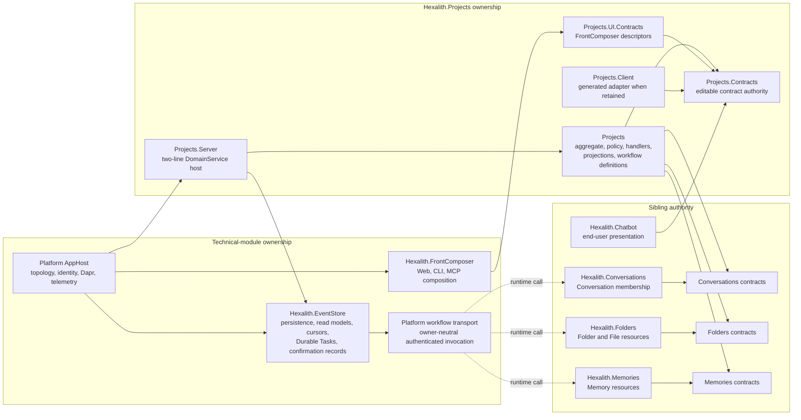
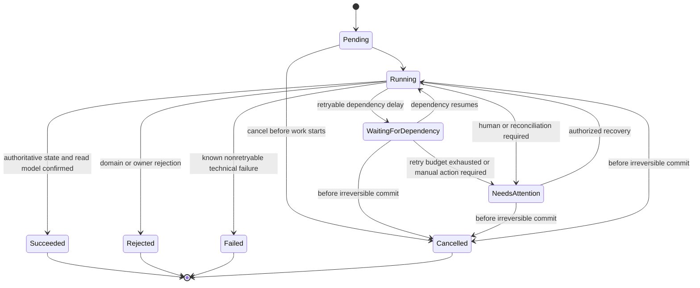
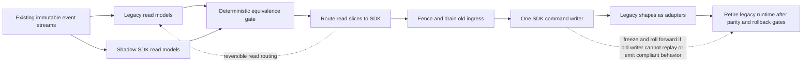
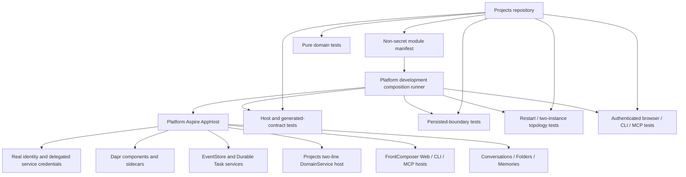

# Architecture Spine — Hexalith.Projects

## Design Paradigm

Hexalith.Projects is a domain-centric, CQRS/event-sourced vertical slice hosted by `Hexalith.EventStore.DomainService`. One Project aggregate owns Project invariants; incremental read models own query shape; platform Durable Tasks orchestrate cross-context work as forward-recovery sagas. Runtime, topology, identity, persistence, telemetry, and presentation adapters remain outside the domain module.



Solid arrows are compile-time/package dependencies; dashed arrows are authenticated runtime invocation. Generic EventStore code depends only on owner-neutral workflow transport, never on a sibling domain contract.

## Invariants & Rules

### AD-1 — [ADOPTED] DomainService is the runtime boundary

- **Binds:** all Projects capabilities; ARCH-001; OPS-001
- **Prevents:** a second Projects-owned implementation of hosting, Dapr persistence/publication, subscription, projection, cursor, health, telemetry, or topology semantics.
- **Rule:** Projects supplies contracts, pure domain behavior, handlers, projections, and workflow definitions to `Hexalith.EventStore.DomainService`; technical runtime behavior is consumed from platform modules and is not reimplemented in this repository.

### AD-2 — [ADOPTED] Authority is assigned by bounded context and adapter role

- **Binds:** FR-1 through FR-24; ARCH-002; CLIENT-001; MCP-001
- **Prevents:** duplicated domain authority and authority expansion through a UI, CLI, MCP, Chatbot, or service caller.
- **Rule:** Projects owns Project policy and stable Project contracts; EventStore/platform owns generic runtime and durable workflow; `Projects.UI.Contracts` owns descriptors; FrontComposer/platform hosts own runtime surfaces and credentials; Chatbot owns candidate/proposal presentation; Conversations, Folders, and Memories retain authority over their resources.

### AD-3 — [ADOPTED] An Active or context-usable Project always has one authorized Folder

- **Binds:** FR-1, FR-2, FR-5, FR-8, FR-12, FR-16, FR-20, FR-23; NFR-4
- **Prevents:** a folderless Project appearing Active or usable as context while preserving recovery access to archived history.
- **Rule:** Project lifecycle is exactly `Active` or `Archived`; no Project appears Active, becomes a candidate, or is usable as context until exactly one authorized Folder is bound and the required read model confirms completion. Pre-activation progress exists only as Durable Task state. An authorized Archived legacy record lacking valid Folder evidence may appear only in safe recovery/list/operator views as `Unavailable`, without references or context, so FR-23 can repair it.

### AD-4 — [ADOPTED] Durable Task state is the truth for consequential work

- **Binds:** FR-1, FR-3, FR-4, FR-6 through FR-15, FR-21 through FR-23; NFR-3, NFR-4, NFR-8
- **Prevents:** acknowledgement, notification, worker memory, or mutable terminal outcomes from being treated as durable completion.
- **Rule:** Platform task records durably hold checkpoints, fenced worker ownership, leases, receipts, retries, the recorded irreversible checkpoint, compensation/reconciliation state, and terminal outcome. One durable transition authority rejects every transition absent from the state graph; restart, lease expiry, two-instance execution, and duplicate delivery converge from the last checkpoint. Active tasks remain pollable until terminal. `Succeeded`, `Rejected`, `Failed`, and `Cancelled` are immutable; `Rejected` is a known domain/owner denial, `Failed` is a known non-retryable technical failure, and an unknown partial outcome becomes recoverable `NeedsAttention`. Cancellation is allowed only before the irreversible checkpoint; afterward it returns conflict plus safe current status. HTTP `202` and SignalR never prove completion.



### AD-5 — [ADOPTED] Confirmation-required admission uses bound artifacts and scoped idempotency

- **Binds:** FR-4, FR-7, FR-8, FR-11, FR-14, FR-15, FR-23; NFR-1, NFR-4, NFR-8
- **Prevents:** Boolean confirmation, replay, target substitution, changed-request reuse, duplicate work after a lost response, and unnecessary confirmation of actor-selected additive work.
- **Rule:** The canonical action classification identifies confirmation-required actions: archive, restore, Conversation move, Folder replacement, unlink, ambiguous-resolution confirmation, and proposed-creation confirmation. They require a server-issued 15-minute Confirmation Artifact bound to Tenant, actor, action, targets, normalized request hash, Preview, and current versions. Actor-selected additive Conversation/File/Memory links, initial Folder setting, Setup update, and direct creation are task-only and require no second confirmation. Idempotency scope is `(Tenant, actor, operation, key)`; equivalent reuse returns the original task, changed-request reuse conflicts, and the terminal task result plus idempotency record remain together for at least 30 days or the longer result lifetime.

### AD-6 — [ADOPTED] Migration preserves history and repository authority

- **Binds:** NFR-10, NFR-11; ARCH-001, ARCH-002, ID-001, API-001
- **Prevents:** event-history rewrite, unsafe dual command writes, implicit sibling mutation, and unversioned external dependencies.
- **Rule:** Existing committed events remain readable and unchanged. Projects planning never authorizes a sibling mutation. Every EventStore, FrontComposer, Conversations, Folders, Memories, Chatbot, identity, or Builds change requires separate repository-local scope approval, a named owner, a pinned revision/version, entry criteria, verification evidence, and rollback. Only root-declared repository/submodule checkouts are admissible evidence; nested submodules are not initialized. Historical implementation is evidence, not release authorization.

### AD-7 — [ADOPTED] Diagnostics are current, bounded, and authority-neutral

- **Binds:** FR-12 through FR-18, FR-22, FR-24; NFR-1, NFR-6, NFR-8
- **Prevents:** persisted inference history, unbounded troubleshooting payloads, and semantic drift between surfaces.
- **Rule:** Resolution Traces are request-scoped, current-only, and nonpersistent. Safe Diagnostic Export is separately authorized and bounded under AD-21. Web, CLI, MCP, and Chatbot preserve the same server semantics without gaining authority; autonomous consequential MCP mutation remains gated.

### AD-8 — [ADOPTED] Creation is Folder-first

- **Binds:** FR-1, FR-15; NFR-4
- **Prevents:** an incomplete Project stream or observable interval in which an Active Project has no Folder.
- **Rule:** A Durable Task reserves the ProjectId and creates or validates the authorized Folder through a Folders provisioning contract keyed to the hidden ProjectId; pre-activation resources are visible only to the task actor and authorized reconciliation principals, never in general Project/Folder listings or context. It then submits one Project creation commit already containing the Folder binding. Public visibility waits for the read model. Folder-created/Project-uncommitted work enters `NeedsAttention` and is resumed by reconciliation; Projects never automatically deletes the Folders-owned resource.

### AD-9 — [ADOPTED] Durable execution is platform-owned and workflow meaning is Projects-owned

- **Binds:** all consequential FRs; REL-001; TEST-001
- **Prevents:** per-domain task engines and operational task state inside Project event history.
- **Rule:** EventStore/platform owns generic task IDs, admission, records, leases, checkpoints, receipts, retry scheduling, polling, cancellation enforcement, recovery, retention, and transition integrity. Projects owns versioned workflow definitions, domain transition guards, dependency steps, completion predicates, and Recovery Action Codes.

### AD-10 — [ADOPTED] Conversations owns Conversation-to-Project membership

- **Binds:** FR-6, FR-7, FR-11, FR-12, FR-14; NFR-1, NFR-4
- **Prevents:** two writable membership representations and ambiguous Conversation ownership.
- **Rule:** `Hexalith.Conversations` is the sole system of record for membership. Projects owns intent, actor/Project policy, orchestration, metadata-only audit, and a rebuildable Tenant-scoped reverse index; the Project aggregate stores no Conversation membership. Success requires authoritative Conversations state and Projects read-model convergence.

### AD-11 — [ADOPTED] Projects owns references, not foreign resources or authority

- **Binds:** FR-8 through FR-13, FR-16 through FR-18; NFR-1, NFR-5
- **Prevents:** copied Folder/File/Memory payloads, duplicated resource lifecycle, and cached authorization granting writes.
- **Rule:** The Project aggregate owns one Folder binding and File/Memory stable-reference membership. Folders and Memories own existence, payload, lifecycle, and authorization. Context contains only current authorized metadata; stale, rebuilding, unavailable, or excluded evidence is represented explicitly and foreign payloads are never copied.

### AD-12 — [ADOPTED] Cross-context mutation uses an orchestrated forward-recovery saga

- **Binds:** FR-1, FR-6 through FR-11, FR-14, FR-15, FR-23; NFR-3, NFR-4
- **Prevents:** distributed-transaction assumptions, blind retries after lost responses, and destructive rollback of foreign resources.
- **Rule:** Each owner call carries a deterministic task/step idempotency key and expected owner version. The task persists the owner's durable receipt before advancing and queries authoritative status before retrying an unknown response. Compensation uses only an explicit idempotent owner command; irreducible partial work becomes `NeedsAttention`. `Succeeded` requires authoritative end state and relevant read-model confirmation.

### AD-13 — [ADOPTED] Confirmation Artifacts are opaque durable platform records

- **Binds:** FR-4, FR-7, FR-8, FR-11, FR-14, FR-15, FR-23; AGENT-001
- **Prevents:** token disclosure, stateless replay, actor/target substitution, and confirmation/task admission races.
- **Rule:** The caller receives a high-entropy opaque token. Platform storage retains only its protected hash with Tenant, actor/delegation, action, targets, normalized request hash, Preview digest, owner versions, schema version, issue/expiry time, consumption state, idempotency scope, and admitted task ID. Validation, single-use consumption, and task admission are atomic. After consumption, an exactly equivalent retry with the same scoped idempotency key returns the retained admitted task; any unmatched token replay, altered request, stale version, expiry, or binding mismatch fails closed with `409` and admits no task.

### AD-14 — [ADOPTED] Query trust is incremental and rebuildable

- **Binds:** FR-2, FR-5, FR-12, FR-13, FR-16 through FR-20, FR-22; NFR-3, NFR-5, NFR-7
- **Prevents:** per-reference live fan-out, copied foreign authority, and silent use of stale evidence.
- **Rule:** Named incremental projections implement `IAsyncDomainProjectionHandler` over `IReadModelStore`/`IReadModelBatchStore` with explicit `ReadModelWritePolicy`; `IDomainProjectionHandler` is reserved for identified full-replay compatibility only. Queries implement `IDomainQueryHandler`; cursors use `IQueryCursorCodec` and authenticated `QueryCursorScope`. EventStore storage owns bounded list, detail, reference, audit, task, and reverse-membership views. A rebuildable Tenant-scoped Reference Trust Index stores safe owner metadata, owner version/watermark, authorization outcome, and freshness only. Normal context includes `Current` evidence; explicit refresh uses owner batch APIs with bounded concurrency; mutations always reauthorize with the owner. Persisted end-state, duplicate dispatch, rebuild, cursor-scope, and cursor-tamper evidence are mandatory.

### AD-15 — [ADOPTED] One Project stream owns atomic Project invariants

- **Binds:** FR-1, FR-3, FR-4, FR-8 through FR-11, FR-19, FR-23; NFR-4, NFR-5
- **Prevents:** divergent cap, uniqueness, lifecycle, setup, or reference membership across partitioned writers.
- **Rule:** One Project aggregate stream owns lifecycle, setup, exactly one Folder binding, and the combined unique File/Memory reference identity set capped at 5,000 excluding the Folder. Commands serialize per Project; all query shape is projected. Partitioning requires measured contention or replay-budget failure and a coordinated migration.

### AD-16 — [ADOPTED] Versioned .NET contracts are the sole editable contract authority

- **Binds:** FR-1 through FR-24; NFR-10; ARCH-002; API-001; MCP-001
- **Prevents:** editable C#, OpenAPI, JSON Schema, client, MCP, CLI, and runtime vocabularies from drifting.
- **Rule:** Dependency-light `Hexalith.Projects.Contracts` owns commands, events, identifiers, DTOs, enums, action-admission classification, compatibility metadata, and all operation schemas, security semantics, and domain/wire vocabulary. It must not depend on FrontComposer Shell, Fluxor, Fluent UI, `Microsoft.AspNetCore.App`, Dapr, or Aspire. Platform generators derive and live-host-verify OpenAPI, clients, JSON schemas, MCP/CLI schemas, and runtime descriptors. Legacy shapes use explicit adapters. `Projects.UI.Contracts` depends inward on Contracts and contains presentation metadata only; it cannot redefine operations, vocabulary, or security. `Hexalith.Builds` is the sole version owner for NSwag and Fluxor.

### AD-17 — [ADOPTED] Cutover is shadow-read first and single-writer always

- **Binds:** Epic-6, Epic-7; NFR-4, NFR-10, NFR-11; ARCH-001, PERF-001
- **Prevents:** flag-day replacement, undetected projection drift, and concurrent old/new command writers.
- **Rule:** Before cutover, inventory existing events, state keys, read models, cursors, routes, clients, identities, in-flight work, consumers, Active folderless Projects, pending-Folder work, and other partial records. The SDK writer gate requires one convention-discovered `projects` aggregate deriving from `EventStoreAggregate<TState>`, `DomainResult` command behavior equivalent to current success/rejection/no-op semantics, instance `Apply` replay for every historical success/rejection event including `ProjectFolderCreationPending`, command-discriminator compatibility or explicit adapters, and deterministic golden-history plus command equivalence against the current fold. No Projects-owned `IDomainProcessor` remains after writer cutover. Replay existing streams into shadow SDK read models; compare deterministic output, keys, watermarks, cursors, and Tenant isolation; switch read routes independently with reversible routing. Fence and drain old command ingress before atomically selecting one SDK writer. Legacy HTTP/client shapes adapt to that writer. Command rollback is permitted only while the old writer can both replay every new event and emit spine-compliant events and observable behavior; otherwise freeze mutation and roll forward. Every affected legacy record receives an idempotent compensating Durable Task with durable receipts/status recovery and terminal disposition before its value slice switches; owner resources are never automatically deleted.



### AD-18 — [ADOPTED] Platform-generated ULIDs identify governed work

- **Binds:** FR-1 through FR-24; ID-001
- **Prevents:** GUID-shaped identifiers, caller-selected aggregate identity, and cross-surface identity drift.
- **Rule:** The platform generates ULIDs for Project, task, message, correlation, causation, event, and receipt identities. ProjectId is reserved at task admission, stable across equivalent retries, and hidden until activation. Tenant and actor come from authenticated server context; aggregate identity is `Tenant/projects/ProjectId`. Owner-defined foreign identifiers remain opaque and are never GUID-parsed. Persisted legacy IDs remain readable.

### AD-19 — [ADOPTED] One observable transport mapping binds every surface

- **Binds:** FR-1 through FR-24; API-001; MCP-001; CLI-001
- **Prevents:** acknowledgement-as-success, unsafe disclosure, and surface-specific meanings for task or recovery state.
- **Rule:** Authorized read computations return `200` with `Complete`, `Partial`, or `Unavailable`; denied and nonexistent collapse to safe `404` whose body exposes no protected logical `Denied` detail. New admission and an exactly equivalent retry bound to the retained original task return `202` with that task location; task polls return `200` for every status. Invalid input is `400`; stale/expired confirmation, unmatched consumed-artifact replay, post-irreversible cancellation, and changed-request idempotency are `409`, with `RenewPreview` for expired/stale confirmation; admission overload is `429`; failure to persist admission is `503` and creates no task. SignalR only sends a versioned re-query notification. `Rejected`, `Failed`, `NeedsAttention`, and `Cancelled` follow AD-4 semantics.

### AD-20 — [ADOPTED] Cross-service authorization carries actor and workload identities

- **Binds:** all FRs; NFR-1, NFR-2; SEC-001; CLIENT-001
- **Prevents:** service-only authority, raw-token forwarding, confused-deputy behavior, and production allow-all composition.
- **Rule:** An immutable context carries server-derived Tenant, original actor, authenticated caller/workload service, delegation identifier/scopes/audience, and correlation/task IDs. Platform admission validates both credentials and fails startup on incomplete authority, audience, signing, or key configuration. Projects evaluates actor/action/Project policy; each owner reauthorizes its resource; queries filter again. Allow-all implementations exist only in explicit test composition.

### AD-21 — [ADOPTED] Safe Diagnostic Export is synchronous and non-retained

- **Binds:** FR-21, FR-22, FR-24; NFR-1, NFR-6, NFR-7, NFR-8
- **Prevents:** retained diagnostic payloads, unrecoverable asynchronous results, cursored extraction, and unbounded export load.
- **Rule:** `projects.safe-diagnostic-export.v1` is a separately authorized synchronous read-only query exposed with equivalent semantics through Web, CLI, and MCP, never Chatbot. FR-22 read permission does not imply export permission. It uses one diagnostic snapshot and a platform-owned two-lease per-Tenant gate. A named stable reference sort and newest-first audit sort with stable tie-breaking produce one complete encoded response, including envelope and truncation metadata, no larger than 1 MiB, 500 reference rows, and 100 audit rows. The response reports included/omitted counts and safe truncation reason codes without excluded detail; unavailable components use safe markers. Every attempt/outcome is metadata-audited; bytes, cursors, and tasks are never stored or created.

### AD-22 — [ADOPTED] Project creation events evolve additively

- **Binds:** FR-1, FR-23; NFR-4, NFR-10
- **Prevents:** history rewrite, `V2` event forks, and new folderless creation intervals.
- **Rule:** `ProjectCreated` gains a serialization-tolerant optional Folder binding that is mandatory on every new write and nullable only during historical replay. New writes stop emitting `ProjectFolderCreationPending`; its deserializer and apply behavior remain supported. Historical Active folderless, pending-Folder, and other partial state is excluded from Active reads and enters the compensating Durable Task process in AD-17. `ProjectFolderSet` remains for legacy repair and confirmed replacement.

### AD-23 — [ADOPTED] Restore establishes Folder validity before activation

- **Binds:** FR-23; NFR-4
- **Prevents:** an Archived Project becoming Active with missing or unauthorized Folder evidence.
- **Rule:** Restore validates or establishes an authorized Folder while the Project remains Archived. A replacement emits `ProjectFolderSet` before `ProjectRestored` in one EventStore command commit. Task success waits for the Active read model; created-Folder/failed-activation work follows AD-8 recovery.

### AD-24 — [ADOPTED] The target Projects package graph is domain-only

- **Binds:** Epic-6 through Epic-8; ARCH-001, ARCH-002, BUILD-001, TEST-001
- **Prevents:** domain-owned technical layers while preserving repository-local build, run, debug, and test capability.
- **Rule:** Retain packable `Projects.Contracts`, `Projects`, and `Projects.Testing`; `Projects.Testing` contains only Projects-specific builders, replay conformance, leakage, and Tenant-isolation helpers, while reusable fixtures live in `EventStore.Testing(.Integration)`. Add non-packable `Projects.UI.Contracts`; retain non-packable `Projects.Server` only as the assembly-explicit two-line DomainService host; retain `Projects.Client` only as a generated adapter while supported consumers require it. Move/retire `Projects.Client.Generation` and `.Shared` only after the platform generator reproduces client output and compatibility fingerprints. Retire Projects-owned Infrastructure, Workers, ServiceDefaults, Aspire, AppHost, UI, MCP, and CLI runtime projects only after platform replacements and equivalent local lanes pass. The release-package manifest enforces this exact target inventory.

### AD-25 — [ADOPTED] Local execution uses a platform development composition runner

- **Binds:** Epic-6 through Epic-8; NFR-11; TEST-001
- **Prevents:** loss of local operability after technical-layer extraction and reintroduction of a Projects-owned AppHost.
- **Rule:** A checked-in non-secret, versioned module manifest names the assembly-explicit two-line Projects host, deterministic domain/app/resource IDs, UI descriptor assembly, sibling dependencies, and fixture profile, with all paths repository-relative. A pinned independently consumable platform .NET tool in `.config/dotnet-tools.json` validates the manifest and owns EventStore, Dapr, identity/secret injection, FrontComposer, ports, health, telemetry, and Aspire lifecycle without edits to its repository. This repository owns stable run and teardown commands, local domain/host/descriptor debugging, and manifest-aware fixtures that are thin runner consumers and contain no Projects-owned topology, Dapr, port, credential, or lifecycle definition. Pure-domain, host-contract, persisted-boundary, restart, two-instance, and authenticated browser/CLI/MCP lanes plus clean-checkout and CI package-mode parity must pass before old runtime projects are removed; Debug-only source references are insufficient.

### AD-26 — [ADOPTED] Durable audit and product analytics are separate channels

- **Binds:** FR-21, FR-22, FR-24; NFR-1, NFR-8; SM-7, SM-8, SM-C4
- **Prevents:** analytics availability or 30-day retention from controlling domain/audit truth.
- **Rule:** Metadata-only audit truth retained at least 365 days includes task admission and terminal outcome; confirmation use/cancellation and stale/replay/tamper rejection; authorization denial; confirmed Project mutations/outcomes; manual reconciliation; export attempt/outcome; and stable upstream receipt IDs. Stable audit identities deduplicate equivalent idempotent retries. Intermediate task states, polls, retries, dependency latency, notifications, unused expiry, and read-only Resolution Traces are operational telemetry only. Separate versioned Projects/Chatbot outcome signals flow through a platform analytics bus to rolling 30-day aggregates and contain only state/reason/action codes, timestamps, ephemeral correlation, and correction category. Analytics is not domain history and never authorizes behavior.

### AD-27 — [ADOPTED] Platform admission owns back-pressure and dependency policy

- **Binds:** NFR-3 through NFR-8; PERF-001; OPS-001
- **Prevents:** divergent surface quotas, retries inside domain handlers, and acceptance without durable capacity.
- **Rule:** Gateway/task admission enforces per-Tenant 100 metadata reads/second with burst 200, 20 mutation admissions/second with burst 40, 1,000 nonterminal tasks, two export leases, two-second interactive dependency timeout, ten-second durable-step timeout, and at most three idempotent retries within 30 seconds before truthful waiting/intervention. Projects supports 10,000 Projects per Tenant, 5,000 references per Project, and an online/query performance shape of 100,000 audit records per Project; the audit figure is not a retention cap, and older records inside the mandatory 365-day window move losslessly to a bounded queryable platform archive. Hard Project/reference/task admission limits reject before partial durable work with safe `409` or `429` semantics; audit pressure never discards required records. Cursor pages default 50/max 200. At the authenticated warm steady-state median shape of 1,000 Projects/500 references, metadata reads have p95 under 500 ms; at supported maxima, p95 is under one second; Durable Task admission p95 is under 500 ms when required dependencies are available. Domain handlers perform no infrastructure retry or per-surface quota logic.

### AD-28 — [ADOPTED] The platform owns the operational and environmental envelope

- **Binds:** NFR-1 through NFR-7, NFR-11; OPS-001; BUILD-001
- **Prevents:** provider-specific infrastructure in Projects and different logical dependencies across local, CI, and production.
- **Rule:** The platform AppHost owns environment topology, Dapr component/provider binding, authenticated encryption in transit, managed encryption at rest, identity/KMS/secrets and rotation, mTLS/network policy, health/telemetry, non-root container publication, deployment, and primary-region recovery policy. Projects declares required capabilities and configuration schema only. Local, CI, and production bind the same logical resource contract. The platform configuration and evidence must enforce 99.9% monthly availability, 15-minute service RTO, accepted-task recovery or truthful `NeedsAttention` within five minutes, and committed-event RPO 0 inside the configured primary-region durability domain.

### AD-29 — [ADOPTED] MCP is a contained platform adapter

- **Binds:** FR-21, FR-22, FR-24; NFR-1, NFR-9; MCP-001
- **Prevents:** agent surfaces from bypassing actor authority, confirmation, admission, or release containment.
- **Rule:** FrontComposer/platform composes MCP over the same versioned contracts and dual-principal authorization. MCP cannot confirm end-user resolution or proposal choices, bypass Preview/Confirmation/Task admission, or expand permissions. Consequential MCP mutation remains disabled until readiness and release gates pass. Exact tool inventory and interaction presentation belong to UX/API work under these limits.

### AD-30 — [ADOPTED] Release acceptance is machine-checkable and fail-closed

- **Binds:** NFR-9 through NFR-11; Epic-6 through Epic-8; all audit P1/P2 findings
- **Prevents:** implementation from starting on unresolved external gates and failed, skipped, or unavailable evidence from being represented as passing.
- **Rule:** The canonical evidence source is `_bmad-output/planning-artifacts/implementation-readiness-traceability-matrix.yaml`, schema `hexalith.readiness-evidence.v1`; the required Markdown matrix is a human view over the same row identities. `Hexalith.Builds` owns the `hexalith-evidence validate` capability. Each stable row key maps requirement/finding, AD, UX journey, story, repository and named owner, pinned revision/dependencies/gates, environment/fixture, exact command, evidence artifact, estimate, status, and release disposition. Validation rejects duplicate/missing keys, unresolved placeholder values, absent owner/version/command/artifact, incomplete FR/NFR/P1/P2/release categories, failed critical evidence, unexplained critical skips, and `passed` for unavailable environments. Placeholder reconciliation is atomic and grants no implementation authority; no replacement story is created for execution or becomes `ready-for-dev`, and sprint reconciliation does not occur, until an independent superseding assessment returns exactly `READY`. Production, consequential autonomous MCP mutation, and proposed-Project confirmation remain blocked until Story 8.11 deployment/rollback evidence passes and Jerome and John record dated terminal acceptance; a blocker or unavailable environment cannot complete Story 8.11 or a critical release case.

### AD-31 — [ADOPTED] Canonical creation classifies metadata before admission

- **Binds:** FR-1, FR-15, FR-19; NFR-1, NFR-10; API-001
- **Prevents:** user text selecting its own sensitivity, protected parsing before authorization, inconsistent direct/proposal validation, and silent expansion of the legacy creation path.
- **Rule:** Canonical Create Project accepts exactly `public_metadata`, `tenant_sensitive`, `credential_sensitive`, or `secret` at `projectMetadata.metadataClass`, assigned by authenticated integration policy and never inferred from user text. Authorization precedes protected metadata parsing; malformed or unknown values return `400 ValidationFailure` with metadata-only `details.rejectedField = projectMetadata.metadataClass`, and no command is submitted. One `SensitiveMetadataTierValidator` governs direct creation and proposal confirmation; `secret` is a classification label, never permission to store secret content. Only the historical unversioned name-only request is a v1 compatibility shape and remains accepted/readable throughout v1; retirement requires a major version, migration notice, usage evidence, compatibility tests, and rollback evidence.

### AD-32 — [ADOPTED] One response snapshot governs context usability

- **Binds:** FR-2, FR-3, FR-5, FR-12 through FR-20; NFR-1, NFR-3, NFR-5
- **Prevents:** adapters inventing incompatible response fields, silently treating stale evidence as usable, selecting unauthorized candidates, or admitting Chatbot first response on insufficient evidence.
- **Rule:** Applicable list, open, resolution, context, Conversation-start, and proposal-recovery results contain `responseState`, `asOf`, authorized `projectVersion` when disclosable, conditional `resolutionResult`, metadata-only `components`, and `recoveryActions`. Components use inclusion `Included|Excluded`, freshness `Current|Stale|Rebuilding|Unavailable`, safe reason, and last-verified time; resolution uses `NoMatch|SingleCandidate|MultipleCandidates` and reasons `ConversationLinked|ProjectFolderMatched|FileReferenceMatched|MemoryMatched|MetadataMatched`. `Complete` requires all required evidence current. `Partial` is usable only when Project, Folder, Setup, and first-response authorization evidence are current and every optional omission is represented. `Unavailable` blocks use when required evidence is missing/non-current; `Denied` discloses no protected detail. Neither state selects a resolution candidate. Chatbot admits first response only for `Complete|Partial`. `RefreshContext` is a read-only recomputation with a new snapshot and no maintenance audit; Setup update is idempotent, durable, and complete only after authoritative read-model confirmation. Recovery codes are exactly `None|Retry|RefreshContext|RequestPreview|RenewPreview|PollTask|ResolveNeedsAttention|SelectAlternative|ContactAdministrator`.

### AD-33 — [ADOPTED] Action authorization is role-specific and surface-invariant

- **Binds:** FR-1 through FR-24; NFR-1; SEC-001; CLIENT-001; MCP-001
- **Prevents:** Web, CLI, MCP, Chatbot, or delegated callers independently expanding an actor's authority.
- **Rule:** Every adapter enforces the same action matrix after AD-20 authentication; action-specific policy and owner reauthorization may narrow it, never widen it. Delegated service/workflow callers inherit the original actor's authority and never gain end-user confirmation authority.

| Action | Project User | Tenant Operator | Tenant Project Administrator |
| --- | --- | --- | --- |
| Confirm ambiguous resolution or proposed creation | Allowed | Denied | Denied |
| Archive or restore | Allowed when action-authorized | Allowed when action-authorized | Allowed when action-authorized |
| Add Conversation/File/Memory link or initially set Folder | Allowed | Denied | Denied |
| Move/unlink or replace Folder | Allowed | Denied | Allowed |
| Inspect pre-activation safe task status | Own permitted tasks through Chatbot | Allowed | Allowed |
| Reconcile `NeedsAttention` | Denied | Denied | Allowed |
| Safe Diagnostic Export through Web/CLI/MCP | Denied | Separately authorized | Separately authorized |

### AD-34 — [ADOPTED] Accessible completion is a release invariant

- **Binds:** FR-14, FR-15, FR-22 through FR-24; NFR-9; SM-5
- **Prevents:** functionally correct flows that cannot be completed by keyboard, assistive technology, zoom, or narrow viewport.
- **Rule:** Chatbot and operator presentation owners meet WCAG 2.2 AA with full keyboard operation, deterministic focus placement/restoration, accessible names/instructions, non-color-only state, status/live-region announcements, 200% zoom, and 320 CSS-pixel reflow without loss of action or evidence. Release evidence combines automated checks with authenticated manual keyboard and screen-reader review at small, median, and maximum data shapes; any unresolved critical or serious accessibility violation blocks the capability and release.

## Consistency Conventions

| Concern | Convention |
| --- | --- |
| Project lifecycle | Exactly `Active` and `Archived`; creation progress is never a lifecycle value. |
| Task and response vocabulary | Use the exact Task Status, Context Response State, Evidence Freshness State, Resolution Result, and Recovery Action Code vocabularies from the PRD; adapters do not create synonyms. |
| Commands and events | Imperative command names, past-tense event names, no `Command`/`Event` suffix, structured rejection events, pure `Handle` and `Apply`, persist before publish. |
| Event evolution | Additive and serialization-tolerant; no `V2` event types and no committed-history rewrite. |
| Identifiers | Framework-generated ULIDs for governed identities; server-derived Tenant/actor/aggregate identity; foreign IDs remain opaque; persisted legacy IDs stay readable. |
| Serialization and canonicalization | `System.Text.Json`; canonical request hashing rejects U+2028/U+2029 in identity/envelope fields and preserves byte-identical direct-server/generated-helper escaping for accepted descriptive metadata. Tests prove no collision with LF or literal backslash-`u`, stable unaffected hashes, and generated-file protection. Before canonical bytes change, inspect deployed fingerprints and gate a bounded legacy-hash strategy when affected values exist. Request equivalence is never broadened. |
| Contracts | Editable contract types live in `Projects.Contracts`; generated artifacts are changed through their generator/source contract and verified against a live host, never hand-edited. |
| Files and types | One handwritten C# type per same-named file; generated artifacts are exempt and remain generator-owned. |
| Query ordering and cursors | Stable deterministic ordering; EventStore-scoped opaque cursors bound to authenticated query scope; default 50 and maximum 200 rows. |
| Errors and disclosure | Use AD-19 status semantics and stable metadata-only reason/recovery codes; denial and nonexistence are boundary-indistinguishable; never echo rejected sensitive values or raw upstream problems. |
| Authentication and authorization | AD-20 dual-principal context; Tenant and actor are never trusted from body/header substitutes; every owner and every query reauthorizes. |
| Logging, telemetry, and audit | Source-generated structured logs with stable event IDs; metadata-only, low-cardinality fields; never log payloads, names, prompts, paths, tokens, secrets, or raw command bodies. |
| Outcome measurement | Rolling 30-day metadata-only Projects/Chatbot aggregates use the PRD definitions of eligible resolution, eligible resumption, continuity success, and context correction. SM-7 and SM-8 require at least 90%; SM-C4 is at most 5%. Expired, abandoned, degraded, unavailable, and timed-out eligible outcomes remain in denominators as specified; reports include numerator, denominator, excluded counts by safe reason, `Partial`, `Unavailable`, and correction counts. Zero eligible resumptions is `insufficient volume`, never 100%. Deterministic authenticated fixture parity is release evidence. |
| Configuration | Central package versions, no inline package pins, production fail-fast for missing security configuration, no provider-specific settings in domain packages. |
| Build and test | `.slnx` only; Debug plus project references locally, Release plus package references in CI; each test project runs individually; integration asserts persisted end state. |

## Stack

Verified against the checked-out root configuration, centralized package catalog, checked-out sibling revisions, and published/clean package evidence on 2026-07-16.

### Target and compatibility bindings

| Name | Version |
| --- | --- |
| .NET SDK feature-band policy | Current repository pin `10.0.302` with `rollForward: latestPatch`; the 2026-07-15 reviewed environment resolved `10.0.301` |
| Target framework | `net10.0` |
| C# | 14 (`LangVersion=latest`) |
| Hexalith.EventStore package binding | 3.67.3; API evidence only from published 3.67.3 packages or a clean 3.67.3 build |
| Hexalith.FrontComposer package-mode binding | 4.0.0; checked-out source is 4.0.1 and requires G-3 parity disposition |
| Aspire AppHost SDK / Aspire.Hosting platform binding | 13.4.6 |
| Dapr runtime current CI/test evidence | 1.18.0; not release-approved with SDK 1.18.4 until G-6 |
| Dapr .NET Client / ASP.NET Core current platform packages | 1.18.4; not release-approved with runtime 1.18.0 until G-6 |
| Microsoft Fluent UI Blazor presentation binding | 5.0.0-rc.4-26180.1; prerelease gate G-6 |
| ByteAether.Ulid | 1.3.8 |
| NSwag.MSBuild | 14.7.1 |
| xUnit v3 | 3.2.2 |
| Shouldly | 4.3.0 |
| NSubstitute test binding | 6.0.0-rc.1; prerelease gate G-6 |

### Migration and catalog-only inventory

| Name | Version |
| --- | --- |
| CommunityToolkit.Aspire.Hosting.Dapr migration adapter | 13.4.0-preview.1.260602-0230 |
| Fluxor.Blazor.Web legacy UI migration input | 6.9.0 |
| Dapr.Workflow catalog entry, unselected pending G-1 | 1.18.4 |
| Unused `Dapr` central catalog entry | 1.17.9 |

## Structural Seed

### Target Projects-owned artifacts

| Artifact | Packaging | Contents |
| --- | --- | --- |
| `Hexalith.Projects.Contracts` | Packable | Versioned domain/wire vocabulary and compatibility metadata |
| `Hexalith.Projects` | Packable | Aggregate, domain policy, handlers, projections, workflow definitions |
| `Hexalith.Projects.UI.Contracts` | Non-packable | FrontComposer descriptors only |
| `Hexalith.Projects.Server` | Non-packable host | Assembly-explicit two-line DomainService host plus module registration |
| `Hexalith.Projects.Client` | Generated, conditional | Compatibility/consumer adapter while supported consumers require it |
| `Hexalith.Projects.Testing` | Packable | Projects-specific builders and replay/leakage/Tenant-isolation support only |
| Module manifest | Checked-in, non-secret | Host/app identity, descriptor assembly, sibling capabilities, fixture profile |

`Projects.Server` uses the equivalent of the following explicit assembly discovery contract while Server and domain remain separate assemblies:

```csharp
builder.AddEventStoreDomainService(typeof(ProjectAggregate).Assembly);
app.UseEventStoreDomainService();
```

`Projects.Client.Generation` and `.Shared` are migration inputs, not target artifacts; the platform generator must reproduce their output and compatibility fingerprints before they are retired.

### Canonical action-admission classification

`Projects.Contracts` owns this versioned classification; OpenAPI, Web, CLI, MCP, and Chatbot adapters generate from it and cannot infer confirmation policy from UI shape.

| Admission class | Stable action IDs | Contract |
| --- | --- | --- |
| Confirmation plus Durable Task | `project.archive`, `project.restore`, `conversation.move`, `project-folder.replace`, `context-reference.unlink`, `resolution.confirm`, `project-proposal.confirm` | AD-5 Preview and Confirmation Artifact, then idempotent task admission |
| Durable Task only | `project.create`, `project-setup.update`, `conversation.link`, `project-folder.set-initial`, `file-reference.link`, `memory.link` | Actor-selected action; authorize, validate, and admit idempotently without a second confirmation |
| Durable Task control | `task.cancel`, `task.reconcile` | Authorize against task/current checkpoint; AD-4 transition rules apply; reconciliation is Administrator-only |
| Synchronous read | list/open/resolve/context/refresh/validate/Conversation-start/audit/operator-read and `safe-diagnostic-export.create` | No task or Confirmation Artifact; export retains separate action authorization and AD-21 bounds |

### Repository-owned runner contract

```text
.config/dotnet-tools.json                  # pins the platform module runner and evidence validator
module/hexalith-projects.module.json       # hexalith.module.v1, non-secret, CI-validated
```

After `dotnet tool restore`, the stable clean-checkout contracts are:

```text
dotnet tool run hexalith-module run --manifest module/hexalith-projects.module.json
dotnet tool run hexalith-module down --manifest module/hexalith-projects.module.json
dotnet tool run hexalith-module test --manifest module/hexalith-projects.module.json --profile full
dotnet tool run hexalith-evidence validate _bmad-output/planning-artifacts/implementation-readiness-traceability-matrix.yaml
```

These commands are target entry contracts supplied only after the pinned platform/Builds tools satisfy G-4 and AD-30; they are not claims that the tools already exist.

### Local and platform topology



### External capability entry gates

| Gate | Required capability | Entry condition |
| --- | --- | --- |
| G-1 | EventStore/platform Durable Task engine and opaque Confirmation Artifact record | Repository-local approval, package/revision pin, durability and atomic-admission contract, restart/two-instance evidence; absent from current published/clean EventStore 3.67.3 API evidence; stale local binaries are inadmissible |
| G-2 | Conversations/Folders/Memories owner contracts | Pinned expected-version, deterministic idempotency, durable receipt/status query, safe batch-read, and explicit compensation capabilities required by each workflow |
| G-3 | FrontComposer runtime adapters | Reconcile root package-mode 4.0.0 with checked-out source 4.0.1 and record the patch disposition; then prove pinned descriptor discovery, generated Web/CLI/MCP schemas, real credential propagation, current MCP annotations/tasks, and authenticated parity |
| G-4 | Platform development composition runner | Approved manifest schema/version; pinned .NET tool in the repository tool manifest; checked-in valid module manifest; repository-owned run/teardown commands; repository-relative paths; deterministic IDs; runner-owned identity/secrets; thin manifest-aware fixtures; clean-checkout Debug and CI package-mode proof for persisted, restart, two-instance, and authenticated Web/CLI/MCP lanes before removal of Projects AppHost/Aspire/runtime code |
| G-5 | Platform identity, KMS, secrets, telemetry, and environment bindings | Fail-fast dual-principal admission, key rotation/revocation, encryption, health, deployment, and recovery evidence |
| G-6 | Runtime/toolchain alignment | Before release, align Dapr runtime and .NET SDK to an authoritative support-matrix-listed tuple or record a platform-owner-approved support exception, then prove it under live restart/two-instance fixtures. Treat `Dapr=1.17.9` as catalog hygiene and Dapr.Workflow 1.18.4 as unselected pending G-1. Fluent UI RC4, CommunityToolkit preview, and NSubstitute RC require explicit Builds/platform approval plus compatibility evidence; Fluxor 6.9 must be upgraded or intentionally held through Builds governance. No prerelease or stale migration pin silently becomes a target dependency. |

## Capability → Architecture Map

| Capability / Area | Lives in | Governed by |
| --- | --- | --- |
| FR-1 Create Project | Projects creation workflow, Project aggregate, EventStore task engine, Folders owner | AD-3, AD-5, AD-8, AD-9, AD-12, AD-13, AD-22 |
| FR-2 and FR-5 Open/List | EventStore read models and authorization-filtered handlers | AD-3, AD-14, AD-19, AD-20, AD-27 |
| FR-3 and FR-19 Setup update/validation | Projects aggregate, shared validators, Contracts | AD-15, AD-16, AD-18, conventions |
| FR-4 and FR-23 Archive/Restore | Projects lifecycle workflows and aggregate | AD-3 through AD-5, AD-12, AD-13, AD-23 |
| FR-6, FR-7, and Conversation part of FR-11 | Conversations authority, Projects workflow and reverse index | AD-4, AD-10, AD-12 through AD-14 |
| FR-8 through FR-11 Folder/File/Memory associations | Project aggregate references, Folders/Memories authorities, Projects workflows | AD-3, AD-11 through AD-15 |
| FR-12 through FR-15 Resolution and proposal | Projects current resolution policy, Chatbot presentation, Projects workflows | AD-5, AD-7, AD-10, AD-13, AD-14, AD-19, AD-29 |
| FR-16 through FR-20 Context and Conversation start | Projects query handlers, Reference Trust Index, Project read models | AD-3, AD-7, AD-11, AD-14, AD-19, AD-20 |
| FR-21 Audit | Project/event and platform security-event projections | AD-21, AD-26, AD-30 |
| FR-22 Operator read | FrontComposer/platform adapters over Projects contracts and read models | AD-2, AD-14, AD-19, AD-20, AD-29 |
| FR-24 Safe Diagnostic Export | Synchronous Projects query plus platform lease and audit | AD-7, AD-19, AD-21, AD-26, AD-27 |
| NFR-1 and NFR-2 Security/privacy/encryption | Platform identity/KMS/admission plus owner reauthorization | AD-11, AD-13, AD-20, AD-28 |
| NFR-3 and NFR-4 Availability/durability | EventStore runtime, Durable Tasks, Project aggregate | AD-3, AD-4, AD-9, AD-12, AD-28 |
| NFR-5 through NFR-7 Scale/bounds/back-pressure | Incremental read models, gateway/task admission, Projects contract bounds | AD-14, AD-15, AD-21, AD-27 |
| NFR-8 Retention/transience | Platform task/confirmation/audit stores and nonpersistent diagnostics | AD-4, AD-5, AD-7, AD-21, AD-26 |
| NFR-9 Accessibility | Chatbot and FrontComposer presentation owners | AD-2, AD-29, AD-30, AD-34 |
| NFR-10 Compatibility | Contracts, event evolution, adapters, staged cutover | AD-6, AD-16 through AD-18, AD-22 |
| NFR-11 Release evidence | Cross-repository machine-checkable evidence gate | AD-25, AD-28, AD-30 |
| Epic-6 Authorized reads | Contracts, SDK read models, trust index, generated read adapters | AD-14, AD-16, AD-17, AD-20, AD-25 |
| Epic-7 Durable decisions | Projects workflow definitions and platform Durable Tasks | AD-3 through AD-5, AD-8 through AD-13, AD-23 |
| Epic-8 Safe operations/release | Platform adapters, export, observability, environment and evidence gates | AD-21, AD-25 through AD-30 |

## Deferred

| Decision deferred | Revisit condition |
| --- | --- |
| Exact platform package, database/provider, lease algorithm, and scheduler for Durable Tasks and Confirmation Artifacts | G-1 platform design approval; ownership and behavioral rules in AD-4, AD-9, and AD-13 remain binding |
| Cryptographic hash, token generation, KMS product, and key-rotation mechanics | G-5 security design and threat-model review; opaque protected-hash and fail-closed rules remain binding |
| Project reference partitioning | Measured per-Project contention or replay-budget failure at the supported 5,000-reference shape |
| Exact Reference Trust Index storage schema and owner batch protocol | G-2 pinned owner contracts and Epic-6 performance test design; metadata/freshness/authority boundaries remain binding |
| `Projects.Client` retirement date and legacy HTTP/identifier/tool compatibility windows | Supported-consumer and persisted-usage evidence plus approved major-version and rollback plan |
| Exact MCP tool inventory, Chatbot interaction design, operator information architecture, and visual styling | UX/API artifacts; AD-2, AD-19, AD-20, and AD-29 constrain authority and semantics |
| Analytics bus/provider and aggregate-store implementation | Platform analytics design; AD-26 fixes channel separation, metadata boundary, and 30-day window |
| Cloud provider, region count, and cross-region disaster recovery | Deployment architecture; cross-region DR is outside v1, while AD-28 fixes the logical environment and primary-region obligations |
| Per-story fixture catalogs, test matrices, benchmark harnesses, and CI partitioning | Test design and story decomposition; AD-30 fixes evidence completeness and release behavior |
| Multiple Project Folders or multi-Project Conversation membership | A separately approved product requirement and conflict/authorization model |
