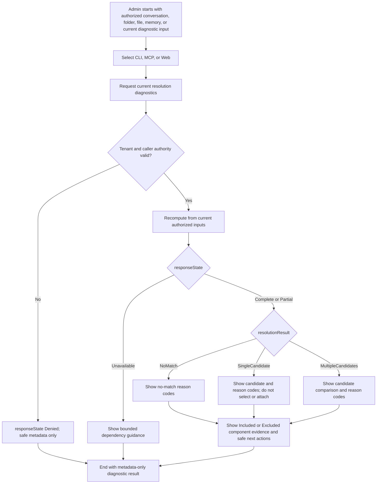

# Sprint Change Proposal: Resolve Implementation-Readiness Rerun 4

## 1. Issue Summary

The selected product baseline is internally consistent and complete at the requirements layer. All
24 Functional Requirements map to production-authority stories, all 11 Non-Functional Requirements
were assessed, and the selected PRD, addendum, Architecture Spine, UX specification, epics, and
traceability matrices hash-match the conformance checklist. The rerun nevertheless returned
**NOT READY** because the plan is not yet executable from its first production story and required
human/external evidence is absent or failed.

The four controlling blockers are:

1. Story 6.1's prerequisite chain is incomplete:
   `6.1-P1R -> {6.1-P0, 6.1-P2} -> 6.1-P3 -> authorized same-baseline architecture sign-off -> 6.1-P4 -> Story 6.1 specification readiness -> independent READY rerun`.
2. The Architecture Spine is technically sufficient, but the conformance checklist has no
   authorized human Solution Architect signature against the exact implementation baseline.
3. The canonical `release-smoke` evidence still records 19 passed and 56 failed cases. It must stay
   failed until a later authenticated live-topology run supplies a complete superseding record.
4. The independently owned Chatbot companion package `8.8-P3` and the Projects pin
   `evidence/epic8/8.8-P3-chatbot-companion-pin.json` are absent, blocking Stories 8.8 and 8.11.

The 11 readiness findings comprise four UX-alignment findings and seven epic/story-quality
findings. They do not invalidate the PRD or Architecture Spine, but they require current-authority
wording, provenance, scheduling safeguards, owner dispositions, and evidence sequencing to be
corrected before the next readiness assessment.

### Trigger and evidence

- Triggering entry story: **Story 6.1 — List and open Projects through supported authenticated
  paths**.
- Triggering assessment:
  `_bmad-output/planning-artifacts/implementation-readiness-report-2026-08-02-rerun-4.md`.
- Overall verdict: **NOT READY**.
- Requirements result: **24/24 FRs mapped; no missing or extra FR identifiers; 11 NFRs assessed**.
- Finding count: **11**.
- Independent baseline check: the selected artifact and matrix hashes equal those recorded in the
  conformance checklist.

### Problem statement

> Product scope and architecture invariants are complete, but production-authority implementation
> cannot begin because the first story's external prerequisites and exact-baseline human sign-off
> are incomplete. Release evidence is also non-acceptable because the authenticated smoke record
> failed and the independently owned Chatbot companion package is missing. Current UX and epic
> language contains four semantic mismatches and three planning-quality risks that must be repaired
> without manufacturing acceptance or weakening containment.

## 2. Change-Analysis Checklist

Status tokens: `[x]` complete, `[N/A]` not applicable, `[!]` unresolved gate preserved by this
proposal.

### 2.1 Trigger and context

- [x] **1.1 Trigger identified:** Story 6.1 is the first production-authority entry story; Stories
  8.8 and 8.11 carry the controlling downstream release-evidence gaps.
- [x] **1.2 Core problem classified:** failed/incomplete technical dependency and governance/evidence
  gates, plus artifact-alignment defects; not a new requirement or invalid MVP hypothesis.
- [x] **1.3 Evidence collected:** rerun-4 report, canonical planning artifacts, conformance checklist,
  traceability YAML/Markdown, and sprint-status prerequisite ledgers were inspected.

### 2.2 Epic impact

- [!] **2.1 Current epic execution:** Epic 6 is the correct first production epic but cannot start
  until the complete Story 6.1 chain returns an independent literal `READY` result.
- [x] **2.2 Epic-level change:** no new capability, epic, or story is required. Provenance,
  traceability labels, and bounded readiness conditions need adjustment.
- [!] **2.3 Downstream impact:** Epic 7 remains blocked behind the production read foundation;
  Stories 8.8 and 8.11 remain blocked by `8.8-P3` and release evidence.
- [x] **2.4 Obsolete/new epics:** none. Epic 8's cohesion exception needs explicit Product Owner and
  authorized Solution Architect disposition; rejection of the exception would require a separate
  structural course correction.
- [x] **2.5 Order and priority:** preserve Epic 6 -> Epic 7 -> Epic 8 and every existing prerequisite
  edge. Do not promote any story around the readiness gate.

### 2.3 Artifact conflicts

- [x] **3.1 PRD:** no conflict and no semantic change required.
- [!] **3.2 Architecture:** no spine change required; exact corrected-baseline hashes and authorized
  human sign-off are missing.
- [!] **3.3 UX:** four alignment defects require internal corrections; the external Chatbot
  companion remains independently owned and absent.
- [!] **3.4 Secondary artifacts:** epics/addendum provenance is stale, three story traceability labels
  are vague, historical-story scheduling needs a machine-checkable guard, and smoke/Chatbot evidence
  must remain non-acceptable until superseded.

### 2.4 Corrective options

- [x] **4.1 Direct Adjustment:** viable; Medium planning effort and Medium coordination risk.
- [x] **4.2 Potential Rollback:** not viable; no invalid production-authority implementation exists
  to roll back, and rollback would not create external evidence or a human signature.
- [x] **4.3 MVP Review / scope reduction:** not viable as this correction; all approved FRs/NFRs are
  release-binding, and removing product scope would not complete Story 6.1 or `8.8-P3`.
- [x] **4.4 Recommended path:** Direct Adjustment with implementation containment preserved.

### 2.5 Proposal and approval state

- [x] **5.1–5.5 Proposal components:** issue summary, impact analysis, option selection, exact edit
  proposals, ownership, sequencing, risks, and success criteria are recorded below.
- [x] **6.1–6.2 Internal review:** scope is Moderate and the proposed changes preserve requirements,
  architecture invariants, stable story IDs, stable evidence keys, and release containment.
- [x] **6.3 Approval:** approved by Jerome on 2026-08-03 after batch review.
- [N/A] **6.4 Structural sprint update:** no epic/story addition, deletion, or renumbering is
  proposed. Sprint tracking receives provenance/guard reconciliation only after approval.
- [x] **6.5 Handoff:** complete after approval; accountable routes are specified in Section 7.

## 3. Impact Analysis

### 3.1 Product and MVP impact

The PRD remains authoritative without modification. The MVP is still coherent, but implementation
timing is indeterminate until independently owned prerequisites are accepted. No production start
or release date should be inferred from this proposal.

### 3.2 Epic and story impact

#### Epic 6 — preserve the full entry chain

Epic 6 remains first and Story 6.1 remains `blocked-external`. Historical `6.1-P1` is a satisfied
input only; it does not authorize the drifted source/package/runner tuple. Neither planning edits nor
partial evidence may mark `P1R`, `P0`, `P2`, `P3`, architecture sign-off, or `P4` accepted.

Story 6.3 may remain one story only if its future story specification demonstrates one bounded
read-only slice with shared implementation fixtures and separately testable retrieval,
refresh/freshness, explanation, authorization, and leakage evidence. If that standard cannot be met,
split retrieval from refresh/explanation without introducing a forward dependency.

#### Epic 7 — no reordering or scope change

Epic 7 remains sequenced behind the supported production read foundation. No current rerun-4 finding
requires a new Epic 7 story.

#### Epic 8 — retain the exception only with authorized disposition

Stories 8.1–8.6 form the operator-value track; Stories 8.7–8.11 form the release qualification and
governance track. Retaining both tracks in Epic 8 avoids destabilizing story numbers and canonical
evidence keys. Product Owner and authorized Solution Architect must explicitly accept that cohesion
exception on the exact corrected baseline. If either rejects it, stop and run a new structural
course correction to split the epic and reconcile every affected matrix/story reference.

Stories 8.8 and 8.11 remain blocked. Projects must not author, infer, or substitute the missing
Chatbot-owned `8.8-P3` package.

#### Epics 1–5 — immutable implementation history

Historical contents stay intact as point-in-time evidence, but must be mechanically excluded from
future production scheduling. Narrative labels alone are insufficient because historical terms can
look executable when read out of context.

### 3.3 Artifact disposition

| Artifact | Impact | Proposed disposition |
| --- | --- | --- |
| Final PRD | Requirements complete | No change |
| PRD addendum | Current readiness provenance stops at E-16/rerun 3 | Add rerun-4/proposal records and make rerun 4 current after approval |
| Architecture Spine | Technical invariants sufficient | No semantic change |
| Architecture conformance checklist | Exact current hashes match, but human signature is pending and approved edits will change hashes | Apply edits first, recompute/review hashes, then obtain authorized same-baseline signature |
| UX specification | Four current-authority semantic defects | Apply the exact current-only/canonical-state/audit edits in Section 5 |
| `epics.md` | Rerun-3 provenance, vague finding labels, historical scheduling risk, pending Epic 8 disposition | Reconcile without changing story numbers or acceptance state |
| Traceability YAML/Markdown | Canonical keys already exist | Preserve row keys; use them verbatim from stories; regenerate Markdown only if YAML changes |
| `sprint-status.yaml` | Correct blocker states already present | Preserve statuses; add approved provenance and production-authority scheduling guard |
| Chatbot `8.8-P3` | Required external package absent | Chatbot owners produce/approve; Projects records the immutable pin only |
| `release-smoke` | 19 passed / 56 failed | Keep failed until a complete authenticated live-topology run supersedes it |

### 3.4 Technical and operational impact

This proposal changes planning authority only. It does not modify production code, external
repositories, package versions, deployment state, identity/KMS configuration, event history, or
release evidence. All external work remains subject to its repository owner, immutable revisions,
exact commands, expected artifacts, rollback/containment, and accountable approval.

## 4. Recommended Approach

Use **Direct Adjustment** and preserve the implementation freeze.

1. Approve this proposal without accepting any external gate.
2. Apply the internal UX, epic, addendum, traceability wording, and sprint-guard corrections.
3. Recompute hashes for every changed authoritative artifact, update the conformance baseline, and
   re-execute the affected conformance checks.
4. Obtain the authorized human Solution Architect signature and dated Epic 8 cohesion disposition
   against that exact corrected baseline. An AI-generated or pre-edit signature is invalid.
5. Complete and accept `6.1-P1R -> {6.1-P0, 6.1-P2} -> 6.1-P3` at immutable owner revisions.
6. Execute `6.1-P4` from the exact signed clean-checkout baseline, including all required
   restore/run/full-test/down/evidence-validation commands and executable rollback.
7. Require the Story 6.1 specification to pass the full ready-for-development standard, then run an
   independent implementation-readiness assessment. No production story becomes ready unless its
   result is exactly `READY`.
8. Independently acquire Chatbot `8.8-P3`, rerun authenticated release smoke, and complete the
   remaining Story 8.11 evidence before a terminal release decision.

### Options evaluated

| Option | Viability | Effort | Risk | Decision |
| --- | --- | --- | --- | --- |
| Direct Adjustment | Viable | Medium internal planning effort; external schedule uncommitted | Medium | **Recommended** |
| Potential Rollback | Not viable | High | High | Discards valid planning evidence and closes no external gate |
| MVP Review / scope reduction | Not viable for this trigger | High | High | Requirements are complete and release-binding; evidence/sign-off gaps remain |

### Scope classification

**Moderate.** The correction updates planning/UX authority and coordinates external acceptance; it
does not change the approved product or architecture, add/remove epics, or renumber stories. The
schedule remains blocked and uncommitted until owner evidence exists.

## 5. Detailed Change Proposals

The approved internal edits were applied as one corrected baseline on 2026-08-03. The hashes in
Section 8 record that baseline for the required conformance recheck and authorized architecture
sign-off; application accepts no external or governance gate.

### 5.1 PRD and Architecture Spine — preserve semantics

**OLD:** The final PRD and Architecture Spine define the current requirements and technical
invariants.

**NEW:** No semantic change.

**Rationale:** Rerun 4 found no missing requirement or architecture decision. The deficiency is
execution authority/evidence, not design coverage.

### 5.2 PRD addendum — advance current implementation provenance

**Artifact:**
`prds/prd-Hexalith.Projects-2026-05-24/addendum.md`

**OLD:** E-15/rerun 3 is described as the current implementation disposition; E-16 is the latest
approved correction.

**NEW after approval:**

- Add **E-17** for
  `implementation-readiness-report-2026-08-02-rerun-4.md`, disposition `NOT READY`, 24/24 FR
  coverage, 11 NFRs, 11 findings, and the four controlling blockers in Section 1.
- Add **E-18** for this approved proposal, recording Moderate Direct Adjustment and explicitly
  stating that it does not accept any prerequisite, signature, smoke result, or Chatbot package.
- Replace “E-15 is the current implementation disposition” with “E-17 is the current
  implementation disposition”; retain E-15 and E-16 as history.
- Preserve the implementation freeze and the Story 8.11 terminal release gate.

### 5.3 Epic provenance and containment — advance to rerun 4

**Artifact:** `epics.md`

**OLD:**

```yaml
implementationReadiness: 'NOT READY on 2026-08-02 rerun 3; production-authority implementation remains blocked'
```

The front matter and current-authority narrative list the rerun-3 report/proposal as the latest
readiness provenance.

**NEW after approval:**

```yaml
implementationReadiness: 'NOT READY on 2026-08-02 rerun 4; production-authority implementation remains blocked'
```

Add the rerun-4 report and approved proposal to `inputDocuments`; retain prior reports/proposals as
history. Update current-authority narrative to name rerun 4 without weakening the existing
`implementationBlockedUntil` or `releaseBlockedUntil` gates.

### 5.4 Story 6.1 — preserve the literal prerequisite chain

**Artifacts:** `epics.md`, conformance checklist, traceability matrices, `sprint-status.yaml`

**OLD:** The current plan already models the chain, but external steps and architecture sign-off are
open.

**NEW:** Preserve this normative sequence verbatim wherever summarized:

```text
6.1-P1R -> {6.1-P0, 6.1-P2} -> 6.1-P3
          -> authorized Solution Architect sign-off on the exact corrected baseline
          -> 6.1-P4 exact clean-checkout acceptance
          -> Story 6.1 specification readiness
          -> independent implementation-readiness result exactly READY
          -> Story 6.1 may become ready-for-dev
```

Retain `6.1-P1` only as historical satisfied input. Do not infer acceptance from “implemented,”
candidate revisions, partial command success, an unsigned checklist, or an AI attribution.

### 5.5 UX — remove persisted/replayable resolution-case semantics

**Artifact:** `ux-design-specification.md`

Replace every use of a stored/replayable “resolution case” in current-authority diagnostic flows
with current recomputation from authorized inputs and, when correlation is needed, an ephemeral
request/correlation identifier supplied by the active response.

Representative exact replacements:

| OLD | NEW |
| --- | --- |
| `resolution replay` | `current resolution recomputation from authorized inputs` |
| `Re-run or replay safe resolution diagnostics without changing project state.` | `Recompute safe resolution diagnostics from current authorized inputs without changing project state or persisting a resolution trace.` |
| `project or resolution case` | `project or current resolution diagnostic identified by authorized inputs or an ephemeral request/correlation identifier` |
| `Resolution case ID.` | `Ephemeral request/correlation identifier from the current diagnostic response; never a persisted resolution-case identifier.` |
| `Re-running a safe diagnostic or resolution replay.` | `Recomputing a safe diagnostic from current authorized inputs.` |
| `resolution case ID` in diagnostic forms | `ephemeral request/correlation identifier from the active response` |

The Confirmation Artifact word “replayed” remains unchanged; that use correctly describes rejected
reuse of a single-use confirmation and is unrelated to resolution-trace persistence.

### 5.6 UX — make Journey 1 use the canonical state dimensions

**Artifact:** `ux-design-specification.md`, Journey 1

**OLD:** Journey 1 branches on local outcomes `Resolved`, `Ambiguous`, `NoMatch`, and `Excluded`, and
offers “replay dry-run.”

**NEW:** Replace the flow with:



`resolutionResult` is only `NoMatch|SingleCandidate|MultipleCandidates`; `Denied|Unavailable` belong
to `responseState`, and `Included|Excluded` belong to component evidence.

### 5.7 UX — keep Preview/dry-run out of durable audit unless authorized

**Artifact:** `ux-design-specification.md`, Audit Timeline states

**OLD:**

```text
States: Normal event, warning event, failed action, dry-run event.
```

**NEW:**

```text
States: normal event, warning event, and failed action. Preview/dry-run observations are
telemetry-only unless the operation is explicitly mapped to an approved FR-21/AD-26 durable
audit category; the UX must not invent a generic durable dry-run event.
```

### 5.8 UX — preserve the external Chatbot companion boundary

**OLD:** The UX requires a separately owned Chatbot companion artifact, but no approved immutable
package or Projects pin exists.

**NEW:** Keep the requirement and add no substitute. Package `8.8-P3` must record the Chatbot owner
repository, immutable revision, companion contract version, approval date/authority, accountable
owners, authenticated commands/fixtures, artifact paths/hashes, results, terminal disposition, and
containment/rollback. Projects records only:

```text
evidence/epic8/8.8-P3-chatbot-companion-pin.json
```

### 5.9 Story traceability — replace vague labels with canonical stable IDs

**Artifacts:** `epics.md`, canonical traceability YAML/Markdown

Do not rename or recreate matrix rows. Use the existing exact keys and finding IDs:

| Story | OLD | NEW |
| --- | --- | --- |
| 8.1 | `findings (audit)` | `finding TEST-001; canonical evidence rows finding-test-001, fr-21, nfr-8, release-authenticated-persisted-boundary` |
| 8.6 | `findings (health)` | `findings SEC-001 and OPS-001; canonical evidence rows finding-sec-001, finding-ops-001, nfr-3` |
| 8.7 | `findings CLIENT-001/supply-chain; evidence row supply-chain` | `findings BUILD-001 and CODE-001; canonical evidence rows finding-build-001 and finding-code-001` |

`CLIENT-001` remains owned by Story 6.5 according to canonical row `finding-client-001`; do not
duplicate or silently reassign it to Story 8.7.

### 5.10 Historical scheduling — add a machine-checkable production-authority guard

**Artifacts:** `epics.md`, `sprint-status.yaml`, story-creation/sprint reconciliation validation

**OLD:** Narrative says Epics 1–5 are history and Epics 6–8 are production authority, but historical
story records remain in the same active files.

**NEW:** Add one authoritative scheduling field expressing production-authority epics `[6, 7, 8]`
and make story-creation/sprint reconciliation fail closed if asked to create, reopen, or schedule an
Epic 1–5 story as current production work. Historical `done` records remain readable and unchanged.
The guard must be covered by a deterministic positive test for 6.x–8.x and negative tests for
1.x–5.x; a prose note alone does not close EQ-M4.

If the current workflow cannot consume such a field, archive the historical plan into a clearly
referenced immutable artifact before scheduling begins, then regenerate the active index without
renumbering Epics 6–8.

### 5.11 Story 6.3 — retain only with a bounded story specification

**OLD:** Story 6.3 combines assembled context retrieval with refresh/freshness/explanation behavior.

**NEW:** Add a specification-readiness condition requiring one cohesive read-only implementation
slice, no forward dependencies, shared fixtures, and separately testable evidence for retrieval,
refresh/freshness, explanation, authorization, and payload leakage. If the story specification
cannot meet that condition, split it before `ready-for-dev` into retrieval and
refresh/explanation slices while preserving FR/NFR/evidence coverage.

### 5.12 Epic 8 — record the cohesion and milestone disposition

**OLD:** Epic 8 combines operator value and release qualification; Stories 8.7–8.11 can read as
ordinary user-value stories despite being release/quality/governance milestones.

**NEW:** Retain the existing two-track narrative and require dated Product Owner and authorized
Solution Architect acceptance on the exact corrected baseline. Explicitly label Stories 8.7–8.11
as release/quality/governance work with evidence outcomes, not independent end-user features. A
rejected disposition triggers a separate epic-split correction; it must not be resolved by an
unreviewed rename or renumbering.

### 5.13 Evidence — preserve failed/missing states until superseded

**OLD:** `release-smoke` is failed (19/56), `8.8-P3` is absent, and their dependent stories are
blocked.

**NEW:** No status reclassification. A superseding smoke record must contain the authenticated live
topology, pinned environment/revisions, exact command, deterministic authorized fixtures, all
required assets, complete result set, artifact hash, accountable owner disposition, and no skipped
critical cases. The Chatbot package must satisfy Section 5.8. Only then may the canonical rows and
dependent story gates be reconsidered.

## 6. Sequencing, Risks, and Success Criteria

### Required sequence

```text
proposal approval
  -> internal artifact corrections
  -> corrected-baseline hash refresh and conformance recheck
  -> authorized same-baseline architecture signature + Epic 8 disposition
  -> accepted P1R -> {P0,P2} -> P3
  -> P4 exact clean-checkout acceptance
  -> Story 6.1 specification readiness
  -> independent result exactly READY
  -> production story may become ready-for-dev
```

Chatbot `8.8-P3`, release smoke, and remaining Story 8.11 evidence may proceed under their owners but
cannot be inferred from implementation readiness and cannot be replaced by Projects-authored proof.

### Primary risks and mitigations

| Risk | Mitigation |
| --- | --- |
| Architect signs the pre-edit baseline | Apply all approved authority edits first; recompute hashes; sign only the exact corrected baseline |
| Partial external implementation is treated as acceptance | Require immutable revisions, exact commands, artifacts, rollback, and accountable owner dispositions |
| Failed smoke evidence is overwritten or summarized away | Preserve the 19/56 record and add a separate complete superseding record |
| Projects manufactures Chatbot evidence | Enforce repository authority; Projects stores only the accepted immutable pin |
| Historical stories are accidentally rescheduled | Machine-checkable `[6,7,8]` production-authority guard or archive fallback |
| Stable evidence identity drifts | Keep canonical row keys and use exact IDs in story traceability |
| Story 6.3 hides multiple delivery slices | Require specification proof; split only if the bounded-story test fails |

### Success criteria

This correction is complete only when:

1. The approved internal edits are applied and every changed authoritative artifact has a refreshed
   recorded hash.
2. An authorized human Solution Architect signs the exact corrected baseline and records the Epic 8
   cohesion disposition; no AI attribution is used as authorization.
3. `6.1-P1R`, `6.1-P0`, `6.1-P2`, and `6.1-P3` are accepted at immutable owner revisions in their
   required order.
4. `6.1-P4` passes every exact clean-checkout command and records expected artifacts, rollback, and
   owner approvals against the signed baseline.
5. The Story 6.1 specification passes readiness and an independent assessment returns exactly
   `READY` before any production story is marked ready.
6. The UX contains current-only recomputation semantics, canonical state dimensions, and no generic
   durable dry-run audit state.
7. Stories 8.1, 8.6, and 8.7 cite the exact stable finding IDs/row keys, and historical Epics 1–5
   cannot be scheduled as production work.
8. Chatbot owners deliver and approve `8.8-P3`, and Projects records the valid immutable companion
   pin without authoring a substitute.
9. A complete authenticated live-topology smoke run supersedes the 19/56 failure; the failed record
   remains historical evidence.
10. Story 8.11 receives all terminal deployment, rollback, security, quality, and stakeholder
    evidence before Jerome/John record a dated release disposition.

## 7. Ownership and Handoff Plan

| Owner | Required action after approval |
| --- | --- |
| Product Owner | Apply/coordinate approved planning edits; preserve blocked states; accept or reject the Epic 8 cohesion exception |
| UX owner | Apply Sections 5.5–5.8 and verify current-only/canonical vocabulary across CLI, MCP, and Web guidance |
| Authorized Solution Architect | Recheck and sign the exact corrected hashed baseline; record Epic 8 disposition; never sign on behalf of external owners |
| EventStore / Builds / Platform / Identity-Security owners | Complete and accept `P1R`, `P0`, `P2`, and `P3` at immutable revisions with rollback evidence |
| Test Architect | Validate P4 commands/artifacts, Story 6.1 specification readiness, independent readiness rerun, and superseding release smoke |
| Developer / planning maintainer | Apply exact provenance/traceability/scheduling-guard edits without changing acceptance states or story numbers |
| Chatbot Presentation and Test owners | Produce and approve the independently owned `8.8-P3` package |
| Projects Product Owner and Test Architect | Validate and record only the accepted Chatbot companion pin |
| Jerome / John | Record terminal production-release disposition only after Story 8.11 evidence is complete |

### Handoff boundaries

- Proposal approval authorizes planning-artifact correction only.
- It does not authorize production implementation, external-repository mutation, architecture
  signature, prerequisite acceptance, release-evidence acceptance, or deployment.
- No deadline is committed; external completion dates remain uncommitted until owners accept exact
  work and evidence.

## 8. Approval Record

**Decision:** Approved by Jerome on 2026-08-03 in batch mode.

**Authorized scope:** Moderate planning-artifact correction and the handoff defined in Section 7.
The approved internal correction was applied on 2026-08-03. Application does not accept any
external prerequisite, architecture signature, smoke result, Chatbot package, production
implementation, deployment, `READY` result, or release disposition.

### Application record

The following SHA-256 values define the corrected Projects-owned baseline. The conformance
checklist remains unchanged by this application and must be refreshed, rechecked, and signed by an
authorized human Solution Architect as a separate governance step.

| Corrected artifact | SHA-256 |
| --- | --- |
| `_bmad-output/planning-artifacts/prds/prd-Hexalith.Projects-2026-05-24/addendum.md` | `176b461b92915cff8b7a8c1128dd2b3fc5969faeb0e7fc82785c2418e28c909d` |
| `_bmad-output/planning-artifacts/epics.md` | `6802a8e1464aa603816cfbdbfd9988833fd87cf9493fde106e1d679321a66298` |
| `_bmad-output/planning-artifacts/ux-design-specification.md` | `cc957fa8a9b82602d70aea56b32c63b7d9b5a3da9970dcd621c3913f1c2cbca6` |
| `_bmad-output/planning-artifacts/implementation-readiness-traceability-matrix.yaml` | `43c4717dff092eb074df62eec6094d04f6eb2488af9ba97b296ef0aaab514905` |
| `_bmad-output/planning-artifacts/implementation-readiness-traceability-matrix.md` | `dcc5ec5ced261a6a15f5b27ad36127d9f6a552b92f134928f80002bcf053b723` |
| `_bmad-output/implementation-artifacts/sprint-status.yaml` | `8b5f929b1c2a7a7da3bb052d0e2b02a753d6da68a7249f9689d120df78604a63` |
| `_bmad-output/project-context.md` | `0a56aca34ae3be397e6d8499c0ba82c7b1c8562ba3c7e30011af4dcfc9c83156` |
| `tools/planning/validate_production_authority.py` | `ba0d421178aac1c971468a9323f93a230373ba5de98f17ce5849b22e77454163` |
| `tests/tools/test_production_authority_guard.py` | `4045405d9032a75d3e22b6094467ccd2336dfbc3b6624be5c89bf26d896e7d37` |
| `.github/workflows/ci.yml` | `8e8ce793bd6523c4c59607e8cf3d5b4c9c34a51bdebe302777857cff0c9ce5ca` |

**Handoff:** Complete. Routed to the Product Owner and Developer/planning maintainer, with the
authorized Solution Architect, Test Architect, prerequisite owners, UX owner, Chatbot companion
owners, and terminal release approvers retaining the responsibilities in Section 7.

## Suggested Review Order

**Production scheduling authority**

- Start with the planning authority and its single fail-closed enforcement point.
  [`epics.md:12`](epics.md#L12)

- Inspect the authoritative epic set, immutable-history digest, and preserved prerequisite chain.
  [`sprint-status.yaml:58`](../implementation-artifacts/sprint-status.yaml#L58)

- Review snapshot parsing, historical pinning, and exact story admission checks.
  [`validate_production_authority.py:179`](../../tools/planning/validate_production_authority.py#L179)

- Confirm story creation and sprint reconciliation consume candidate validation before replacement.
  [`project-context.md:125`](../project-context.md#L125)

**Containment and provenance**

- Verify the complete Story 6.1 chain remains literal and unaccepted.
  [`epics.md:351`](epics.md#L351)

- Confirm canonical containment advanced to rerun 4 without changing evidence rows.
  [`implementation-readiness-traceability-matrix.yaml:55`](implementation-readiness-traceability-matrix.yaml#L55)

- Check the regenerated human-readable containment view mirrors canonical YAML.
  [`implementation-readiness-traceability-matrix.md:7`](implementation-readiness-traceability-matrix.md#L7)

- Review E-17/E-18 provenance while historical dispositions remain intact.
  [`addendum.md:18`](prds/prd-Hexalith.Projects-2026-05-24/addendum.md#L18)

- Inspect the bounded-specification condition before Story 6.3 may advance.
  [`epics.md:1429`](epics.md#L1429)

- Verify Epic 8's two-track exception requires authorized dated disposition.
  [`epics.md:1878`](epics.md#L1878)

- Confirm Stories 8.1, 8.6, and 8.7 use stable canonical identities.
  [`epics.md:1911`](epics.md#L1911)

**Canonical UX semantics**

- Review current recomputation through canonical response, result, and component dimensions.
  [`ux-design-specification.md:596`](ux-design-specification.md#L596)

- Confirm preview observations remain telemetry-only absent an approved durable category.
  [`ux-design-specification.md:810`](ux-design-specification.md#L810)

- Verify Projects records only the accepted immutable Chatbot companion pin.
  [`ux-design-specification.md:1025`](ux-design-specification.md#L1025)

**Verification and application evidence**

- Inspect deterministic positive, negative, mutation, CLI, and workflow-consumption tests.
  [`test_production_authority_guard.py:60`](../../tests/tools/test_production_authority_guard.py#L60)

- Confirm CI executes the guard suite before existing repository invariants.
  [`ci.yml:34`](../../.github/workflows/ci.yml#L34)

- Finish with corrected-baseline hashes and explicitly open governance gates.
  [`sprint-change-proposal:549`](sprint-change-proposal-2026-08-02-implementation-readiness-rerun-4.md#L549)
