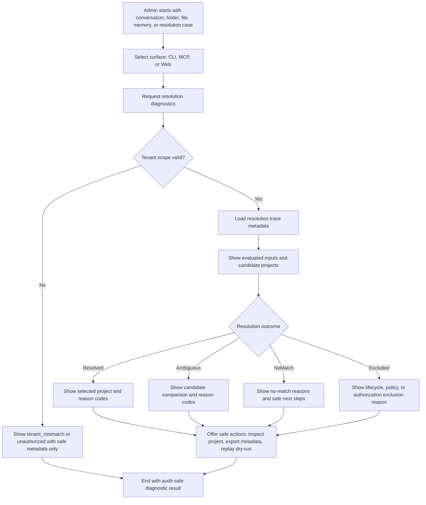
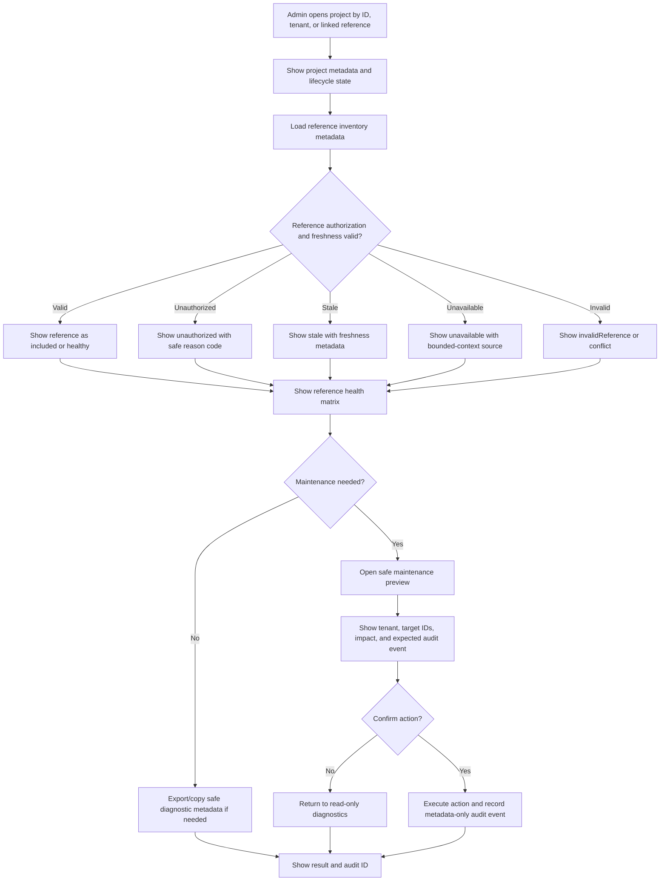
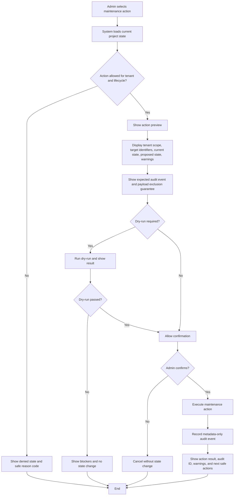
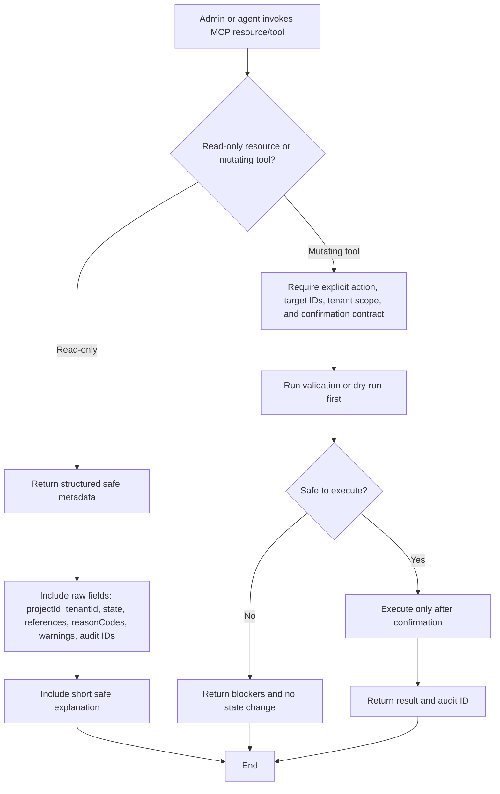

---
stepsCompleted:
  - 1
  - 2
  - 3
  - 4
  - 5
  - 6
  - 7
  - 8
  - 9
  - 10
  - 11
  - 12
  - 13
  - 14
lastStep: 14
status: complete
inputDocuments:
  - _bmad-output/planning-artifacts/briefs/brief-Hexalith.Projects-2026-05-24/brief.md
  - _bmad-output/planning-artifacts/prds/prd-Hexalith.Projects-2026-05-24/prd.md
  - _bmad-output/planning-artifacts/prds/prd-Hexalith.Projects-2026-05-24/reconcile-product-brief.md
  - _bmad-output/planning-artifacts/prds/prd-Hexalith.Projects-2026-05-24/handoff-blocker.md
  - _bmad-output/planning-artifacts/prds/prd-Hexalith.Projects-2026-05-24/review-rubric.md
  - _bmad-output/planning-artifacts/prds/prd-Hexalith.Projects-2026-05-24/validation-report.md
  - _bmad-output/planning-artifacts/implementation-readiness-report-2026-05-24.md
  - _bmad-output/planning-artifacts/sprint-change-proposal-2026-05-18-dotnet-sdk-10-0-300.md
  - _bmad-output/project-context.md
---

# UX Design Specification Hexalith.Projects

**Author:** Jerome
**Date:** 2026-05-24

---

<!-- UX design content will be appended sequentially through collaborative workflow steps -->

## Executive Summary

### Project Vision

Hexalith.Projects provides the durable metadata control plane that helps Hexalith.Chatbot use the correct project context for AI conversations. The end-user conversation experience belongs to Hexalith.Chatbot and is outside this module's direct UX scope.

The UX scope for Hexalith.Projects is administrative and operational. Administrators, operators, developers, and MCP-enabled assistants need CLI, MCP, and Web experiences to inspect project metadata, diagnose project-resolution behavior, maintain project state, and resolve operational issues without exposing conversation transcripts, file contents, prompts, secrets, memory payloads, or unsafe derived summaries.

### Target Users

The primary product consumer is Hexalith.Chatbot, which uses Projects to preserve project continuity for end users across conversations, folders, files, memories, and setup instructions.

The direct UX users for this module are administrators, operators, developers, and agent-assisted support workflows. They need safe, metadata-only surfaces through CLI, MCP, and FrontComposer Web UX to inspect project state, context references, resolution outcomes, reference health, lifecycle state, warnings, and audit history.

### Key Design Challenges

- Designing administrative UX that supports troubleshooting without becoming an end-user project-management product.
- Creating one shared operational model across CLI, MCP, and Web so all surfaces use the same states, reason codes, timestamps, tenant visibility rules, and redaction behavior.
- Making context resolution explainable enough to diagnose wrong, missing, stale, unauthorized, or ambiguous matches.
- Showing linked conversations, folders, file references, and memories as references without implying Projects owns their payloads.
- Distinguishing states such as `included`, `excluded`, `unauthorized`, `unavailable`, `stale`, `archived`, `ambiguous`, `tenant_mismatch`, `conflict`, and `invalidReference`.
- Keeping all operational views metadata-only while still useful for issue diagnosis.
- Ensuring Web UX is composed through Hexalith.FrontComposer rather than a bespoke Projects UI framework.

### Design Opportunities

- Treat CLI, MCP, and Web as three adapters over one operational diagnostic model.
- Provide scriptable CLI diagnostics for project lookup, reference health, resolution replay, lifecycle changes, and safe maintenance actions.
- Provide MCP resources and tools for agent-assisted troubleshooting, with read-only resources separated from mutating tools.
- Provide FrontComposer-generated Web views for project lists, project detail, reference inventory, resolution trace, audit timeline, warnings, and guided maintenance actions.
- Explain context inclusion and exclusion with safe reason codes that administrators and tools can understand.
- Provide consistent operational diagnostics across CLI, MCP, and FrontComposer Web so administrators can resolve project-state issues without accessing payload data.

### Design Principle: One Operational Model, Three Surfaces

CLI, MCP, and Web UX must expose the same project metadata, lifecycle states, context-resolution evidence, reference health, reason codes, warnings, audit identifiers, and maintenance actions through surface-appropriate interactions. Web UX is composed through Hexalith.FrontComposer; CLI remains scriptable; MCP remains structured for agent-assisted diagnostics. No surface may expose payloads owned by Conversations, Folders, Files, Memories, Chatbot, or other bounded contexts.

## Core User Experience

### Defining Experience

The defining experience for Hexalith.Projects is safe operational diagnosis and maintenance of project context. Administrators, operators, developers, and MCP-enabled assistants need to answer: what project state exists, how context resolution behaved, which references were included or excluded, and what safe maintenance action is available.

The core user action is inspecting a project or resolution case and understanding its current state without accessing payload data owned by Chatbot, Conversations, Folders, Files, or Memories.

### Platform Strategy

Hexalith.Projects uses three operational UX surfaces over one shared diagnostic model:

- CLI for scriptable administration, diagnostics, automation, and support workflows.
- MCP for agent-assisted investigation, safe project metadata access, and guided maintenance.
- Web UX composed through Hexalith.FrontComposer for human operational inspection and maintenance.

The Web UX is not a bespoke Projects frontend. It should be a FrontComposer-generated operational console with project lists, project detail, reference inventory, resolution trace, audit timeline, warnings, state badges, and guided maintenance actions.

All surfaces must preserve shared semantics for lifecycle states, reference states, reason codes, timestamps, tenant visibility, warnings, audit identifiers, and redaction behavior.

### Effortless Interactions

The following interactions should require minimal thought:

- Find a project by project ID, tenant, linked conversation reference, folder reference, file reference, or relevant metadata.
- Inspect project lifecycle state, context references, warnings, and audit history.
- Understand why Project Resolution selected, rejected, or could not decide between candidate projects.
- See which references are `included`, `excluded`, `unauthorized`, `unavailable`, `stale`, `archived`, `ambiguous`, `tenant_mismatch`, `conflict`, or `invalidReference`.
- Re-run or replay safe resolution diagnostics without changing project state.
- Take maintenance actions only when the action, impact, tenant scope, and audit consequence are clear.

### Critical Success Moments

The experience succeeds when an administrator can quickly answer:

- What project did the system resolve or inspect?
- Why did it resolve that project, return no match, or return multiple candidates?
- Which references were included or excluded, and why?
- Is this a tenant, authorization, lifecycle, stale data, missing reference, or conflict problem?
- What maintenance action is safe, and what audit evidence will it create?

The experience fails if any surface hides ambiguity, silently changes state, exposes payload data, collapses distinct failure states into a generic error, or uses different terminology from another surface.

### Experience Principles

- One operational model, three surfaces: CLI, MCP, and Web adapt presentation but preserve the same semantics.
- Metadata only: show enough to diagnose, never enough to leak payloads.
- Diagnostic first: optimize for troubleshooting, maintenance, and safe explanation, not end-user project management.
- Fail closed but explain safely: refusal states should be visible through safe reason codes.
- FrontComposer by default: Web UX is composed through Hexalith.FrontComposer, not a custom UI stack.
- Scriptable and agent-safe: CLI and MCP outputs must be structured, stable, and suitable for automation and support workflows.
- Auditable maintenance: state-changing actions must expose impact before execution and produce metadata-only audit evidence.

## Desired Emotional Response

### Primary Emotional Goals

Hexalith.Projects should make administrators, operators, developers, and MCP-enabled assistants feel confident, oriented, and in control when diagnosing or maintaining project state.

The desired emotional response is: "I can see what happened, understand why it happened, and take the next safe action without exposing protected payload data."

This is not a delight-driven consumer UX. It is a calm, precise operational UX for high-trust maintenance work.

### Emotional Journey Mapping

When first entering a Projects operational surface, users should feel oriented. The UX should quickly show tenant scope, project identity, lifecycle state, warnings, and whether the user is in a read-only diagnostic flow or a state-changing maintenance flow.

During core diagnosis, users should feel clarity and control. They should be able to inspect resolution outcomes, reference states, reason codes, audit events, and warnings without guessing what hidden state exists.

When something goes wrong, users should feel protected rather than blocked. Fail-closed states should explain safely whether the issue is authorization, tenant mismatch, stale data, archived state, unavailable reference, invalid reference, conflict, or ambiguity.

After completing a maintenance action, users should feel accountable and reassured. The UX should show the action result, affected project/reference identifiers, tenant scope, warnings, and audit evidence.

When returning later, users should feel continuity. They should be able to reconstruct what happened from metadata-only audit history and diagnostic traces.

### Micro-Emotions

The most important micro-emotions are:

- Confidence over confusion.
- Trust over suspicion.
- Control over anxiety.
- Clarity over guesswork.
- Accountability over uncertainty.
- Safety over speed when the two conflict.

The UX should avoid making users feel that the system is hiding important state, silently choosing context, or exposing more data than it should.

### Design Implications

- Confidence requires consistent state names, reason codes, and warning semantics across CLI, MCP, and Web.
- Trust requires visible tenant scope, metadata-only output, and clear redaction behavior.
- Control requires dry-run or preview behavior for risky maintenance actions.
- Clarity requires resolution traces, reference health, audit timelines, and explicit included/excluded states.
- Accountability requires every state-changing action to show impact and produce audit evidence.
- Safety requires no transcript text, file content, prompt content, memory payload, secret value, embedding vector, or unsafe derived summary in any operational surface.

### Emotional Design Principles

- Calm precision: use clear operational language, not marketing language.
- Explain safely: show why something happened without leaking what is protected.
- Prefer explicitness over cleverness: ambiguity must be surfaced, not hidden.
- Make danger visible before action: state-changing operations must communicate tenant scope, target identifiers, and expected audit result.
- Reward correct restraint: when the system refuses access or excludes a reference, the UX should make that refusal understandable and trustworthy.
- Preserve operator confidence through parity: CLI, MCP, and Web should make users feel they are seeing the same truth through different surfaces.

## UX Pattern Analysis & Inspiration

### Inspiring Products Analysis

Hexalith.Projects should draw inspiration from operational and diagnostic products rather than consumer project-management tools.

**Kubernetes kubectl**

`kubectl` is a strong CLI inspiration because it exposes complex distributed state through stable commands, structured output, and consistent resource vocabulary. Its useful patterns include resource lookup, describe-style inspection, event timelines, status fields, namespaces, and machine-readable output.

Transferable lesson: CLI diagnostics should make project state inspectable, scriptable, and consistent without requiring a Web UI.

**Azure Portal / Cloud Admin Consoles**

Cloud admin portals are relevant because they organize operational resources around lists, detail blades, health/status indicators, activity logs, access control, and guided actions. Their best patterns help operators move from overview to detail to safe action.

Transferable lesson: FrontComposer Web UX should use resource lists, detail views, status badges, activity/audit timelines, warning panels, and action panels for safe maintenance.

**GitHub Actions / CI Run Diagnostics**

CI diagnostic views are useful because they show run state, logs, timing, failed steps, retries, and links between cause and effect. They help users understand what happened without hiding the sequence of events.

Transferable lesson: resolution traces and audit timelines should make cause, sequence, and outcome easy to inspect.

**OpenTelemetry / Observability Dashboards**

Observability tools are relevant for traces, correlation IDs, service boundaries, error classifications, and filtering by dimensions such as tenant, time, resource, and status.

Transferable lesson: diagnostic UX should make correlation, tenant scope, lifecycle state, reference health, and reason codes filterable and consistent.

**MCP Tooling Patterns**

MCP should borrow from structured tool/resource design: explicit schemas, clear read/write separation, bounded responses, reason codes, and safe summaries backed by raw metadata fields.

Transferable lesson: MCP should expose safe fields plus short explanations, not free-form narrative alone.

### Transferable UX Patterns

- Resource list to detail inspector: start with projects and move into metadata, references, warnings, audit events, and actions.
- Describe-style CLI inspection: provide a single command that gives a complete safe metadata snapshot of a project or resolution case.
- Resolution trace: show evaluated candidates, reason codes, inclusion/exclusion states, and final outcome.
- Audit timeline: show who or what changed state, when, through which surface, and with what safe result.
- Status badges with semantic labels: use consistent lifecycle, reference, and warning states across CLI, MCP, and Web.
- Dry-run or preview before change: allow risky maintenance actions to show expected impact before execution.
- Structured output: make CLI and MCP responses stable enough for automation and tests.
- Filterable operational grids: allow admins to filter by tenant, lifecycle state, reason code, warning, reference type, and timestamp.

### Anti-Patterns to Avoid

- Consumer project-management patterns such as kanban boards, milestones, task lists, and scheduling as the center of the UX.
- Web-only diagnostics that cannot be reproduced through CLI or MCP.
- Free-form MCP explanations without raw safe metadata fields and reason codes.
- Silent automatic repair or state changes from diagnostic views.
- Blank or generic errors for fail-closed states.
- Color-only status communication in Web UX.
- Exposing payload previews, transcript snippets, file contents, memory payloads, prompt text, embedding vectors, or unsafe derived summaries.
- Inconsistent names for the same state across CLI, MCP, and Web.

### Design Inspiration Strategy

**Adopt:**

- `kubectl describe`-style safe inspection for CLI.
- Cloud portal resource list/detail/action patterns for FrontComposer Web UX.
- CI-style resolution traces and audit timelines.
- Observability-style filtering by tenant, correlation, lifecycle, reason code, and timestamp.
- MCP structured resources and tools with explicit schemas.

**Adapt:**

- Cloud admin console patterns should be simplified for Projects-specific metadata rather than becoming a broad resource-management portal.
- Observability patterns should focus on project context resolution and reference health, not general system telemetry.
- CLI commands should support both human-readable diagnostics and machine-readable output, with stable schemas for automation.

**Avoid:**

- Designing a standalone project-management destination.
- Creating UX patterns that require a bespoke Projects Web framework instead of FrontComposer.
- Optimizing for speed at the expense of tenant isolation, auditability, or payload safety.

## Design System Foundation

### 1.1 Design System Choice

Hexalith.Projects will use the existing Hexalith UI foundation: Web UX composed through Hexalith.FrontComposer, backed by the established Fluent UI Blazor component approach used across Hexalith modules.

This is an established-system approach rather than a custom design system. The goal is consistency, maintainability, accessibility, and generated/admin surface compatibility, not visual uniqueness.

CLI and MCP surfaces do not use a visual design system, but they must share the same operational vocabulary, result model, state names, reason codes, and redaction semantics as the Web UX.

### Rationale for Selection

FrontComposer is a project constraint and integration requirement. Using it keeps Projects aligned with the Hexalith ecosystem and avoids a bespoke Projects Web framework.

Fluent UI Blazor is already part of the Hexalith UI stack, including admin UI and FrontComposer-related surfaces. Reusing it gives Projects access to familiar operational components such as tables, forms, panels, badges, tabs, command bars, dialogs, and accessible interaction patterns.

This approach supports the product's operational character. Administrators need dense, predictable diagnostic interfaces, not a branded marketing experience or consumer project-management UI.

The design foundation also supports implementation consistency: Projects can contribute metadata, descriptors, actions, and generated/admin views through FrontComposer rather than hand-building unrelated Web screens.

### Implementation Approach

Web UX should be specified as FrontComposer-generated operational views:

- Project list view with tenant scope, lifecycle state, warnings, updated timestamps, and filters.
- Project detail view with metadata, lifecycle state, setup metadata, and safe identifiers.
- Reference inventory view for linked conversations, folders, file references, and memories.
- Resolution trace view showing candidate projects, reason codes, inclusion/exclusion states, and final outcome.
- Audit timeline view showing metadata-only state changes and maintenance actions.
- Maintenance action panels for safe operations such as archive, restore, relink, unlink, or re-run diagnostics.
- Warning and error panels for fail-closed states such as `tenant_mismatch`, `unauthorized`, `stale`, `unavailable`, `conflict`, and `invalidReference`.

CLI UX should use stable command structures and machine-readable output while preserving the same state and reason-code vocabulary.

MCP UX should expose structured resources and tools using the same safe metadata model, with clear separation between read-only diagnostic resources and mutating maintenance tools.

### Customization Strategy

Customization should be minimal and operational. Projects should customize labels, field grouping, table columns, filters, status badges, warning panels, and action availability based on Projects-specific metadata and maintenance workflows.

Projects should not introduce a custom visual language, custom component library, or bespoke Web runtime. Any custom component or FrontComposer extension should exist only when the standard generated/admin patterns cannot express a required diagnostic or maintenance workflow.

All customizations must preserve:

- Metadata-only display.
- Tenant-aware filtering and visibility.
- Keyboard accessibility and visible focus behavior.
- Status labels that are not color-only.
- Consistent state and reason-code semantics across CLI, MCP, and Web.
- Stable component/test identifiers where needed for automation.

## 2. Core User Experience

### 2.1 Defining Experience

The defining experience is safe project-context diagnosis.

An administrator should be able to start from a project ID, tenant, conversation reference, folder reference, file reference, memory reference, audit event, or resolution case and quickly understand:

- What project or candidate projects are involved.
- What state the project is in.
- Which references are linked and healthy.
- Why resolution selected, rejected, or could not decide between candidates.
- What warnings or fail-closed states exist.
- What safe maintenance action is available.

If this interaction is done well, every Projects operational surface becomes useful: CLI can script it, MCP can reason over it, and FrontComposer Web can make it inspectable.

### 2.2 User Mental Model

Administrators think in terms of operational evidence:

- "Show me the project."
- "Show me what the system evaluated."
- "Show me why it chose this result."
- "Show me what is blocked, stale, unauthorized, or ambiguous."
- "Show me what I can safely do next."

They expect Projects to behave like a metadata control plane, not a content system. They should not expect to browse transcript bodies, file contents, prompt text, memory payloads, or unrestricted resource data.

They may come from mental models shaped by CLI diagnostics, cloud resource consoles, CI traces, and observability tools. The UX should therefore use familiar patterns: list, inspect, describe, trace, filter, compare, dry-run, confirm, audit.

### 2.3 Success Criteria

The defining experience succeeds when:

- Users can locate a project or resolution case through any supported reference.
- The same diagnostic facts are available through CLI, MCP, and Web.
- Users can distinguish lifecycle, authorization, reference health, resolution, and audit states without guessing.
- Ambiguous resolution shows candidates and reasons without selecting silently.
- Fail-closed states explain safely what happened.
- Maintenance actions show tenant scope, target identifiers, impact, and audit result before execution.
- No surface exposes payload data owned by another bounded context.

Success should feel like: "I know exactly what happened and what I can safely do next."

### 2.4 Novel UX Patterns

The UX should rely mostly on established operational patterns rather than novel interactions.

Established patterns to adopt:

- Resource list and detail inspector.
- `describe`-style CLI output.
- Filterable status grids.
- Resolution trace.
- Audit timeline.
- Warning and error panels.
- Dry-run and confirmation flows.
- Read-only MCP resources separated from mutating MCP tools.

The unique twist is not a new interaction pattern. It is the shared diagnostic model across CLI, MCP, and FrontComposer Web, combined with strict metadata-only safety.

### 2.5 Experience Mechanics

**1. Initiation**

The user starts with one of:

- Project ID.
- Tenant ID.
- Conversation reference.
- Folder reference.
- File reference.
- Memory reference.
- Resolution case ID.
- Audit event ID.
- Warning or failed operation.

CLI initiation happens through commands. MCP initiation happens through structured tool/resource calls. Web initiation happens through FrontComposer resource lists, search/filter controls, or linked detail views.

**2. Interaction**

The system returns a safe diagnostic view containing project metadata, lifecycle state, reference inventory, resolution status, reason codes, warnings, audit identifiers, and available actions.

The user filters, expands, compares, or traces the diagnostic evidence. For ambiguous resolution, the user compares candidates and reason codes. For reference problems, the user inspects reference health and exclusion reason. For lifecycle problems, the user inspects state and audit history.

**3. Feedback**

The system gives feedback through consistent state labels, reason codes, warnings, timestamps, audit IDs, and tenant scope. Risky or mutating actions use preview, dry-run, or confirmation behavior.

Errors are specific but safe: `tenant_mismatch`, `unauthorized`, `stale`, `unavailable`, `archived`, `conflict`, `invalidReference`, or `ambiguous`, rather than generic failure text.

**4. Completion**

The user completes the flow by either:

- Understanding the state without changing anything.
- Exporting or copying safe diagnostic metadata for support handoff.
- Re-running a safe diagnostic or resolution replay.
- Taking a maintenance action such as archive, restore, relink, unlink, or trigger a safe re-evaluation.
- Confirming that an action created the expected metadata-only audit evidence.

The successful outcome is always explainable, tenant-scoped, and auditable.

## Visual Design Foundation

### Color System

Hexalith.Projects should inherit the Hexalith/FrontComposer/Fluent UI color foundation rather than defining an independent brand palette.

Color should be semantic and operational:

- Neutral surfaces for dense metadata inspection.
- Primary/action colors from the existing Hexalith/Fluent UI theme.
- Success for completed or healthy states.
- Warning for stale, ambiguous, archived, or attention-required states.
- Error for denied, invalid, conflict, failed, or unavailable states.
- Information for explanatory context, resolution evidence, and audit metadata.
- Muted/disabled treatment for unavailable or excluded references.

Status color must never be the only signal. Every status also needs a text label, icon, accessible name, or structured reason code.

### Typography System

Typography should follow the existing FrontComposer/Fluent UI type scale and accessibility defaults.

The tone should be professional, calm, and precise. Text density will be moderate to high because administrators inspect tables, metadata fields, reason codes, warnings, and audit history.

Typography priorities:

- Clear table and grid readability.
- Compact but legible metadata labels and values.
- Strong hierarchy between project identity, lifecycle state, warnings, section headings, and diagnostic details.
- Monospace treatment where useful for identifiers, reason codes, tenant IDs, correlation IDs, audit event IDs, and command examples.
- No oversized hero typography or marketing-oriented display treatment.

### Spacing & Layout Foundation

The layout should be dense, predictable, and optimized for repeated operational use.

Web UX should use FrontComposer/Fluent UI spacing patterns with restrained density:

- Resource list and detail layouts.
- Filter bars and command bars near the data they affect.
- Inspector panels for project metadata and reference details.
- Timeline layouts for audit and resolution history.
- Warning panels close to the affected resource or action.
- Action panels separated from read-only diagnostic sections.

The layout should avoid decorative cards, landing-page sections, and consumer dashboard visuals. Cards are appropriate only for repeated resource summaries, compact status groups, or modal/action contexts where a framed unit improves scanning.

### Accessibility Considerations

Accessibility is part of the operational safety model.

Web UX must preserve:

- Keyboard navigation for grids, filters, tabs, command bars, dialogs, and action panels.
- Visible focus states.
- Status labels that are not color-only.
- Accessible names for reason-code badges, warning icons, and action buttons.
- Screen-reader-friendly table headers and relationships.
- Sufficient contrast for neutral, warning, error, success, and disabled states.
- Reduced-motion-safe interactions.
- Deterministic component keys or test identifiers where needed for automation.

CLI UX must support machine-readable output and avoid relying on color for meaning. MCP UX must expose structured fields rather than explanation-only text so agent-assisted workflows can preserve accessibility, automation, and testability.

## Design Direction Decision

### Design Directions Explored

Six operational design directions were explored in `ux-design-directions.html`:

- Metadata Control Plane: a balanced FrontComposer resource-console layout centered on projects, states, warnings, and safe actions.
- Resolution Trace Workbench: a diagnostic layout for explaining why Projects matched, rejected, or stayed ambiguous.
- Reference Health Matrix: a dense maintenance view for stale, unauthorized, unavailable, excluded, and invalid references.
- Incident Desk: a support triage view for active warnings, failed operations, and safe metadata handoff.
- CLI/MCP Parity Console: a schema-parity direction that makes CLI, MCP, and Web show the same safe operational fields.
- Audit-First Maintenance: a conservative maintenance direction where every state-changing action starts with tenant scope, impact, and expected audit evidence.

### Chosen Direction

The chosen direction is Metadata Control Plane as the primary base, with Resolution Trace Workbench and Audit-First Maintenance used as specialized interaction patterns.

This means the default Web UX should be a FrontComposer-generated operational console with project inventory, filters, lifecycle state, warnings, metadata inspection, and safe actions. When users drill into a resolution issue, the experience should shift into a trace-oriented workbench. When users initiate a state-changing operation, the experience should shift into an audit-first confirmation flow.

### Design Rationale

Metadata Control Plane is the best default because it matches the module's purpose: Projects is a metadata control plane, not a content browser or project-management destination.

Resolution Trace Workbench is necessary because Project Resolution is the most failure-prone and trust-sensitive diagnostic workflow. Administrators need to see candidates, reason codes, inclusion/exclusion states, and final outcome without payload exposure.

Audit-First Maintenance is necessary because state-changing actions must communicate tenant scope, target identifiers, expected impact, and audit result before execution.

The combined direction supports the emotional goal of calm operational confidence and the experience principle of one operational model across CLI, MCP, and Web.

### Implementation Approach

FrontComposer Web UX should implement the chosen direction through:

- Project inventory/list view.
- Project detail inspector.
- Reference inventory and health view.
- Resolution trace view.
- Audit timeline view.
- Warning and error panels.
- Maintenance action panels with dry-run or preview behavior.

CLI should mirror the same model through describe, inspect, trace, validate, dry-run, and maintenance commands.

MCP should mirror the same model through read-only resources for project metadata, references, resolution traces, and audit events, plus clearly separated mutating tools for maintenance actions.

All surfaces must preserve the same state names, reason codes, warning semantics, tenant scope, audit identifiers, and payload-exclusion guarantees.

## User Journey Flows

### Journey 1: Diagnose Project Resolution

Administrators need to understand why Projects selected a project, returned multiple candidates, returned no match, or excluded a project from resolution.

### Journey 2: Inspect Project Reference Health

Administrators need to inspect linked Conversations, Project Folder, File References, and Memories without accessing payloads owned by other bounded contexts.

### Journey 3: Perform Safe Maintenance Action

Administrators need to archive, restore, relink, unlink, or trigger safe re-evaluation while understanding impact and audit consequences.

### Journey 4: Use MCP for Agent-Assisted Troubleshooting

MCP-enabled assistants need safe project metadata and structured tools to help administrators investigate without receiving payload-bearing data.

### Journey Patterns

Common patterns across all journeys:

- Start from any safe identifier or reference.
- Validate tenant scope before showing diagnostic details.
- Return structured metadata before explanation.
- Use reason codes for included, excluded, unauthorized, stale, archived, ambiguous, conflict, and invalid states.
- Separate read-only diagnostics from state-changing maintenance.
- Preview or dry-run risky actions before execution.
- End with audit-safe evidence.

### Flow Optimization Principles

- Minimize time to safe diagnosis.
- Prefer structured diagnostic output over prose-only explanations.
- Keep terminology identical across CLI, MCP, and Web.
- Surface ambiguity instead of hiding it.
- Never collapse tenant, authorization, lifecycle, freshness, and conflict issues into a generic error.
- Make every state-changing action explicit, scoped, confirmed, and auditable.

## Component Strategy

### Design System Components

Hexalith.Projects should rely on FrontComposer-generated views and Fluent UI Blazor-compatible components wherever possible.

Foundation components expected from the existing UI stack:

- Resource lists and data grids.
- Detail panels and inspectors.
- Tabs or pivots for project metadata, references, resolution, audit, and actions.
- Command bars for diagnostic and maintenance actions.
- Filter bars, search inputs, dropdowns, and segmented filters.
- Status badges and message bars.
- Dialogs and confirmation panels.
- Forms for safe maintenance inputs.
- Timeline/list patterns for audit events.
- Empty, loading, denied, and error states.

These components cover most Web UX needs. Projects should define the metadata, actions, state semantics, and generated-view descriptors that allow FrontComposer to compose the operational console.

### Custom Components

Custom components should be minimized. Where needed, they should be Projects-specific compositions built from foundation components.

#### Project Diagnostic Header

**Purpose:** Shows tenant scope, project identity, lifecycle state, warnings, and current mode.

**Usage:** Top of project detail, resolution trace, and maintenance views.

**Anatomy:** Tenant label, project ID/name, lifecycle badge, warning count, last updated timestamp, mode indicator such as `read-only`, `dry-run`, or `maintenance`.

**States:** Active, archived, unavailable, unauthorized, stale warning, conflict warning.

**Accessibility:** Lifecycle and warning badges must include text labels and accessible names. Tenant and project IDs should be copyable without relying on visual-only affordances.

#### Reference Health Matrix

**Purpose:** Shows linked Conversations, Project Folder, File References, and Memories as safe references with health and inclusion states.

**Usage:** Project detail and maintenance flows.

**Anatomy:** Reference type, reference ID, bounded-context owner, inclusion state, health state, reason code, last checked timestamp, available safe actions.

**States:** Included, excluded, unauthorized, unavailable, stale, archived, conflict, invalidReference.

**Accessibility:** Grid headers must be explicit. Status badges must not be color-only. Rows must expose action labels clearly.

#### Resolution Trace

**Purpose:** Explains how Project Resolution evaluated inputs, candidate projects, reason codes, exclusions, and final outcome.

**Usage:** Resolution diagnosis and ambiguous-match troubleshooting.

**Anatomy:** Input summary, candidate list, reason-code badges, inclusion/exclusion evidence, outcome panel, safe next actions.

**States:** Resolved, no match, multiple candidates, excluded, failed closed.

**Accessibility:** Trace order must be readable by screen readers. Candidate comparisons must have semantic headings and labels.

#### Audit Timeline

**Purpose:** Shows metadata-only maintenance and lifecycle history.

**Usage:** Project detail, maintenance confirmation, and support handoff.

**Anatomy:** Timestamp, actor/source surface, operation, previous state, new state, affected references, correlation ID, audit event ID.

**States:** Normal event, warning event, failed action, dry-run event.

**Accessibility:** Timeline must remain understandable as a list. Timestamps and event IDs must be copyable.

#### Maintenance Action Panel

**Purpose:** Makes state-changing actions explicit, scoped, previewable, and auditable.

**Usage:** Archive, restore, relink, unlink, or re-run safe evaluation flows.

**Anatomy:** Action name, tenant scope, target identifiers, current state, proposed state, warnings, dry-run result, expected audit event, confirmation control.

**States:** Preview, dry-run required, dry-run passed, dry-run blocked, confirmation required, executing, succeeded, failed.

**Accessibility:** Destructive or risky actions need clear button labels, focus handling, and confirmation messaging.

#### Safe Diagnostic Export

**Purpose:** Allows administrators to copy or export structured metadata for support handoff.

**Usage:** Resolution diagnosis, incident desk, project detail, and failed maintenance flows.

**Anatomy:** Safe JSON/structured metadata preview, included fields, excluded payload guarantee, copy/export action.

**States:** Ready, copied, export failed, redaction applied.

**Accessibility:** Export content must be keyboard-copyable and screen-reader accessible.

### Component Implementation Strategy

Projects should define components as FrontComposer-compatible descriptors and compositions before creating bespoke UI code.

Implementation rules:

- Prefer generated/admin patterns over custom components.
- Build custom compositions from Fluent UI-compatible primitives.
- Keep Projects-specific logic in metadata descriptors, action contracts, state models, and reason-code definitions.
- Use shared state and reason-code contracts across CLI, MCP, and Web.
- Ensure all components support loading, empty, unauthorized, unavailable, stale, conflict, validation failure, and success states.
- Ensure every component preserves metadata-only display and safe redaction rules.
- Add stable component keys or test IDs where needed for automation.

### Implementation Roadmap

**Phase 1 - Core Diagnostic Components**

- Project Diagnostic Header.
- Project list/detail descriptors.
- Reference Health Matrix.
- Resolution Trace.
- Shared status/reason-code badge semantics.

**Phase 2 - Maintenance Components**

- Maintenance Action Panel.
- Dry-run/preview flow.
- Audit Timeline.
- Safe Diagnostic Export.

**Phase 3 - Operational Refinement**

- Incident/warning dashboard composition.
- Advanced filters for tenant, lifecycle, reference state, reason code, and timestamp.
- CLI/MCP/Web parity validation views or evidence outputs.
- Accessibility and automation refinements for generated FrontComposer views.

## UX Consistency Patterns

### Button Hierarchy

Web UX should follow FrontComposer/Fluent UI action hierarchy.

**Primary actions** are reserved for the main safe next step in the current context, such as inspect, run dry-run, confirm maintenance action, or export diagnostic metadata.

**Secondary actions** support non-destructive alternatives such as cancel, return to diagnostics, copy ID, open related reference, or view audit event.

**Destructive or state-changing actions** must not appear as casual primary actions. They require preview, dry-run where applicable, confirmation, tenant scope, target identifiers, expected impact, and expected audit event.

**CLI and MCP parity:** CLI commands and MCP tools should mirror the same action hierarchy through command naming and tool classification:

- Read-only diagnostics: `describe`, `inspect`, `trace`, `validate`, `list`.
- Preview actions: `dry-run`, `preview`.
- Mutating actions: `archive`, `restore`, `relink`, `unlink`, `reevaluate`, requiring explicit target and confirmation semantics.

### Feedback Patterns

Feedback must be specific, safe, and consistent across surfaces.

**Success feedback** should include operation result, tenant scope, project/reference identifiers, timestamp, and audit event ID when state changed.

**Warning feedback** should identify non-blocking risks such as `stale`, `archived`, `ambiguous`, `excluded`, or `partialReferenceAvailability`.

**Error feedback** should use safe reason codes such as `tenant_mismatch`, `unauthorized`, `unavailable`, `conflict`, `invalidReference`, or `validationFailed`. Error text must not echo secrets, prompts, transcript snippets, file contents, memory payloads, or unsafe derived summaries.

**Fail-closed feedback** should explain the safe category of refusal without exposing protected details.

**Loading feedback** should distinguish metadata retrieval, reference validation, resolution trace loading, dry-run execution, and maintenance execution.

### Form Patterns

Forms are used only for operational filtering, diagnostic input, and safe maintenance actions.

**Diagnostic forms** should accept safe identifiers such as tenant ID, project ID, conversation reference, folder reference, file reference, memory reference, resolution case ID, audit event ID, correlation ID, lifecycle state, reason code, and timestamp range.

**Maintenance forms** must show current state, proposed state, affected identifiers, tenant scope, warnings, dry-run result, and expected audit event before execution.

**Validation** should happen before state changes and should return field-specific safe errors. Validation messages should identify the invalid field or reference type without echoing unsafe values.

**CLI and MCP parity:** CLI arguments and MCP tool schemas should use the same field names and validation semantics as Web forms.

### Navigation Patterns

Web navigation should follow operational resource-console patterns:

- Project inventory as the main entry point.
- Project detail as the central inspector.
- Tabs or sections for metadata, references, resolution, audit, and actions.
- Deep links from warnings, reference rows, resolution candidates, and audit events into the relevant detail view.
- Breadcrumb or context header showing tenant, project, and mode.

CLI navigation is command-based and should preserve predictable command grouping:

- `projects list`
- `projects describe`
- `projects trace-resolution`
- `projects validate-references`
- `projects audit`
- `projects dry-run`
- `projects archive|restore|relink|unlink`

MCP navigation is resource/tool-based and should separate read-only resources from mutating tools.

### Additional Patterns

#### Status and Reason-Code Pattern

Every state must have a stable code, display label, accessible name, and severity mapping. Color is supportive only.

Examples:

- `active`
- `archived`
- `included`
- `excluded`
- `unauthorized`
- `unavailable`
- `stale`
- `ambiguous`
- `tenant_mismatch`
- `conflict`
- `invalidReference`

#### Empty State Pattern

Empty states must distinguish true absence from denied or unavailable data.

Examples:

- No projects found.
- No references linked.
- No audit events available.
- Data unavailable.
- Access denied.
- Filter returned no results.

These states must not collapse into a blank table.

#### Audit Evidence Pattern

Every state-changing action must end with metadata-only audit evidence including action, actor or source, tenant, project ID, affected reference IDs when applicable, timestamp, correlation ID, result, and audit event ID.

#### Safe Export Pattern

Diagnostic export should include only safe metadata fields and explicitly indicate that payload data is excluded. Export should be available through Web copy/download, CLI structured output, and MCP resource responses.

#### Confirmation Pattern

Confirmations are required for mutating actions. Confirmation surfaces must show tenant scope, target identifiers, current state, proposed state, warnings, expected audit event, and whether a dry-run passed.

#### Cross-Surface Parity Pattern

For the same project or resolution case, CLI, MCP, and Web must expose equivalent operational facts even when formatting differs.

## Responsive Design & Accessibility

### Responsive Strategy

Hexalith.Projects Web UX should be desktop-optimized and responsive. The primary Web use case is operational diagnosis and maintenance, which benefits from larger screens, dense tables, inspector panels, timelines, and side-by-side comparisons.

**Desktop**

Desktop is the primary layout target. Use available width for:

- Project inventory plus detail inspection.
- Side navigation or resource navigation.
- Filter bars and command bars.
- Multi-column reference health and resolution trace layouts.
- Audit timelines beside maintenance panels.
- Side-by-side candidate comparison for ambiguous resolution.

**Tablet**

Tablet layouts should preserve operational inspection while reducing column count:

- Collapse side navigation into top or drawer navigation.
- Stack inspector panels below the main table or detail view.
- Keep command bars visible but wrap secondary actions.
- Preserve touch targets and avoid dense hover-only interactions.
- Favor read-only inspection and lightweight maintenance actions.

**Mobile**

Mobile should support urgent inspection and safe metadata lookup, not full dense operations:

- Prioritize project identity, tenant scope, lifecycle state, warnings, and top reason codes.
- Collapse tables into stacked rows or summary lists.
- Hide advanced comparison until explicitly expanded.
- Keep state-changing actions available only when confirmation content remains fully visible and understandable.
- Prefer CLI or desktop Web for complex maintenance when mobile space would hide critical evidence.

CLI and MCP are inherently responsive through structured text/schema output and should not rely on terminal width, color, or prose formatting for meaning.

### Breakpoint Strategy

Use FrontComposer/Fluent UI responsive conventions where available. If explicit breakpoints are needed, use standard operational breakpoints:

- Mobile: 320px to 767px.
- Tablet: 768px to 1023px.
- Desktop: 1024px and above.
- Wide desktop: 1440px and above for side-by-side diagnostics and audit/maintenance split views.

The Web UX may be desktop-first for layout planning, but components must degrade predictably. Critical metadata, warnings, reason codes, and action consequences must remain visible at every supported viewport.

### Accessibility Strategy

Target WCAG 2.2 AA for Web UX.

Accessibility requirements:

- Keyboard access for navigation, grids, filters, command bars, tabs, dialogs, and action panels.
- Visible focus indicators.
- Semantic headings and landmarks for project detail, references, resolution, audit, and actions.
- Status indicators that include text labels and accessible names, not color alone.
- Sufficient contrast for normal text, badges, warnings, errors, disabled states, and focus indicators.
- Screen-reader-readable tables and timelines.
- Clear labels for filters, search inputs, dropdowns, and action buttons.
- Modal/dialog focus trapping and restoration.
- Reduced-motion-safe interaction patterns.
- No hover-only critical actions.
- Safe error messages that do not expose payload values.

CLI accessibility:

- Do not rely on color.
- Provide structured output modes.
- Keep tables readable but offer JSON for assistive tooling and automation.
- Use stable exit codes and safe reason codes.

MCP accessibility and agent safety:

- Return structured fields plus short explanations.
- Avoid explanation-only output.
- Use stable schemas so assistive workflows and agent tools can reason over the same safe metadata.

### Testing Strategy

Responsive testing should cover:

- Desktop, tablet, mobile, and wide desktop viewports.
- Dense tables and collapsed stacked layouts.
- Long identifiers and reason codes.
- Warning and error panels.
- Dialogs and maintenance confirmation flows.
- Side-by-side candidate comparison collapsing to single-column layouts.
- High data volume and empty states.

Accessibility testing should include:

- Automated accessibility checks for generated FrontComposer Web views.
- Keyboard-only navigation.
- Screen reader spot checks for key views.
- Focus management in dialogs and action panels.
- Contrast validation for status badges and warning/error states.
- Reduced-motion behavior.
- Verification that status meaning is not color-only.

Cross-surface testing should verify:

- CLI, MCP, and Web expose equivalent state names, reason codes, and audit identifiers.
- Payload-bearing fields are not displayed in any surface.
- Fail-closed states remain specific and safe.
- Maintenance actions produce metadata-only audit evidence.

### Implementation Guidelines

- Use FrontComposer and Fluent UI responsive primitives before custom layout code.
- Prefer grids and tables that can collapse into readable stacked rows.
- Keep command bars close to the data they affect.
- Keep destructive or state-changing actions separated from read-only diagnostics.
- Provide copyable identifiers for tenant, project, reference, correlation, and audit IDs.
- Use semantic HTML and ARIA only where it improves native semantics.
- Preserve stable component keys or test IDs for automation.
- Avoid fixed-width layouts that truncate long identifiers without accessible full-value access.
- Avoid mobile layouts that hide tenant scope, warnings, reason codes, or action impact.
- Ensure CLI and MCP schemas remain independent of visual formatting.
